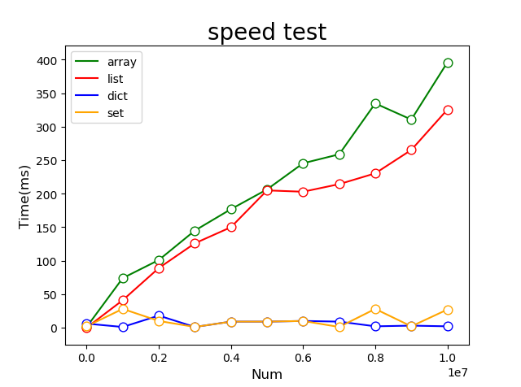

# 各类运算速度大PK
## 数据容器的速度探索
### Python3列表追加元素之`L+=[x]`与`L.extend([x])`与`L.append(x)`谁更快？
结论：L.append()方法在追加元素的多次测试中表现速度均更快。  
思考：L.append(x)后面的参数直接是给元素x，少了生成新列表[x]的过程  
运行结果：


代码：
```python
import datetime
import matplotlib.pyplot as mp


def get_time(fn):
    def f(*args):
        t0 = datetime.datetime.now()
        print('\nstart', t0)
        fn(*args)
        t1 = datetime.datetime.now()
        print(' end', t1, '\n运行耗时', t1-t0)
        Ltime.append((t1-t0).seconds)
    return f


@get_time
def f1(n):
    L = []
    for x in range(n):
        L += [n]


@get_time
def f2(n):
    L = []
    for x in range(n):
        L.extend([n])


@get_time
def f3(n):
    L = []
    for x in range(n):
        L.append(n)


X, y1, y2, y3 = [], [], [], []
x = 10000000
for x in range(x, 20*x, 4*x):
    Ltime = []
    f1(x)
    f2(x)
    f3(x)
    X.append(x)
    y1.append(Ltime[0])
    y2.append(Ltime[1])
    y3.append(Ltime[2])

mp.plot(X, y1, linestyle='-', label="+=", color='red')
mp.plot(X, y2, linestyle='-', label="L.extend", color='blue')
mp.plot(X, y3, linestyle='-', label="L.append", color='orange')
for y, colors in zip([y1, y2, y3], ['red', 'blue', 'orange']):
    mp.scatter(X, y,
               marker='o',  # 点型 ~ matplotlib.markers
               s=60,  # 大小
               edgecolor=colors,  # 边缘色
               facecolor='white',  # 填充色
               zorder=3  # 绘制图层编号 （编号越大，图层越靠上）
               )
mp.legend()
mp.show()
```

### Python3中`in操作`在列表，字典，集合中的速度对比
结论：对于需要涉及大量in查找操作的一批数据，最好使用字典或集合。  
运行结果：



```python
import datetime
import matplotlib.pyplot as mp
import numpy as np
import hashlib

def hex_sha1(STR):
    s1 = hashlib.sha1()
    s1.update(STR.encode('utf8'))
    return s1.hexdigest().upper()
    # print(hex_sha1('E5AC7D06E7C9A0F5'))
    # E18937A9639FE98F8A24348ED0BBE3061A5465A8

def f(xx, iters):
    t0 = datetime.datetime.now()
    print('查找开始', t0)
    print('类型', type(iters), xx, len(iters))
    print(xx in iters)
    t1 = datetime.datetime.now()
    print('查找结束', t1)
    print('耗时', (t1-t0).seconds, (t1-t0).microseconds)
    return (t1-t0).microseconds

sed = 10**7  # 储存md5的数
# 1) 先准备数据
print(datetime.datetime.now())
L_all = np.array([hex_sha1(str(x))*2 for x in range(sed+1)])
print(datetime.datetime.now())

X, y = [], []  # X数量, y是各个函数时间[[y1,y2,y3],[...],...]
for x in list(range(0, sed+1, int(sed/10))):
    X.append(x)
    Ly = []  # y1,y2,y3运行时间
    print()
    for iters in ('L_all[:x+1]',
                  'list(L_all[:x+1])',
                  'dict.fromkeys(L_all[:x+1], None)',
                  'set(L_all[:x+1])'):
        iters = eval(iters)
        yn = f(hex_sha1(str(x))*2, iters)
        Ly.append(yn)
    y.append(Ly)

y1, y2, y3, y4 = (np.array(y)/1000).T

mp.plot(X, y1, linestyle='-', label="array", color='green')
mp.plot(X, y2, linestyle='-', label="list", color='red')
mp.plot(X, y3, linestyle='-', label="dict", color='blue')
mp.plot(X, y4, linestyle='-', label="set", color='orange')
mp.title('speed test', fontsize=20)
mp.xlabel('Num', fontsize=12)
mp.ylabel('Time(ms)', fontsize=12)
for y, colors in zip([y1, y2, y3, y4], ['green', 'red', 'blue', 'orange']):
    mp.scatter(X, y,
               marker='o',  # 点型 ~ matplotlib.markers
               s=60,  # 大小
               edgecolor=colors,  # 边缘色
               facecolor='white',  # 填充色
               zorder=3  # 绘制图层编号 （编号越大，图层越靠上）
               )
mp.legend()
mp.show()
```

### Python3中`in操作`在列表，字典，集合中的速度对比2（改进版）
上一个实例的对比不是很明显，主要是用单个元素在一个大空间内查找，太浪费资源了。  
在这基础上，思考了一下，为何不用事先定义好的每一个元素就地查找呢。

改进版：

结论：集合和字典查找最快，其次为np.array，最慢的是list和tuple  
运行结果：  


代码：
```python
# 对比某个元素在"列表/元组/字典/集合"的查找速度
# 结论：对于x in X的操作，集合字典在查找速度上有明显优势
import datetime
import numpy as np
import matplotlib.pyplot as mp
from collections import OrderedDict


def f(xx):
    t0 = datetime.datetime.now()
    for i in L:
        if i in xx:
            continue
    t1 = datetime.datetime.now()
    print('-->', type(xx), '遍历结束，耗时%s秒' % ((t1 - t0).total_seconds()))
    return (t1 - t0).total_seconds()


X, y = [], []
n = 5*10**4
L_all = np.arange(0, n)
for x in range(0, n+1, 10000):
    print('\nx', x)
    L = L_all[:x+1]
    L_result = []
    L_result.append(f(L))
    L_result.append(f(list(L)))
    L_result.append(f(tuple(L)))
    L_result.append(f(set(L)))
    L_result.append(f(dict(zip(L, [None] * len(L)))))
    L_result.append(f(OrderedDict(zip(L, [None] * len(L)))))
    X.append(x)
    y.append(L_result)

mp.title('speed test', fontsize=20)
mp.xlabel('Num', fontsize=12)
mp.ylabel('Time(s)', fontsize=12)
for y, lable, colors in zip(
        (np.array(y)).T,
        ['np.array', 'list', 'tuple', 'set', 'dict', 'Orderdict'],
        ['green', 'red', 'blue', 'orange', 'yellow', 'pink']):
    mp.plot(X, y, linestyle='-', label=lable, color=colors)
    mp.scatter(X, y,
               marker='o',  # 点型 ~ matplotlib.markers
               s=60,  # 大小
               edgecolor=colors,  # 边缘色
               facecolor='white',  # 填充色
               zorder=3  # 绘制图层编号 （编号越大，图层越靠上）
               )
mp.legend()
mp.show()
```