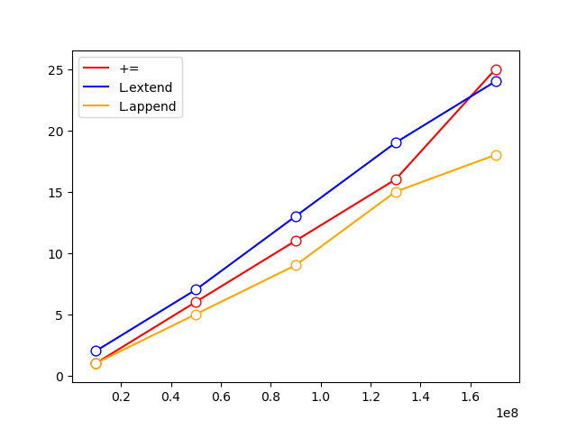

# 各类运算速度大PK
## 列表速度探索
### 列表追加元素之`L+=[x]`与`L.extend([x])`与`L.append(x)`谁更快？
结论：append更快。  
运行结果：  


代码：
```python
import datetime
import matplotlib.pyplot as mp


def get_time(fn):
    def f(*args):
        t0 = datetime.datetime.now()
        print('\nstart', t0)
        fn(*args)
        t1 = datetime.datetime.now()
        print(' end', t1, '\n运行耗时', t1-t0)
        Ltime.append((t1-t0).seconds)
    return f


@get_time
def f1(n):
    L = []
    for x in range(n):
        L += [n]


@get_time
def f2(n):
    L = []
    for x in range(n):
        L.extend([n])


@get_time
def f3(n):
    L = []
    for x in range(n):
        L.append(n)


X, y1, y2, y3 = [], [], [], []
x = 10000000
for x in range(x, 20*x, 4*x):
    Ltime = []
    f1(x)
    f2(x)
    f3(x)
    X.append(x)
    y1.append(Ltime[0])
    y2.append(Ltime[1])
    y3.append(Ltime[2])

mp.plot(X, y1, linestyle='-', label="+=", color='red')
mp.plot(X, y2, linestyle='-', label="L.extend", color='blue')
mp.plot(X, y3, linestyle='-', label="L.append", color='orange')
for y, colors in zip([y1, y2, y3], ['red', 'blue', 'orange']):
    mp.scatter(X, y,
               marker='o',  # 点型 ~ matplotlib.markers
               s=60,  # 大小
               edgecolor=colors,  # 边缘色
               facecolor='white',  # 填充色
               zorder=3  # 绘制图层编号 （编号越大，图层越靠上）
               )
mp.legend()
mp.show()
```