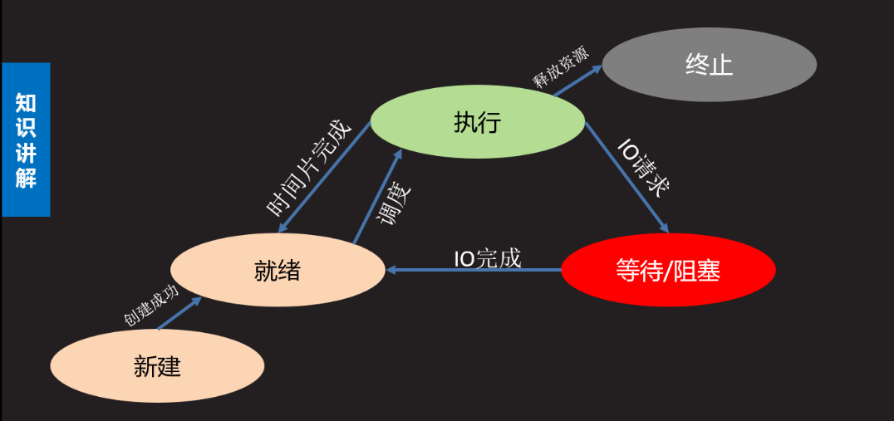
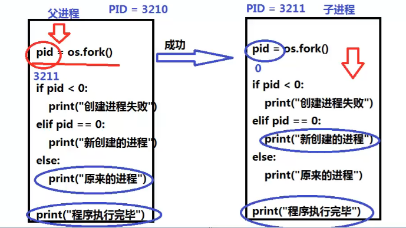
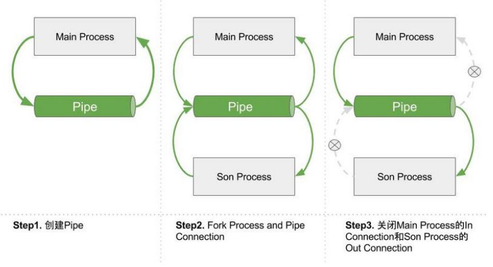
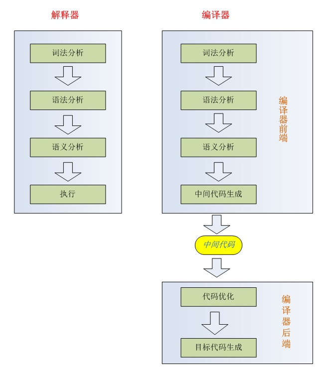

<h1>多任务编程</h1>


# 概述

学习要求 ：
> 什么是进程，进程和程序的区别  
> 了解进程的特征  
> 清楚进程的状态及状态间的转化关系  
> 并行和并发的区别，操作系统功能【操作系统完成】
> 编写一个程序，能够同时执行多个任务。同时需要在程序运行过程中，根据情况创建进程。

## 实现意义与方式

意义 ：  
> 充分利用计算机的资源提高程序的运行效率

定义 ：  
> 通过应用程序利用计算机多个核心，达到同时执行多个任务的目的。

通常：  
> 单线程-单线程

实施方案 ：  
> 单进程 - 多线程  
> 多进程 - 单线程  
> 多进程 - 多线程

## 基本概念

### 并行和并发

并行 ：  
> 多个计算机核心在同时处理多个任务，多个任务之间是并行关系

并发 ：  
> 计算机同时处理多个任务，内核在多个任务间不断切换，达到好像在同时处理的运行效果。此时多个任务实际为并发关系  
> 【此处缺图，后台切换到前台等需求，单核处理？】

### 进程和线程

#### 进程

-   进程：  
> 程序在计算机中运行一次的过程 【进程是程序的一次运行实例】

- 程序和进程区别：

> 程序：是一个可执行文件，是静态的，占有磁盘，不占有计算机运行资源  
> 进程：是一个动态的过程描述，占有cpu内存等计算机资源的，有一定的生命周期  
> 同一个程序的不同执行过程是不同的进程，因为分配的计算机资源等均不同

#### 线程

什么是线程？  
> 线程也是一种多任务编程的方式，可以使用计算机多核资源。线程又被称为轻量级的进程

线程特征  
> \* 一个进程可以包含多个线程  
> \* 线程是计算机核心分配的最小单位  
> \* 线程也是一个运行过程，也要消耗计算机资源。  
> \* 多个线程之间共享同一进程的资源和空间。  
> \* 线程也拥有自己特有的资源属性，比如指令集，TID等  
> \* 线程无论创建还是删除还是运行资源消耗都小于进程  
> \* 多个线程之间并行执行，互不干扰

### cpu时间片 ：  
> 如果一个进程占有计算机核心，我们称为该进程在cpu时间片上。多个任务实际对cpu会进行争夺，一般由操作系统分配cpu时间片

理解：

> cpu对于进程的处理是以时序的形式处理的，也就是时间片段内处理可执行的线程（进程中可执行的最小单元），操作系统并发执行是多个进程在一段时间内交错执行的。不考虑超线程的话，4核应该是只有4个线程在执行的，也就是4个进程。  
> ——廖雪峰笔记 \> Python3 \> 进程和多线程 \> 多进程 \> 评论区

### PCB（进程控制块）：  
> 在操作系统中，进程创建后会自动产生一个空间存放进程信息，称为进程控制块。

应用层：  
> 自己的理解：


# 进程基本介绍
## 进程的状态：三态和五态

> 三态  
> \* 就绪态：进程具备执行条件，等待系统分配cpu  
> \* 运行态：进程占有cpu处理器，处于运行状态  
> \* 等待态：进程暂时不具备运行条件，需要阻塞等待  
> 五态 （增加新建态和终止态）  
> \* 新建态 ： 创建一个新的进程，获取资源的过程  
> \* 终止态 ： 进程结束释放资源的过程



## 进程信息查看（Linux）

进程信息包括进程PID ,进程占有的内存位置，创建时间，用户......

进程 PID :  
> 进程在操作系统中的唯一编号（大于0整数），由系统自动分配

### 进程信息查看

查看进程树（process）：  
> 查看进程树： `pstree`  
> 查看父进程PID ： `ps -ajx`

查看进程状态：  
> `ps -aux` ---\> STAT一列可查看进程状态  
> D 等待态 （不可中断等待）  
> S 等待态 （可中断等待）  
> T 等待态 （暂停状态）  
> R 运行态 （就绪态 运行态）  
> Z 僵尸态  
> \+ 前台进程  
> \< 高优先级  
> N 低优先级  
> l 有子进程的（有进程链接）  
> s 会话组组长(zuzhang)

### 进程优先级查看

优先级决定了一个进程的执行权限和占有资源的优先程度

查看进程优先级  
> `top` ： 动态的查看进程优先级 `< >` 翻页【NI那一列代表优先级】  
> 取值范围：-20~19，-20优先级最高  
> `nice` ： 指定优先级运行程序  
> e.g.   
> `nice -9 ./while.py 9` 优先级  
> `sudo nice --9 ./while.py -9` 优先级（小于0需要加入sudo）

## 进程特征  

> \* 进程是操作系统分配计算机资源的最小单位  
> \* 每个进程都有自己单独的虚拟内存空间。
> \* 进程间的执行相互独立，互不影响  
> 
> 

具体是指虚拟内存地址，分配足够的地址保证程序正常运行

## 进程的创建流程

> 1.【运行程序，发起请求】用户空间运行一个程序，发起进程创建  
> 2.【接受请求，创建进程】操作系统接受用户请求，开启进程创建  
> 3.【分配资源，确认运行】操作系统分配系统资源，确认进程状态  
> 4.【提供应用】将创建好的进程提供给应用层使用  
> 
> 

### os.fork()创建子进程方法
仅在Linux中能够使用，Windows没有fork调用，上面的代码在Windows上无法运行。Mac系统是基于BSD（Unix的一种）内核，也能使用。

```python
import os  
pid = os.fork()  
功能：
    创建一个新的进程  
参数：
    无  
返回值：
    失败 返回一个负数 -1  
    成功 在原有进程中返回新的进程的 PID  
         在新的进程中返回 0
```

理解：  
> \* 子进程会复制父进程的全部数据，在内存中开辟新空间执行。【相当于复制打开了一份新文件执行】  
> \* 子进程从fork的下一句开始执行  
> \* 父子进程通常会根据fork返回值的差异选择执行不同的代码 （使用if结构）  
> \* 父子进程在执行上互不干扰，执行顺序不确定  
> \* 子进程虽然复制父进程内存空间，但是有自己的特性，比如PID号，PCB等  
> \* 父子进程空间独立，各自修改各自的内容，互不影响

- 实例：fork创建子进程



```python
import os
from time import sleep

a = 1
print("fork之前的部分只有父进程执行")

pid = os.fork()

if pid < 0:
    print("创建进程失败")
elif pid == 0:
    print("**************")  # 子进程执行fork之后的部分，此部分可自定义函数
    print("新创建的进程")
    sleep(1)
    print("a = ", a)
    a = 10000
else:
    sleep(2)
    print("==============")  # fork之前的部分只有父进程执行
    print("原来的进程")
    print("parent a = ", a)

print("程序执行完毕")
```
运行结果：
```
fork之前的部分只有父进程执行
**************
新创建的进程
a =  1
程序执行完毕
==============
原来的进程
parent a =  1
程序执行完毕
```
此实例可以看出父子进程之间数据独立不共享。

## 父子进程

### 父子进程：  
> 在系统中除了初始化进程每个进程都有一个父进程，可能有0个或者多个子进程。由此形成父子进程关系。我们认为每个进程都是父进程发起请求创建的。  
> 【比如计算机开机，上电，初始化程序，加载操作系统。。。】

### 孤儿进程：   
> 父进程先于子进程退出，此时子进程就会成为孤儿进程。  
> 孤儿进程会被系统指定的进程收养，即系统进程会成为该孤儿进程新的父进程。孤儿进程退出时该父进程会处理退出状态  
> 【换言之，孤儿进程退出不会成为僵尸进程】

示例：  
```python
import os,sys 
from time import sleep 

pid = os.fork()

if pid < 0:
    print("create process failed")
elif pid == 0:
    print("父进程pid:",os.getppid())
    sleep(2)
    print("父进程PID:",os.getppid())
else: 
    sleep(1)
    print("Parent PID:",os.getpid())
    sys.exit("父进程退出")
```

### 僵尸进程：   
> 子进程先于父进程退出，父进程没有处理子进程退出状态，此时子进程成为僵尸进程  
> 僵尸进程已经结束，但是会滞留部分PCB信息在内存，大量的僵尸会消耗系统资源，应该尽量避免。  
> 【避免方法见os模块 wait() 方法】

示例：产生僵尸进程  
```python
# fork_z.py
import os
import sys
from time import sleep

pid = os.fork()

if pid < 0:
    print("create process failed")
elif pid == 0:
    print("子进程ＰＩＤ:", os.getpid())
    sleep(3)
    sys.exit("子进程退出")
else:
    sleep(1)
    while True:
        sleep(1)
        pass

"""
$ python3 Untitled-1.py 

# 第一秒变化为：
子进程ＰＩＤ: 145

$ ps xf  # 另一个窗口
    9 tty1     Ss     0:00 /init
   10 tty1     S      0:00  \_ -bash
  144 tty1     S      0:00      \_ python3 Untitled-1.py
  145 tty1     S      0:00          \_ python3 Untitled-1.py


# 第三秒变化为：
子进程ＰＩＤ: 145
子进程退出

$ ps xf  # 另一个窗口
    9 tty1     Ss     0:00 /init
   10 tty1     S      0:00  \_ -bash
  144 tty1     S      0:00      \_ python3 Untitled-1.py
  145 tty1     Z      0:00          \_ [python3] <defunct>
"""
```

### 僵尸进程的处理
- 如何处理僵尸进程？方法可以概括为两种：  
  1. 父进程处理子进程退出状态  
  2. 父进程先退出

#### 方法1：父进程处理子进程退出状态，wait( )和waitpid( )捕获子进程推出状态

```C
pid, status = os.wait()
功能：
    在父进程中阻塞等待处理子进程的退出
    【默认为一个阻塞函数】
返回值：
    pid    退出的子进程的PID号
    status 子进程的退出状态

pid, status = os.waitpid(pid, option)
功能：
    同wait
参数：
    pid   -1 表示任意子进程退出
          >0 整数，指定PID号的子进程退出
    option 0 表示阻塞等待
           os.WNOHANG 表示非阻塞
返回值：
    同wait

waitpid(-1, 0) == wait()
```

实例1：os.wait( )阻塞避免僵尸进程

实例说明：  
> 让子进程 os._exit(2)  
> 主进程中执行 pid,status = os.wait()  
> os.WEXITSTATUS(status)  获取退出状态  
> pid, status = os.wait()  阻塞获取子进程信息：PID和status的状态 

文件：
```python
import os
from time import sleep

pid = os.fork()

if pid < 0:
    print("create process failed")
elif pid == 0:
    sleep(3)
    print("Child process over")
    os._exit(2)
else:
    # 等子进程执行完毕
    pid, status = os.wait()
    print("++++++++++++++++++++")
    print(pid, status, type(pid), type(status))
    print(os.WEXITSTATUS(status))  # 获取退出状态, 返回子进程的退出码
    while True:  # 保留进程运行，方便查看进程树
        pass
```

运行结果：  
```
Child process over
++++++++++++++++++++
45 512 <class 'int'> <class 'int'>
2
```

实例2：os.waitpid( )非阻塞方法避免僵尸进程

实例说明：  
> pid, status = os.waitpid(-1,os.WNOHANG)非阻塞获取子进程信息：PID和status的状态，因而需要sleep一秒等待子进程创建。  
> os.WEXITSTATUS(status)获取退出状态可以判断主程序中是否继续执行后续语句。

```python
import os
import sys
from time import sleep

pid = os.fork()

if pid < 0:
    print("create process failed")
elif pid == 0:
    sleep(3)
    print("子进程ＰＩＤ:", os.getpid())
    sys.exit(3)
else:
    # 等待子进程退出
    while True:
        sleep(1)
        pid, status = os.waitpid(-1, os.WNOHANG)
        print(pid, status)
        if os.WEXITSTATUS(status):
            break
        print("do something others")
    while True:
        pass
```

运行结果：  
```
0 0
do something others

0 0
do something others

子进程ＰＩＤ: 51
0 0
do something others

51 768
```

#### 方法2：让父进程先退出——创建二级子进程

创建二级子进程  
> 1. 父进程创建子进程等待子进程退出  
> 2. 子进程创建二级子进程，然后马上退出  
> 3. 二级子进程成为孤儿，处理具体事件

实例：使用二级子进程退出父进程

实例说明：  
> 主进程中用wait()处理等待一级子进程，  
> 在一级子进程退出后，  
> 二级子进程（还在执行）变为孤儿进程，孤儿进程退出会被系统自动处理，因而可以完美解决僵尸进程

理解：


代码：
```python
# 创建二级子进程
import os
from time import sleep


def fun1():
    sleep(3)
    print("第一件事情")


def fun2():
    sleep(4)
    print("第二件事情")


pid = os.fork()

if pid < 0:
    print("Create process error")
elif pid == 0:
    # 创建二级进程
    pid0 = os.fork()
    if pid0 < 0:
        print("创建二级进程失败")
    elif pid0 == 0:
        fun2()  # 做第二件事
    else:
        os._exit(0)
else:
    pid, status = os.wait()
    print(pid, status)
    print('一级子进程退出状态：', os.WEXITSTATUS(status))  # 获取退出状态
    fun1()  # 做第一件事
```
运行代码：
```
164 0
一级子进程退出状态： 0
第一件事情
第二件事情
```

## 进程os相关函数总结

-   导入模块：  
> import os  
> pid = os.fork()

-   获取PID：
> os.getpid()  
> 功能：获取当前进程的PID号  
> 返回值：返回PID号  
> 
> 示例：  
> print(os.getpid())  \#子进程中获取子进程PID，父进程中获取父进程PID

-   获取PPID：
> os.getppid()  
> 功能 ： 获取父进程的进程号  
> 返回值 ： 返回PID号
>
> 示例：  
> print("Parent PID",os.getppid()) \#子进程中获取父进程PID  
> print("Child PID",pid) \#父进程中获取子进程PID


-   退出程序：

    > os._exit(status)  
    > **功能：** 直接退出进程  
    > **参数：** 进程的退出状态 整数

    > sys.exit([status])  
    > **功能：** 会抛出一个异常: SystemExit，如果这个异常没有被捕获，那么python解释器将会退出。如果有捕获该异常的代码，那么这些代码还是会执行。  
    > **参数：** 默认为0 如果是整数则表示退出状态  
    > 如果是字符串则表示退出时打印内容  
    > \* sys.exit 可以通过捕获SystemExit异常阻止退出


# 进程multiprocessing操作模块

multiprocessing 模块的用法：

1）Process创建进程类

2）Pool()进程池技术

3）进程间通信技术

如：Pipe管道通信、Value和Array开辟共享内存通信、signal信号通信、

Process( )创建进程类
--------------------

总结：  
> multiprocessing.Process( )进程对象属性  
> p.name  
> p.pid  
> p.daemon

### 起源

出现的可能原因：

跨平台：

如果你打算编写多进程的服务程序，Unix/Linux无疑是正确的选择。由于Windows没有fork调用，难道在Windows上无法用Python编写多进程的程序？

由于Python是跨平台的，自然也应该提供一个跨平台的多进程支持。multiprocessing模块就是跨平台版本的多进程模块。

multiprocessing模块提供了一个Process类来代表一个进程对象  
> 1. 需要将要做的事件封装为函数  
> 2. 使用multiprocessing中提供的Process类创建进程对象  
> 3. 通过进程对象和Process 初始化函数对进程进行设置，并且绑定要执行的事件  
> 4. 启动进程，会自动执行相关联函数  
> 5. 事件完成后回收进程

### Process()创建进程对象

-   常用方法：  
> 通常使用multiprocessing创建进程，  
> 父进程只用作进程的创建和回收，不做其他工作。

Process()  
> 功能 ： 创建进程对象  
> 参数 ： name : 给创建的进程起一个名字  
> 默认Process-1  
> target : 绑定的函数  
> args ： 元组 给target函数按照位置传参  
> kwargs ： 字典 给target函数按照键值出传参

示例：  
> **def run_proc**(name):...  
> p = Process(target=run_proc, args=('test',))

p.start()  
> 功能： 启动进程，此时进程被创建。自动运行进程函数

p.join([timeout])  
> 功能 ： 阻塞等待回收响应的进程  
> 参数 ： 超时时间

说明：  
> \* multiprocessing创建进程是原来进程的子进程，创建后父子进程各自执行互不影响  
> \* 子进程同样是复制父进程的空间，子进程对内容的修改不会影响父进程空间  
> \* join回收子进程，会有效的阻止僵尸进程产生

创建子进程时，只需要传入一个执行函数和函数的参数，创建一个Process实例，用start()方法启动，这样创建进程比fork()还要简单。

join()方法可以等待子进程结束后再继续往下运行，通常用于进程间的同步。

### 属性：multiprocessing 进程对象属性  
> p.start() 启动进程  
> p.join() 回收进程  
> p.is_alive() 判断进程生命周期状态 返回True False  
> p.name 进程名称 默认为Process-1 如果起名字则为自定义名称  
> p.pid 创建的进程的PID  
> p.daemon  
> 默认值为False 父进程退出不会影响子进程运行  
> 如果设置为True 则父进程退出子进程也会退出  
> \* daemon的设置必须在start前  
> \* 如果设置daemon为True 则不再使用join

### 创建自己的进程类  
> 1. 继承Process类  
> 2. 重写__init_\_ 并且调用父类的__init_\_  
> 3. 重写run方法，此时生成对象后 调用start就会自动运行run  
> from multiprocessing import Process  
> import time  
> class ClockProcess(Process):  
> def \__init__(self,value):  
> \#调用父类的__init_\_  
> super().__init__()  
> self.value = value  
> \#重写run方法  
> def run(self):  
> for i in range(5):  
> time.sleep(self.value)  
> print("The time is {}".\\  
> format(time.ctime()))  
> \#用自己的类创建进程对象  
> p = ClockProcess(2)  
> \#自动执行run　  
> '''  
> def start(self):  
> self.run()  
> '''  
> p.start()  
> p.join()

### 实例【Linux下正常运行】

#### 【实例3.3.1】：Process( )创建子进程

实例说明：

感悟：  
> 用Process创建子进程  
> 实际过程是创建一个子进程函数，参数为函数名target，和传参值args（必须为元组）  
> p = mp.Process(target = fun, args=('test',)) \# 创建进程对象  
> 子进程空间独立不影响主进程a的值  
> 必须用start、join操作进程  
> p.start() \# 启动进程  
> p.join() \# 回收进程

文件：

运行结果：  
> 1  
> ===================  
> 11240  
> 这是父进程  
> 子进程事件  
> ===================  
> 1

#### 【实例3.3.1】：Process( )创建多个子进程

实例说明：  
> 亮点：  
> 使用for循环进行进程的启动和回收。  
> for th in things:  
> p = Process(target = th)  
> process.append(p) \#保存进程对象  
> p.start()  
> for p in process:  
> p.join()

文件：

运行结果：  
> 睡觉  
> 4736 ---- 4740  
> 吃饭  
> 4736 ---- 4739  
> 打豆豆  
> 4736 ---- 4741

#### 【实例3.3.1】：Process( )创建的子进程属性获取

实例说明：  
> \#判断进程状态  
> print("is alive :",p.is_alive())  
> \#进程名  
> print("process name:",p.name)  
> \#子进程ＰＩＤ  
> print("process PID:",p.pid)

文件：

运行结果：  
> is alive : True  
> process name: Worker  
> process PID: 4867  
> I'm Levi  
> I'm working.....  
> I'm Levi  
> I'm working.....  
> I'm Levi  
> I'm working.....

#### 【实例3.3.1】：设置p.daemon主程序退出控制子程序运行

实例说明：  
> \#在start前设置daemon为ｔｒｕｅ  
> p.daemon = True

文件：

运行结果：

Pool( )进程池技术
-----------------

总结：  
> Pool() 创建进程池  
> apply_async() 添加事件  
> close() 关闭进程池  
> join（）回收  
> map()

注意事项：  
> Python中创建的子进程运行的报错信息是无法看见的，慎用。可用异常处理，参考  
> ——python3中子进程不报错的问题 - wmyycsdn的博客 - CSDN博客  
> <https://blog.csdn.net/wmyycsdn/article/details/77744711>

### 背景

-   起源

产生原因：  
> 如果有大量任务需要多进程完成，且可能需要频繁的创建和删除进程，给计算机带来大量的资源消耗。

原理：  
> 【进程数量限制】在进程池内运行一定数量进程，  
> 【如何限制？进程池队列】通过这些进程完成进程池队列中的事件，  
> 直到事件执行完毕，减少进程不断的创建删除过程。

-   多进程优缺点  
> 优点 : 能并行执行多个任务，提高效率  
> 创建方便，运行独立，不受其他进程影响  
> 数据安全  
> 缺点 ： 进程的创建和删除都需要消耗计算机的资源

### 实施操作方法：  
> 1. 创建进程池，在进程池中放入适当进程  
> 2. 将事件加入到进程池队列  
> 3. 事件不断运行，直到所有事件运行完毕  
> 4. 关闭进程池，回收进程

-   注意事项  
> 进程池创建必须放在 if \__name_\_ = "__main__" 目录下  
> from multiprocessing import Pool  
> pool = Pool(processes)  
> 功能 ： 创建进程池对象  
> 参数 ： 表示进程池中有多少进程，Pool的默认大小是CPU的核数  
> pool.apply_async(func，args,kwds)  
> 功能 ： 将事件放入进程池队列  
> 参数 ： func 要执行的事件  
> args 给func用元组传参  
> kwds 给func用字典传参  
> 返回值 ： 返回事件对象，通过get()方法获取事件函数返回值  
> pool.apply(func，args,kwds)  
> 功能 ： 将事件放入进程池队列  
> 参数 ： func 要执行的事件  
> args 给func用元组传参  
> kwds 给func用字典传参  
> pool.close()  
> 功能 ： 关闭进程池，不能再添加新的事件  
> pool.join()  
> 功能 ： 阻塞等待回收进程池  
> pool.map(func,iter)  
> 功能 ： 将要完成的事件放入进程池  
> 参数 ： func 要完成的事件函数  
> iter 可迭代对象给func传参  
> 返回值 ： 事件函数的返回值列表

cookie

获取文件大小

os.path.getsize(path)

功能 ： 获取一个文件的大小

参数 ： 文件

### 【实例3.3.2】：pool创建运行多进程

实例说明：  
> p = Pool(4)代表只能先同时运行4个事件  
> p.apply_async(long_time_task  ,> args=(i,))添加前4个事件后立即同时执行，第5个“Run Task 4”是之后执行。  
> 结果出现方式：task 0 – 3 是一次性打印出现的。task 4 是之后打印。  
> 第一次运行结果“Task 4 runs 2.7  2> seconds.”顺序在Task3、2之后，第二次运行结果“Task 4 runs 1.8  1> seconds.”在主程序运行两秒之后，才打印，说明运行滞后，更加验证了这个问题。

文件：[代码4-多任务编程\\5-1poll.py](https://d.docs.live.net/417d2b113b64f287/Tree%20of%20knowledge/特训学习/代码4-多任务编程/5-1poll.py)

运行：所有平台软件都可正常执行，但windows中不能看到动态过程

第1次运行结果：  
> Parent process 7950.  
> Waiting for all subprocesses done...  
> Run task 0 (7952)...  
> Run task 1 (7955)...  
> Run task 2 (7954)...  
> Run task 3 (7953)...  
> Task 1 runs 1.70 seconds.  
> Run task 4 (7955)...  
> Task 0 runs 1.75 seconds.  
> 主程序运行了2s  
> Task 3 runs **2.79** seconds.  
> Task 2 runs **2.89** seconds.  
> Task 4 runs 2.72 seconds.  
> All subprocesses done.

运行结果2：  
> Parent process 9423.  
> Waiting for all subprocesses done...  
> Run task 0 (9426)...  
> Run task 1 (9425)...  
> Run task 2 (9428)...  
> Run task 3 (9427)...  
> Task 3 runs 0.64 seconds.  
> Run task 4 (9427)...  
> Task 1 runs 0.81 seconds.  
> Task 2 runs 1.78 seconds.  
> Task 0 runs 1.89 seconds.  
> 主程序运行了**2s**  
> Task 4 runs 1.81 seconds.  
> All subprocesses done.

### 【实例3.3.2】：pool的深入理解——并发与返回结果

实例说明：  
> 探索到pool的运行机制。更深入的理解并发运行，一次打印的数量。  
> 返回的是一个事件对象，用p.get()可返回函数的return结果  
> pool = Pool(processes = 4)设置一次同时运行4个事件  
> 结果出现方式：  
> 每4个打印一次，统一2秒后出现，比如一开始3、0、2、1，随后7、4、5、6。

文件：

第一次运行结果：  
> hello 3  
> hello 0  
> hello 2  
> hello 1  
> hello 7  
> hello 4  
> hello 5  
> hello 6  
> hello 9  
> hello 8  
> hello 0over  
> hello 1over  
> hello 2over  
> hello 3over  
> hello 4over  
> hello 5over  
> hello 6over  
> hello 7over  
> hello 8over  
> hello 9over

### 【实例3.3.2】：pool.map( )实现并发运行，返回列表

实例说明：  
> 重点：  
> 1并发运行  
> 前四句“执行　pool map事件”第一次打印，剩余第二次  
> 2返回列表  
> r = pool.map(fun,range(6))  
> print("返回值列表r",r)

文件：[代码4-多任务编程\\4-5poll_map.py](https://d.docs.live.net/417d2b113b64f287/Tree%20of%20knowledge/特训学习/代码4-多任务编程/4-5poll_map.py)

运行结果：  
> 执行　pool map事件  
> 执行　pool map事件  
> 执行　pool map事件  
> 执行　pool map事件  
> 执行　pool map事件  
> 执行　pool map事件  
> 返回值列表r [0, 1, 4, 9, 16, 25]

进程通信
--------

Pipe、Queue、Value、Array、...

（进程间通信）

-   总结：  
> 管道： Pipe() --\> fd1,fd2 recv() send()  
> 消息队列： Queue() q.get() q.put() q.full()  
> q.empty() q.qsize() q.close()  
> 共享内存： Value() obj.value  
> Array() shm[]  
> 套接字

-   起源：  
> 进程间由于空间独立，资源无法互相直接获取，此时在不同的进程间进行数据传递就需要专门的通信方法

-   进程间通信方法（IPC）

管道 消息队列 共享内存 信号 信号量 套接字

-   对比

|          | 管道               | 消息队列 | 共享内存                   |
|----------|--------------------|----------|----------------------------|
| 开辟空间 | 内存               | 内存     | 内存                       |
| 读写方式 | 两端读写 双向/单向 | 先进先出 | 操作覆盖内存               |
| 效率     | 一般               | 一般     | 较快                       |
| 应用     | 多用于两端         | 使用广泛 | 复杂，需要通信同步互斥机制 |

Pipe的读写效率要高于Queue。

### Pipe管道通信 

管道 ：  
> 在内存中开辟一段空间，形成管道结构，管道对多个进程可见，进程可以对管道进行读写操作

multiprocess ---》 Pipe  
> fd1,fd2 = Pipe(duplex = True)  
> 功能 ： 创建一个管道  
> 参数 ： 默认为双向管道  
> 如果设置为False 则为单向管道  
> 返回值 ：如果双向管道，fd1 fd2都可以进行读写操作  
> 如果是单向管道，则fd1 只可读，fd2只可写  
> fd.recv()  
> 功能 ： 从管道读取内容  
> 返回值 ： 读到的内容  
> \* 如果管道无内容则阻塞  
> fd.send(data)  
> 功能： 向管道写入内容  
> 参数： 要发送的内容  
> \* 几乎可以发送所有python支持的数据

【我的理解，管道相当于一个缓冲区】

Pipe的读写效率要高于Queue。

python 学习笔记 - Queue & Pipes，进程间通讯 - helloword - SegmentFault 思否

<https://segmentfault.com/a/1190000008122273>

原理示意图如下：



#### 【实例3.3.3.1】：Pipe

实例说明：  
> **主要步骤：**  
> **1）定义管道**  
> fd1,fd2 = Pipe(False)  
> **2）发送内容（子进程）**  
> def fun(name):  
> fd2.send({'a':1,'b':2})  
> p = Process(target = fun,args = (i,))  
> p.start()  
> **3）读取管道（主进程）**  
> data = fd1.recv()

文件：

运行结果：  
> {'b': 2, 'a': 1}  
> {'b': 2, 'a': 1}  
> {'b': 2, 'a': 1}  
> {'b': 2, 'a': 1}  
> {'b': 2, 'a': 1}

### Queue消息队列 

队列 ： 先进先出  
> 在内存中开辟队列结构空间，多个进程可以向队列投放消息，在取出的时候按照存入顺序取出  
> from multiprocessing import Queue

创建队列  
> q = Queue(maxsize = 0)  
> 功能 ： 创建队列  
> 参数 ： maxsize 默认表示根据系统分配空间存储消息  
> 【如果不提供maxsize，则队列数无限制。】  
> 如果传入一个正整数则表示最多存放多少条消息  
> 返回 ： 队列对象  
> q.put(data,[block,timeout])  
> 功能： 存放消息  
> 参数： data 存入的消息 （python数据类型）  
> block 默认为True表示当队列满的时候阻塞  
> 设置为False则表示非阻塞  
> timeout 当block为True表示超时时间  
> data = q.get([block,timeout])  
> 功能 ： 取出消息  
> 参数 ： block 默认为True 当队列空时阻塞  
> 设置为False表示非阻塞  
> timeout 当block为True时表示超时时间  
> 返回值 ： 返回获取的消息  
> q.full() 判断队列是否为满  
> q.empty() 判断队列是否为空  
> q.qsize() 判断当前队列有多少消息  
> q.close() 关闭队列

#### 【实例3.3.3.2】1：Queue

实例说明：

感悟：  
> Queue类似于

重点：  
> 利用队列存入数据put()，  
> 取出数据get()，  
> empty()判断空  
> full()判断满  
> qsize()判断队列有多少信息

文件：

运行结果：  
> 见文件注释

#### 【实例3.3.3.2】2：Queue

实例说明：  
> 不给参数的效果。  
> \#创建消息队列，无数量限制的数列  
> q = Queue()

文件：

运行结果：  
> 见文件

### Value、Array共享内存

-   共享内存

**基本特点：**  
> （1）共享内存是一种最为高效的进程间通信方式，进程可以直接读写内存，而不需要任何数据的拷贝。  
> （2）为了在多个进程间交换信息，内核专门留出了一块内存区，可以由需要访问的进程将其映射到自己的私有地址空间。进程就可以直接读写这一块内存而不需要进行数据的拷贝，从而大大提高效率。（文件映射）  
> （3）由于多个进程共享一段内存，因此也需要依靠某种同步机制。

**优缺点：**  
> 优点： 快速在进程间传递数据  
> 缺点： 数据安全上存在风险，内存中的内容会被其他进程覆盖或 者篡改

**注：** 经常和同步互斥配合使用

-   共享内存使用方法

在内存中开辟一段空间，存储数据，对多个进程可见。每次写入共享内存中的数据会覆盖之前的内容

共享内存要符合C语言的使用语法  
> Value：将一个值存放在内存中，  
> Array：将多个数据存放在内存中，但要求数据类型一致  
> from multiprocessing import Value , Array

Value()  
> from multiprocessing import Value  
> obj = Value(ctype,obj)  
> 功能 ： 开辟共享内存空间  
> 参数 ： ctype 字符串 要转变的c的数据类型  
> 对比类型对照表  
> obj 共享内存的初始化数据  
> 返回 ： 共享内存对象  
> obj.value 表示共享内存中的值。对其修改或者使用即可

Array()  
> from multiprocessing import Process,Array  
> obj = Array(ctype,obj)  
> 功能： 开辟共享内存  
> 参数： ctype 要转化的c的类型  
> obj 要存入共享内存的数据【或开辟空间数】  
> 1列表 将列表存入共享内存，数据类型一致  
> 2正整数 表示开辟几个数据空间

补充：数据类型ctype

| Type code | C Type             | Python Type       | Minimum size in bytes | Notes |
|-----------|--------------------|-------------------|-----------------------|-------|
| 'c'       |                    |                   |                       |       |
| 'b'       | signed char        | int               | 1                     |       |
| 'B'       | unsigned char      | int               | 1                     |       |
| 'u'       | Py_UNICODE         | Unicode character | 2                     | (1)   |
| 'h'       | signed short       | int               | 2                     |       |
| 'H'       | unsigned short     | int               | 2                     |       |
| 'i'       | signed int         | int               | 2                     |       |
| 'I'       | unsigned int       | int               | 2                     |       |
| 'l'       | signed long        | int               | 4                     |       |
| 'L'       | unsigned long      | int               | 4                     |       |
| 'q'       | signed long long   | int               | 8                     | (2)   |
| 'Q'       | unsigned long long | int               | 8                     | (2)   |
| 'f'       | Float              | float             | 4                     |       |
| 'd'       | Double             | float             | 8                     |       |  
> 其他笔记  
> Array(‘i’, range(10))中的‘i’参数：  
> ‘c’: ctypes.c_char  
> ‘u’: ctypes.c_wchar  
> ‘b’: ctypes.c_byte  
> ‘B’: ctypes.c_ubyte  
> ‘h’: ctypes.c_short  
> ‘H’: ctypes.c_ushort  
> ‘i’: ctypes.c_int  
> ‘I’: ctypes.c_uint  
> ‘l’: ctypes.c_long,  
> ‘L’: ctypes.c_ulong  
> ‘f’: ctypes.c_float  
> ‘d’: ctypes.c_double

#### 【实例3.3.3.3.e.g.1】：Value( )共享内存

实例说明：  
> 使用关键字Value，Process，  
> money = Value('i',2000)表示将int类型的值2000绑定给变量money

random.randint(a,b)

函数返回数字 N ，N 为 a 到 b 之间的数字（a \<= N \<= b），包含 a 和 b。

文件：

运行结果：  
> 某个数

#### 【实例3.3.3.3.e.g.2】：Array( )共享内存

实例说明：

感悟：  
> 可以将共享内存视为一个数组。

重点：  
> 两种共享内存的方法  
> \#创建共享内存，存入列表　  
> shm = Array('i',[1,2,3,4,5])  
> shm = Array('c',b'hello') \# 实质也是存入字符串列表  
> \#表示开辟５个空间  
> shm = Array('i',5)

文件：
[代码4-多任务编程\\3.3.3.3-array.py](https://d.docs.live.net/417d2b113b64f287/Tree%20of%20knowledge/特训学习/代码4-多任务编程/3.3.3.3-array.py)  
> from multiprocessing import Process, Array  
> import time  
> \# 支持bytes格式字符串  
> shm = Array('c', b'hello')  
> print(shm) \# 返回内存地址  
> for i in shm:  
> print(i)  
> shm[0] = b'H'  
> \# 得到整个共享内存中的数据  
> print(shm.value)

运行结果：  
> 0  
> 0  
> 0  
> 0  
> 0  
> =================  
> 0  
> 0  
> 0  
> 1000  
> 0

### 信号（signal模块）  
> 一个进程向另一个进程通过信号传递某种讯息，接收方在接收到信号后进行相应的处理

查看信号： kill -l

kill -signum PID 给PID的进程发送一个信号

-   关于信号

信号名称 ： 信号的名字或者数字

信号含义 ： 信号的作用

默认行为 ： 当一个进程接收到信号时采取的行为

终止进程， 暂停进程，忽略产生

e.g.  
> SIGHUP 终端断开  
> SIGINT ctrl + c  
> SIGQUIT ctrl + \\  
> SIGTSTP ctrl + z  
> SIGKILL 终止进程且不能被处理  
> SIGSTOP 暂停进程且不能被处理  
> SIGALRM 时钟信号  
> SIGCHLD 子进程状态改变发给父进程

-   通过python进行信号处理  
> os.kill(pid,sig)  
> 功能 ： 发送信号给某个进程  
> 参数 ： pid 给哪个进程发送信号  
> sig 要发送什么信号  
> signal.alarm(sec)  
> 功能 ： 一定时间后给自身发送一个 SIGALRM信号  
> 参数 ： 指定时间  
> \* 一个进程中只能设置一个时钟，第二个时钟会覆盖之前的时间

程序执行的同步和异步：

同步 ： 按照步骤一步一步顺序执行

异步 ： 在程序执行中利用内核，不影响应用层程序持续执行

\* 信号是唯一的异步通信方式  
> signal.pause()  
> 功能： 阻塞等待一个信号的发生  
> signal.signal(signum,handler)  
> 功能 ： 处理信号  
> 参数 ： signum : 要处理的信号  
> handler ： 信号的处理方法  
> SIG_DFL 表示使用默认的方法处理  
> SIG_IGN 表示忽略这个信号  
> func 自定义函数处理信号  
> def func(sig,frame):  
> pass  
> sig : 表示要处理的信号  
> frame ： 信号的结构对象  
> \* signal函数是一个异步处理函数  
> \* signal函数不能处理 SIGKILL SIGSTOP信号  
> \* 在父进程中使用signal(SIGCHLD,SIG_IGN),这样子进程退出时会有系统自动处理

#### 【实例3.3.3.4】：alarm发送信号

实例说明：

文件：

运行：

### 信号量Semaphore

给定一定的数量，对多个进程可见，并且多个进程根据信号量的多少确定不同的行为

multiprocessing ---》 Semaphore()  
> sem = Semaphore(num)  
> 功能：生成信号量对象  
> 参数： 信号量的初始值  
> 返回值： 信号量对象  
> sem.acquire() 信号量数量减1 信号量为0时会阻塞  
> sem.release() 信号量数量加1  
> sem.get_value() 获取当前信号量的值

#### 同步互斥机制

目的 ：  
> 解决对共有资源操作产生的争夺

临界资源 ：  
> 多个进程或者线程都能够操作的资源

临界区 ：  
> 操作临界资源的代码段

同步 ：  
> 是一种合作关系，为完成某个任务，多进程或者多线程之间形成一种协调。按照约定依次执行对临界资源的操作，相互告知相互促进。

互斥 ：  
> 互斥是一种制约关系，当一个进程占有临界资源就会进行加锁的操作，此时其他进程就无法操作该临界资源。知道使用的进程进行解锁操作后才能使用。

【什么意思？纳尼？】

### Event事件 

multiprocessing --》 Event  
> 创建事件对象  
> e = Event()  
> 事件阻塞  
> e.wait([timeout])  
> 事件设置  
> e.set()  
> 功能 ： 当e被set() 后 e.wait()不再阻塞  
> 事件清除  
> e.clear()  
> 功能 ： 当e被clear()后 e.wait()又会阻塞  
> 事件判断 判断当前事件对象是否被设置  
> e.is_set()

锁 Lock
-------

multiprocessing --》 Lock

0  
> 创建对象  
> lock = Lock()  
> lock.acquire() 上锁  
> lock.release() 解锁

上锁状态 ： 执行acquire（）操作会阻塞

解锁状态 ： 执行acquire（）不阻塞  
> with lock： ---\> 上锁  
> ...  
> ...

\----》 with代码段结束即解锁

subprocess模块
--------------

subprocess模块可以让我们非常方便地启动一个子进程，然后控制其输入和输出。

见

——廖雪峰笔记 \> Python3 \> 进程和多线程 \> 多进程

线程threading 模块
==================

创建线程
--------

threading 模块创建线程  
> threading.Thread()  
> 功能 ： 创建线程对象  
> 参数 ： name 线程名称  
> target 线程函数  
> args 元组 给线程函数传参  
> kwargs 字典 给线程函数传参  
> t.start() 启动线程  
> t.join([timeout]) 回收线程

线程属性 
---------

t.is_alive() 查看线程状态

t.name 线程名称 默认Thread-1 。。。。。

t.setName() 设置线程名称

threading.currentThread() 获取当前线程对象

t.daemon  
> 默认情况下，主线的结束不会影响分支线程  
> 如果设置为True 则主线程退出分支线程也会退出

设置方法：  
> t.daemon = True  
> t.setDaemon(True)

判断daemon属性：  
> t.isDaemon()  
> \* 线程daemon属性的设置在start前  
> \* 一般设置daemon后不会在使用join

创建自己的线程类
----------------

1. 继承Thread类

2. 运行Thread类中的__init__方法以获取父类属性

3. 重写run方法

threadpool

线程通信
--------

通信方法 ：  
> 多个线程共用进程空间，所以进程的全局变量对进程内的线程均可见。因此使用全局变量通信是线程主要通信方法。

注意事项 ：  
> 线程间通信更容易产生资源争夺，往往需要同步互斥机制保证通信安全

线程的同步互斥

线程的Event事件

操作：  
> e = threading.Event()  
> e.wait([timeout]) 如果e为设置状态则不阻塞，未设置则阻塞  
> e.set() 将e变为设置状态  
> e.clear() 将e设置去除

线程锁  
> lock = threading.Lock() 创建锁  
> lock.acquire() 上锁  
> lock.release() 解锁

操作原理 ：  
> 重复上锁 acquire()会阻塞

Python线程的GIL问题（全局解释器锁）  
> python --》支持多线 --》同步互斥 --》加锁 --》超级锁（给解释器加锁）

后果 ：  
> 一个解释器，同一时刻只能解释一个线程。大大降低了python多线程的执行效率。

Python 的GIL问题 解决方案  
> \* 尽量使用进程  
> \* 不使用c作为解释器 c\# java解释器  
> \  *> Python线程适用于高延迟的IO操作，网络操作，不适合cpu密集型或者传输速度很快的IO操作

注意 ： 线程遇到阻塞会让出解释器

效率测试

Line cpu: 8.739792823791504

Line IO: 3.6495778560638428

Thread cpu: 8.99168848991394

Thread IO: 3.8062639236450195

Process cpu: 4.482893943786621

Process IO: 2.1754744052886963

进程和线程的区别和联系：
========================

\* 两者都是多任务编程的方式，都能够使用计算机多核资源

\* 进程创建和删除要比线程消耗更多计算机资源。

\* 进程空间独立数据安全性好，有专门的通信方法。

\* 线程使用全局变量通信，更加简单，但是往往需要同步互斥操作

\* 一个进程可以包含多个线程，线程共享进程资源

\* 进程线程都有自己的特有属性资源，如命令、id等

使用场景:

如果需要创建较多的并发，任务比较简单，线程比较适合

如果数据操作和功能比较独立，此时使用进程比较合适

使用线程时需要考虑到同步互斥复杂程度

python线程要考虑到GIL问题

总结：

进程线程的特征

进程线程区别和关系？

同步互斥的意义，用过什么方法，什么情况下用？

进程间通信方式都知道哪些，有什么特点？

僵尸进程怎么处理，线程GIL问题怎么看？

给一个情景，问选择进程还是线程，为什么？

服务器
======

服务器模型

基本概念
--------

硬件服务器:  
> 主机 集群

厂商 :  
> IBM HP 联想 浪潮

软件服务器：  
> 编写的服务端程序，依托于硬件服务器运行，提供给用户一定的软件服务

分类 ：  
> webserver --\> 网站后端程序提供网站请求的 后端处理和响应  
> httpserver --》 处理HTTP请求，回复http响应  
> 邮箱服务器 --》 处理邮件  
> 文件服务器 --》 处理文件传输

功能 ：  
> 网络连接，逻辑处理 ，数据的交互，  
> 数据的传输，协议的实现

模型结构 ：  
> c/s (客户端服务器模型)  
> b/s （浏览器服务器模型）

服务器目标 ：  
> 处理速度快， 数据更安全，并发量大

硬件 ：  
> 更高的配置，集成分布基础，更好的网路速度，更多主机，更好的网路安全性

软件 ：  
> 程序占有更少的资源，更稳定的运行效果，更流畅的运行速度，采用更安全更合适的技术

基础的服务器模型
----------------

### 循环服务器 ：  
> 单进程程序，循环接受客户端请求，处理请求，每处理完一个请求再去接受下一个请求。  
> 优点 ：实现简单，占用资源少  
> 缺  点> ：无法同时连接多个客户端，当一个客户端长期占有服务器时，形成其他客户端无  法> 操作的情况

使用情况 ：  
> 任务比较短暂，udp套接字更合适

### 并发服务器：

同时处理多个客户端的任务请求

#### IO并发：   
> IO多路复用协程  
> 优点 ： 资源消耗少，效率较高，适用于IO类型服务器  
> 缺点 ： 不能监控cpu密集型程序，本质是单进程所以不能长期阻塞消息的收发

#### 多进程/多线程并发 ：   
> 为每一个客户端单独提供一个进程或者线程处理请求。由于进程线程执行独立所以对其他进程不会有影响  
> 优点 ： 客户端可以长期占有服务器，操作不会对其他进程线程产生影响  
> 缺点 ： 消耗资源较多

#### 多进程并发

使用fork完成并发  
> 1. 创建套接字，绑定 ，监听  
> 2. 等待接受客户端请求 accept  
> 3. 创建子进程处理客户端请求  
> 父进程继续等待其他客户端连接  
> 4. 客户端退出则子进程退出

### tftp文件服务器

功能要求：  
> \* 客户端有简单的命令提示界面  
> \* 根据提示选择相应的功能  
> 1. 查看服务器文件库的文件列表（只显示普通文件）  
> 2. 下载其中的某个文件到本地  
> 3. 可以将本地文件上传到文件库中  
> 4. 退出  
> \* 服务器需求： 1.处理客户端各种请求  
> 2.允许多个客户端同时访问操作

1. 技术分析

用什么套接字 tcp

需要什么服务器模型 多进程并发

需要注意的问题 粘包 僵尸进程

数据如何传输 文件名传输 注意粘包处理

文件传输注意传输结尾

2. 设计整体结构

要求封装为类，将功能函数写类中

class TFTPServer（）：

def \__init__():

交互套接字

def do_list()

def do_get()

def do_put()

main（）函数控制整体流程

创建套接字

接受客户端连接

创建子进程

父进程继续等待连接

cookie

os.listdir(PATH)

os.path.isfile(): 判断一个文件的类型是否为普通文件

os.path.isdir()： 判断一个文件的类型是否为目录

#### threading 的多线程并发  
> 每有一个客户端就创建一个新的线程处理客户端请求

对比多进程  
> 优点 ： 资源消耗少  
> 缺点 ： 需要处理共享资源  
> 注意GIL问题

实现步骤  
> 1. 创建套接字，绑定，监听  
> 2. 接收客户端请求，创建新的线程  
> 3. 主线程继续等待其他客户端连接，分支线程执行客户端请求  
> 4. 处理完客户端请求后，分支线程退出，关闭客户端套接字

### socket 服务器的继承模块  
> python2 SocketServer  
> python3 socketserver  
> 功能 ： 通过模块的接口完成基于多进程/多线程的tcp/udp的socket并发程序  
> 'StreamRequestHandler', 处理tcp请求  
> 'DatagramRequestHandler', 处理udp请求  
> 'ForkingMixIn', 建立多进程  
> 'ForkingTCPServer', 建立多进程tcp server  
> 'ForkingUDPServer', 建立多进程udp server  
> 'ThreadingMixIn', 建立多线程  
> 'ThreadingTCPServer', 建立多线程tcp server  
> 'ThreadingUDPServer', 建立多线程udp server  
> 'TCPServer', 建立tcp server  
> 'UDPServer', 建立udp server

### 基于多线程并发的HTTPServer  
> 1. 接收浏览器的http请求  
> 2. 对请求进行解析  
> 3. 根据解析判断请求内容  
> 4. 将要返回的内容组织http响应格式发送给客户端

升级 ：  
> \* 使用多线程并发  
> \* 增加具体请求解析  
> \* 增加数据获取功能  
> \* 封装使用类

技术实现 ：  
> threading 并发  
> tcp socket 传输  
> HTTP协议响应和请求的格式

附
==

解释器和编译器的区别：

**解释器**是一条一条的解释执行源语言。比如php，postscritp，javascript就是典型的解释性语言。

**编译器**是把源代码整个编译成目标代码，执行时不在需要编译器，直接在支持目标代码的平台上运行，这样执行效率比解释执行快很多。比如C语言代码被编译成二进制代码（exe程序），在windows平台上执行。

他们最大的**区别**是程序运行时需要解释器边解释边执行，而编译器则在运行时是完全不需要的

**解释器**的**优点**是**比较容易让用户实现自己跨平台的代码**，比如java，php等，同一套代码可以在几乎所有的操作系统上执行，而无需根据操作系统做修改；

**编译器**的目的就是生成目标代码再由连接器生成可执行的机器码，这样的话需要根据不同的操作系统编制代码，虽然有像Qt这样的源代码级跨平台的编程工具库，但在不同的平台上仍然需要重新编译连接成可执行文件，**但其执行效率要远远高于解释运行的程序。**

**——来源：解释器和编译器区别和联系 - CSDN博客**

<https://blog.csdn.net/s646575997/article/details/52577256>


