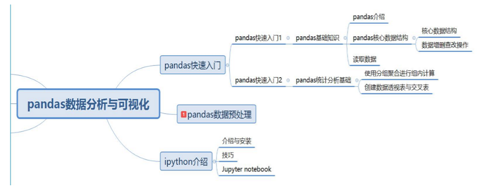
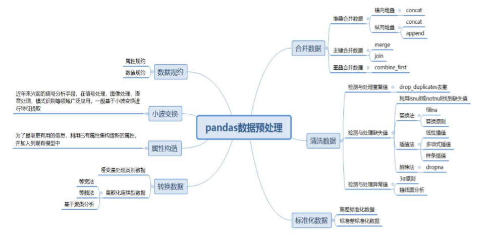
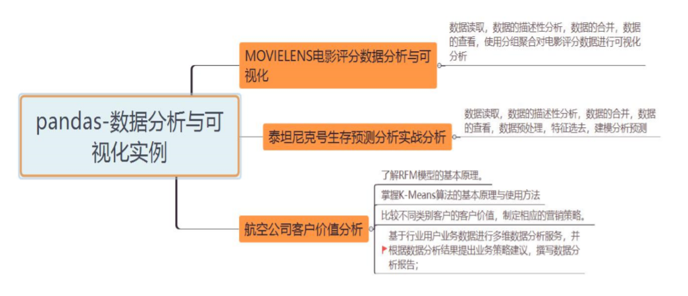

# Pandas数据分析

# 1. pandas数据分析
- 基础知识
- 统计分析基础
- Jupyter notebook介绍
- 数据预处理

## 1.1. 简介

目录：
* [Pandas数据分析](#_pandas数据分析)
* [1. pandas数据分析](#_1-pandas数据分析)
  * [1.1. 简介](#_11-简介)
  * [1.2. pandas介绍](#_12-pandas介绍)
* [2. pandas的核心数据结构](#_2-pandas的核心数据结构)
  * [2.1. Series](#_21-series)
    * [2.1.1. Series创建](#_211-series创建)
    * [2.1.2. Series查看](#_212-series查看)
  * [2.2. Dataframe](#_22-dataframe)
    * [2.2.1. Dataframe创建](#_221-dataframe创建)
    * [2.2.2. Dataframe查看](#_222-dataframe查看)
    * [2.2.3. DataFrame更新修改数据](#_223-dataframe更新修改数据)
    * [2.2.4. DataFrame增添数据](#_224-dataframe增添数据)
    * [2.2.5. DataFrame删除某列或某行数据](#_225-dataframe删除某列或某行数据)
    * [2.2.6. 对DataFrame数据进行排序](#_226-对dataframe数据进行排序)
* [3. 数据描述与统计](#_3-数据描述与统计)
  * [3.1. 数值型特征的描述性统计](#_31-数值型特征的描述性统计)
  * [3.2. 类别型特征的描述性统计](#_32-类别型特征的描述性统计)
* [4. 从文件中读取数据](#_4-从文件中读取数据)
* [5. 常用操作](#_5-常用操作)


常用的参考文档：
- 查询API调用接口：https://pandas.pydata.org/pandas-docs/stable/reference/index.html

学习思维导图：








## 1.2. pandas介绍

名称：Python Data Analysis Library 或 pandas  

介绍：是基于NumPy 的一种工具，该工具是为了解决数据分析任务而创建的。Pandas 纳入了大量库和一些标准的数据模型，提供了高效地操作大型数据集所需的工具。  

定义1：pandas提供了大量能使我们快速便捷地处理数据的函数和方法。Python长期以来一直非常适合数据整理和准备，你很快就会发现，它是使Python成为强大而高效的数据分析环境的重要因素之一。

定义2：pandas是python里面分析结构化数据的工具集，基础是numpy，图像库是matplotlib

应用：做数据分析的相关工作，我们会见到各个方面的数据，可以是产品的用户体验数据，可以是产品的质量监测数据，也可以是证券市场数据，也可以是资本市场数据等等。这些数据杂乱无章，而且随着时代发展，数据量越来越庞大，单纯的Excel操作渐渐开始捉襟见肘。  
http://pandas.pydata.org/pandas-docs/version/0.23/


> - 结构化数据：  
> 是数据的数据库(即行数据,存储在数据库里,可以用二维表结构来逻辑表达实现的数据)
> - 非结构化数据：  
> 包括所有格式的办公文档、文本、图片、HTML、各类报表、图像和音频/视频信息等等
> - 半结构化数据：  
> 所谓半结构化数据，就是介于完全结构化数据（如关系型数据库、面向对象数据库中的数据）和完全无结构的数据（如声音、图像文件等）之间的数据，XML、json就属于半结构化数据。它一般是自描述的，数据的结构和内容混在一起，没有明显的区分。

# 2. pandas的核心数据结构
先导：什么是数据结构？？  
入门：pandas数据结构介绍
1. 查改增删DataFrame数据
2. 描述分析DataFrame数据
3. pandas获取数据

---

什么是数据结构？？？  
- 最简单的答案是，当你有几千几万个数据点时，每一个存放数据点的位置之间的排列关系就是数据结构。
- 数据结构是计算机存储、组织数据的方式。
- 数据结构是指相互之间存在一种或多种特定关系的数据元素的集合。通常情况下，精心选择的
- 数据结构可以带来更高的运行或者存储效率。数据结构往往同高效的检索算法和索引技术有关。


## 2.1. Series
Series可以理解为一个一维的数组，只是index可以自己改动。类似于定长的有序字典，有Index和value。

### 2.1.1. Series创建
创建的方法统一为：  
`pd.Series(data, index=)`  
打印的时候按照index赋值的顺序；
index参数默认从0开始的整数，也是Series的绝对位置，即使index被赋值之后，绝对位置不会被覆盖。
Series可以通过list, ndarry, dict创建。

示例：
```python
import pandas as pd
import numpy as np
# 1.Series创建
# 1) 通过列表创建
s1 = pd.Series([3, -5, 7, 4], index=("A", "B", "C", "D"))
# 2) 通过ndarray创建
s2 = pd.Series(np.array([3, -5, 7, 4]), index=["A", "B", "C", "D"])
# 3) 通过字典创建
s3 = pd.Series({"A": 3, "B": -5, "C": 7, "D": 4})

print("Series数据类型：", type(s1))
print(s1)
"""
Series数据类型： <class 'pandas.core.series.Series'>
A    3
B   -5
C    7
D    4
dtype: int64
"""
```

### 2.1.2. Series查看
索引与切片：  
(1) 通过index对应的标签；  
(2) 通过绝对位置查看。   
    如果通过绝对位置查看，会使用s[XXX]，XXX可以是绝对位置的数字，列表，或者表达式 等

注：切片时可以使用标签，但不可将标签与绝对位置混用

```python
import pandas as pd

s1 = pd.Series([3, -5, 7, 4], index=("A", "B", "C", "D"))
# 2. Series查看之索引与切片
print("查看第一个值：", s1[0])
print("查看第一个值：", s1["A"])
print(s1[0:3])
print(s1["A":"C"])
print(s1[s1>3])
```

运行结果：
```
查看第一个值： 3
查看第一个值： 3
A    3
B   -5
C    7
dtype: int64
A    3
B   -5
C    7
dtype: int64
C    7
D    4
dtype: int64
```

## 2.2. Dataframe
DataFrame是一个类似于表格的数据类型。

### 2.2.1. Dataframe创建

DataFrame 可以理解为一个二维数组，index有两个维度，可更改。  

**DataFrame 统一的创建形式为：**  
  - `pd.DataFrame(data, columns=, index=)`, 其中columns为列的索引，index为行的索引。index或者columns如果不进行设置则默认为0开始的整数  
  - **参数：**  
    - data(方框内数据)： numpy ndarray (structured or homogeneous), dict, or DataFrame  
    - index(行索引)： Index or array-like  
    - columns(列索引)： Index or array-like  
    - dtype(data的数据类型)： dtype, default None  

**Dataframe的常见属性：**  
|  函数   |        返回值        |
| ------- | -------------------- |
| values  | 元素                 |
| index   | 索引                 |
| columns | 列名                 |
| dtypes  | 类型                 |
| size    | 元素个数             |
| ndim    | 维度数               |
| shape   | 数据形状（行列数目） |

示例1：
```python
import pandas as pd
data = [['Belglum', 'Brussels', 11190846],  # 比利时 布鲁塞尔
        ['Indla', 'New Delhi', 1303171035],  # 印度 新德里
        ['Brazil', 'Brasilia', 207847528]]  # 巴西 巴西利亚
colname = ["Country", "Capital", "Population"]

# array-like方式创建
print('array-like方式创建')
df = pd.DataFrame(data=data,  # 还可为data=np.array(data),
                  index=[1, 2, 3],
                  columns=colname)
print(type(df))
print(df)

# 使用字典创建
d = [dict(zip(colname, row)) for row in data]
print('\n字典方式创建')
print(*d, sep='\n')
df = pd.DataFrame(data=d, index=[1, 2, 3])
print(type(df))
print(df)
```

运行结果：
```
array-like方式创建
<class 'pandas.core.frame.DataFrame'>
   Country    Capital  Population
1  Belglum   Brussels    11190846
2    Indla  New Delhi  1303171035
3   Brazil   Brasilia   207847528

字典方式创建
{'Country': 'Belglum', 'Capital': 'Brussels', 'Population': 11190846}
{'Country': 'Indla', 'Capital': 'New Delhi', 'Population': 1303171035}
{'Country': 'Brazil', 'Capital': 'Brasilia', 'Population': 207847528}
<class 'pandas.core.frame.DataFrame'>
   Country    Capital  Population
1  Belglum   Brussels    11190846
2    Indla  New Delhi  1303171035
3   Brazil   Brasilia   207847528
```

示例2：使用pd的日期范围函数作为索引
```python
import numpy as np
import pandas as pd

df = pd.DataFrame(data=np.random.randn(6, 4),
                  index=pd.date_range("20081221", periods=6),
                  columns=list("abcd"))
print(df)
```

运行结果：
```
                   a         b         c         d
2008-12-21 -0.056629  0.250498  0.177238 -1.004025
2008-12-22  1.503906 -1.483001 -1.523983  2.226657
2008-12-23  0.323661 -0.922841 -0.059312  0.591360
2008-12-24  0.289682  0.577375 -0.888769 -0.178762
2008-12-25 -1.396149 -0.197316 -0.503946  0.211741
2008-12-26  0.232540  1.290481  0.127118 -1.675073
```


### 2.2.2. Dataframe查看

1. 列数据访问：
     - 对单列数据的访问：  
       - DataFrame的单列数据为一个Series。根据DataFrame的定义可以 知晓DataFrame是一个带有标签的二维数组，每个标签相当每一列的列名。
       - `df.a`
       - `df['a']`
     - 对多列数据访问：
       - 访问DataFrame多列数据可以将多个列索引名称视为一个列表
       - `df[['a','b']]` 

2. 行数据访问
   - 访问某几行 `df[s:e]`, s和e分别是行索引的位置
   - 取开头或结尾：`head`和`tail`

    ```python
    import pandas as pd
    data = [['Belglum', 'Brussels', 11190846],  # 比利时 布鲁塞尔
            ['Indla', 'New Delhi', 1303171035],  # 印度 新德里
            ['Brazil', 'Brasilia', 207847528]]  # 巴西 巴西利亚
    # DataFrame创建
    df = pd.DataFrame(data=data,
                      index=[1, 2, 3],
                      columns=["a", "b", "c"])
    print("列访问")
    print(df.a)     # 访问第一列
    print(df['a'])  # 访问第一列
    print(df[['a', 'b']])  # 访问第一列和第二列
    print("行访问")
    print(df[0:2])     # 访问第一行和第二行
    print(df[::-1])    # 倒序访问
    print(df.head(2))  # 访问第一行和第二行
    ```

---
查看访问DataFrame中的数据——通用方法：

1. loc,iloc方法介绍  
    - 使用loc方法和iloc实现多列切片，其原理的通俗解释就是将多列的列名或者位置作为一个列表或者数据传入。使用loc，iloc方法可以取出DataFrame中的任意数据。
    - loc方法：
      - loc方法是针对DataFrame索引名称的切片方法，要求传入并须为索引名称。如果传入的不是索引名称，那么切片操作将无法执行 。利用loc方法，能够实现所有单层索引切片操作。
      - loc方法使用方法如下：
      - `DataFrame.loc[行索引名称或条件, 列索引名称]`
        - loc内部可以传入条件表达式，结果会返回满足表达式的所有值。
        - 多行或多列可以用切片或列表表示。在loc使用的时候内部传入的行索引名称如果为切片一个区间，则前后均为闭区间；

    - iloc方法：
      - iloc和loc区别是iloc接收的必须是行索引和列索引的位置。
      - iloc方法的使用方法如下：
      - `DataFrame.iloc[行索引位置, 列索引位置]`
        - 同样可以用切片或列表表示。iloc方法使用时 内部传入的行索引位置或列索引位置为区间时，则为前闭后开区间。

    loc更加灵活多变，代码的可读性更高，iloc的代码简洁，但可读性不高。具体在数据分析工作 中使用哪一种方法，根据情况而定，大多数时候建议使用loc方法。 

    特别的，当loc和iloc只取单个数据时，可用at和iat方法代替。

    示例：
    ```python
    import pandas as pd
    data = [['Belglum', 'Brussels', 11190846],  # 比利时 布鲁塞尔
            ['Indla', 'New Delhi',  1303171035],  # 印度 新德里
            ['Brazil', 'Brasilia',  207847528]]  # 巴西 巴西利亚
    # DataFrame创建
    df = pd.DataFrame(data=data,
                    index=[1, 2, 3],
                    columns=["a", "b", "c"])
    print(df.loc[1:2, "a":"b"])  # 闭区间
    print(df.iloc[0:1, 0:1])     # 开区间
    # 条件表达式
    print(df.loc[df.index<3, "a":"b"])
    print(df.loc[df.c==207847528, "a":"b"])
    # 列表指定取值
    print(df.loc[[1,2], ["a","b"]])
    print(df.iloc[[0,1], [0,1]])
    # 单个数据
    print(df.loc[1,"a"], df.iloc[0,0])
    print(df.at[1,"a"], df.iat[0,0])
    ```

2. 切片方法之ix
   - ix方法更像是loc和iloc两种切片方法的融合。ix方法在使用时既可以接收索引名称也可以接收索引位置。其使用方法如下。
   - `DataFrame.ix[行索引的名称或位置或者条件, 列索引名称或位置]`
   - 使用ix方法时有个注意事项，第一条，当索引名称和位置存在部分重叠时，ix默认优先识别名称。
   -  控制ix方法需要注意以下几点。
      -  使用列索引名称，而非列索引位置。主要用来保证代码可读性。
      -  使用列索引位置时，需要注解。同样保证代码可读性。
      -  除此之外ix方法还有一个缺点，就是在面对数据量巨大的任务的时候，其效率会低于loc和iloc方法，所以在日常的数据分析工作中建议使用loc和iloc方法来执行切片操作。

### 2.2.3. DataFrame更新修改数据

更改DataFrame中的数据，原理是将这部分数据提取出来，重新赋值为新的数据。
需要注意的是，数据更改直接针对DataFrame原数据更改，操作无法撤销，如果做出更改，需要对更改条件做确认或对数据进行备。

示例：

```python
import pandas as pd
df = pd.DataFrame([['小华', 20], ['小明', 19]],
                  index=[1, 2], columns=['name', 'age'])
print(df)
# 更新一个数据
df.iloc[0, 1] = 21
df.iat[1, 1] = 21
print(df)
# 更新一行
df[0:1] = ["小花", 23]
print(df)
# 更新一列
df.age = [-1, -1]
print(df)
```

运行结果：
```
  name  age
1   小华   20
2   小明   19
  name  age
1   小华   21
2   小明   21
  name  age
1   小花   23
2   小明   21
  name  age
1   小花   -1
2   小明   -1
```

### 2.2.4. DataFrame增添数据

列增加：
   - 索引赋值：`df[new_colums] = [values...]` 或 `df[col_index] = {'fiels1':values,'fiels2':values...}`，df原对象新增的一列值是相同的可直接赋值一个常量。如 `df[new_colums] = values`
   - insert增加：`df.insert(num, colums_name, [values...])`，df原对象新增一列
   - reindex改动：`df1 = df.reindex(columns=[name1, name2, ...])`，返回挑选列的新对象，若列不存在与原df中则创建没有的列，值默认为空

行增加：
   - 索引赋值：`df.loc[row_index] = [x1, x2, ...]`
   - append增加：`df3 = df1.append(df2, ignore_index=True)`，在df1基础上增加或合并能被解析为df对象的新数据df2，ignore_index控制是否重新建立索引，默认为False

示例：列增加
```python
import pandas as pd
df = pd.DataFrame([['hua', 20], ['ming', 19]],
                  index=[1, 2], columns=['Name', 'Age'])
print('【原始df】\n', df)

# 增加列: 索引直接增加
df['Score'] = [87, 99]
print('【1列Score增加】\n', df)

# 增加列: insert
df.insert(1, 'Gender', ["M","F"])
print('【1列Gender增加】\n', df)

# 增加列：reindex，返回df新对象，增加的列数值为空
df1 = df.reindex(columns=['Name', 'Gender', 'City', 'Adress', 'Age', 'Score'])
print('【n列增删】\n', df1)
```

示例：行增加
```python
import pandas as pd
df = pd.DataFrame([['hua', 20]], columns=['Name', 'Age'])
print('【原始df】\n', df)

# 增加行, loc指定索引添加
df.loc[3] = ['hu', 22]
print('【行增加】\n', df)

# 增加n行, append：将会返回新df, append合并两个表
row = {'Name': 'juan', 'Age': 14}
df1 = df.append([row, row], ignore_index=True)
df2 = df.append(pd.DataFrame([row, row]), ignore_index=True)
print('【df1】\n', df1)
print('【df2】\n', df2)
```

### 2.2.5. DataFrame删除某列或某行数据

删除某列或某行数据需要用到pandas提供的方法drop，drop方法的用法如下:  
`drop(labels, axis=0, level=None, inplace=False, errors='raise')`  
axis为0时表示删除行，axis为1时表示删除列。

常用参数如下所示。
| 参数名称 |                        说明                         |
| -------- | --------------------------------------------------- |
| labels   | 接收string或array。代表删除的行或列的标签。无默认。 |
| axis     | 接收0或1。代表操作的轴向。默认为0。                 |
| levels   | 接收int或者索引名。代表标签所在级别。默认为None。   |
| inplace  | 接收boolean。代表搡作是否对原数据生效。默认为False. |

示例：
```python
import numpy as np
import pandas as pd
df = pd.DataFrame(np.arange(6).reshape(-1, 3), 
                  columns=["x", "y", "z"])
print("【df】\n", df)
df1 = df.drop(labels=0, axis=0)  # 删除第一行的数据
df2 = df.drop(labels='z', axis=1)  # 删除z列的数据
df3 = df.drop(labels='x', axis=1, inplace=True)  # 删除z列的数据
print("【df1】\n", df1)
print("【df2】\n", df2)
print("【df3】\n", df3)
print("【df】\n", df)
```

```
【df】
    x  y  z
0  0  1  2
1  3  4  5
【df1】
    x  y  z
1  3  4  5
【df2】
    x  y
0  0  1
1  3  4
【df3】
 None
【df】
    y  z
0  1  2
1  4  5
```

### 2.2.6. 对DataFrame数据进行排序

- `df.sort_index(axis=,ascending=)`
  - axis为0/1的参数，表示按行/按列排序；
  - ascending为boolean参数，False表示降序，True表示升序。
- `df.sort_values(by=，ascending=)`
  - by表示按哪一个columns参数排序。
  - ascending同上

```python
import numpy as np
import pandas as pd

name = ["Tony", "Patty", "Alon", "Hellen", "Bella"]
score = np.random.randint(60, 100, 5)

df = pd.DataFrame(data=np.dstack((name, score)).reshape(-1, 2),
                  index=[3, 2, 1, 0, 4],
                  columns=['name', 'score'])
df1 = df.sort_index()
print(df1)
df2 = df.sort_values(by='score', ascending=False)
print(df2)
```

```
     name score
0  Hellen    91
1    Alon    65
2   Patty    86
3    Tony    79
4   Bella    60
     name score
0  Hellen    91
2   Patty    86
3    Tony    79
1    Alon    65
4   Bella    60
```

# 3. 数据描述与统计

## 3.1. 数值型特征的描述性统计
pandas描述性统计方法描述分析DataFrame数据

基于NumPy中的描述性统计函数
   - 数值型数据的描述性统计主要包括了计算数值型数据的完整情况、最小值、均值、中位 数、最大值、四分位数、极差、标准差、方差、协方差和变异系数等。
   - pandas库基于NumPy，自然也可以用这些函数对数据框进行描述性统计。
   - pandas还提供了更加便利的方法来计算均值，如`detail['amounts'].mean()`。
   - pandas还提供了一个方法叫作describe，能够一次性得出数据框所有数值型特征的非空值数 目、均值、四分位数、标准差。

在NumPy库中一些常用的统计学函数如下表所示。

| 函数名称  |  说明  | 函数名称 |  说明  |
| --------- | ------ | -------- | ------ |
| np.min    | 最小值 | np.max   | 最大值 |
| np.mean   | 均值   | np.ptp   | 极差   |
| np.median | 中位数 | np.std   | 标准差 |
| np.var    | 方差   | np.cov   | 协方差 |

在Pandas库中一些常用的统计学函数如下表所示。

| 方法名称 |   说明   | 方法名称 |     说明     |
| -------- | -------- | -------- | ------------ |
| min      | 最小值   | max      | 最大值       |
| mean     | 均值     | ptp      | 极差         |
| median   | 中位数   | std      | 标准差       |
| var      | 方差     | cov      | 协方差       |
| sem      | 标准误差 | mode     | 众数         |
| skew     | 样本偏度 | kurt     | 样本峰度     |
| quantile | 四分位数 | count    | 非空值数目   |
| describe | 描述统计 | mad      | 平均绝对离差 |

> ps:
> - 平均绝对离差指的是各观察值与平均值的 距离总和，然后取其平均数
> - 偏度含义是统计数据分布偏斜方向和程度 的度量，是统计数据分布非对称程度的数 字特征。
> - 峰度，表征概率密度分布曲线在平均值处 峰值高低的特征数，反映了峰部的尖度。

## 3.2. 类别型特征的描述性统计

描述类别型特征的分布状况，可以使用频数统计表。pandas库中实现频数统计的方法为`value_counts`。

describe方法除了支持传统数值型以外，还能够支持对数据进行描述性统计，四个统计量分别为：
- 列非空元素的数目
- 类别的数目
- 数目最多的类别
- 数目最多类别的数目

# 4. 从文件中读取数据

...

# 5. 常用操作

列调换
```python
df.insert(1,'调换',df.pop('A'))  #改变某一列的位置。如：先删除A列，然后在原表data中第1列插入被删掉的列。
```