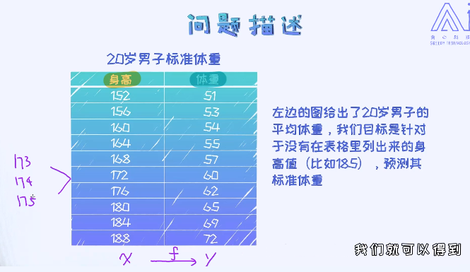

# 1. 初识人工智能
## 1.1. 发展趋势

## 1.2. 应用领域
- 分类
   - **限制领域AI（Narrow AI）**: 电商推荐系统，金融评分卡，医疗智能问答...
   - **通用AI（General AI）**: 让AI做任何事
- 领域
  - 农业：种子质量判断，自动化播种，种植，营养供给；果实采摘，分类
  - 教育：拍照识题，学生情绪判断，针对学习个体实施不同进度的个性化教育
  - 医疗：病变部位识别标注，读片，基因测序数据挖掘
  - 零售：无人超市，虚拟试衣间，智能客服机器人
  - 金融：量化投资，金融风暴，个性化保险
  - 交通：无人驾驶汽车
  - 广告：精准广告投放

## 1.3. 基本名词理解
人工智能 > 机器学习 > 深度学习
### 1.3.1. 机器学习的重要领域
机器学习两大重要领域：监督学习vs无监督学习，工业界应用主要还是以监督学习为主。

- **监督学习**：D = (X, y), 学习X-->y的关系
  - 常见算法：
    - 线性回归
    - 逻辑回归
    - 朴素贝叶斯
    - 决策树
    - 随机森林
    - SVM
    - 神经网络
- **无监督学习**：D = (X), 寻找X中的特征或者规律
  - 特点：无需数据标签
  - 常见算法：
    - PCA
    - K-means
    - GMM
    - LDA
    - ...

其他：
- **强化学习**
   
   暂时无

### 1.3.2. 回归与分类问题
- **回归问题**
  - 输出是连续性数值，比如温度，身高，气温等

- **分类问题**
  - 输出是定性输出，比如阴晴，好坏，是否

### 1.3.3. 数据的特征，样本，以及标签
简单理解：

      特征 --> 有几个区别的属性
      样本 --> 各个不同样本具体属性
      标签 --> 预测值

### 1.3.4. 训练数据与测试数据
训练数据用来训练模型，测试数据用来测试模型


## 1.4. 其他名词
### 深度学习，Deep Learning
  “深度”，可以理解为多个简单模型的叠加。如多个神经网络叠加-->深度神经网络，多个高斯混合模型叠加-->深度高斯混合模型，SVM叠加-->深度SVM模型
### AI vs BI

      AI (Artificial Intelligence)
      BI (Business Intelligence)

### 变量
- 类别型变量
- 数值型变量
- 顺序(ordinal)变量，如五星评分，深入了解参考论文：https://www.aaai.org/ocs/index.php/AAAI/AAAI16/paper/view/12328


# 编写第一个AI程序
## 建模经典环节

机器学习建模中涉及到的几个经典的环节：

> Data source  
> --> 数据预处理  
> --> 特征工程 Feature engineering  
> --> 建模(1.调参、2.改造)  
> --> 验证  

端对端方法：  
从数据预处理直接到建模流程，无需进行特征工程。应用领域如：语音识别。该方法目前很有局限性。

## 模型判断选择
如何知道选用哪个模型呢？
- 建模的第一步，一般是对数据本身的理解。 **切忌不要急于直接套模型，因为不理解数据的情况下做出来的模型是有着很大的不确定性。** 比如出现了异常情况，可能都不知道问题的根源是什么。
- 对于数据理解来说，最重要的一项技术叫做<font color="red">**数据的可视化(data visualization)**</font>。千万不要小看这部分的工作。不理解数据的前提下做模型是很不明智的事情。
- 在数据探索(data exploration)阶段我们会试图从直观的角度来查看数据的特性，比如数据的分布是否满足线性的？ 数据中是否包含异常值？特征是否符合高斯分布等等。这些都会影响到我们后续的决策。

假如数据特征有2个以上，如何进行可视化呢？
- 如果特征很多，没有好的办法
- 可以采用降维的方法，降维到二维或者三维空间(PCA等)
- 针对于每一个特征做可视化，以及观察特征之间的关系

## 实例
### 背景描述



### 数据可视化

```python
# 创建数据集，把数据写入到numpy数组    
import numpy as np  # 引用numpy库，主要用来做科学计算    
import matplotlib.pyplot as plt   # 引用matplotlib库，主要用来画图    
data = np.array([[152,51],[156,53],[160,54],[164,55],    
                 [168,57],[172,60],[176,62],[180,65],    
                 [184,69],[188,72]])    
    
# 打印出数组的大小    
print(data.shape)    
    
    
# 从data中提取出身高和体重，分别存放在x, y变量中    
x, y = data[:,0].reshape(-1,1), data[:,1]    
    
# 在二维空间里画出身高和体重的分布图    
plt.scatter(x, y, color='black')    
plt.xlabel('height (cm)')    
plt.ylabel('weight (kg)')    
plt.show()
```
