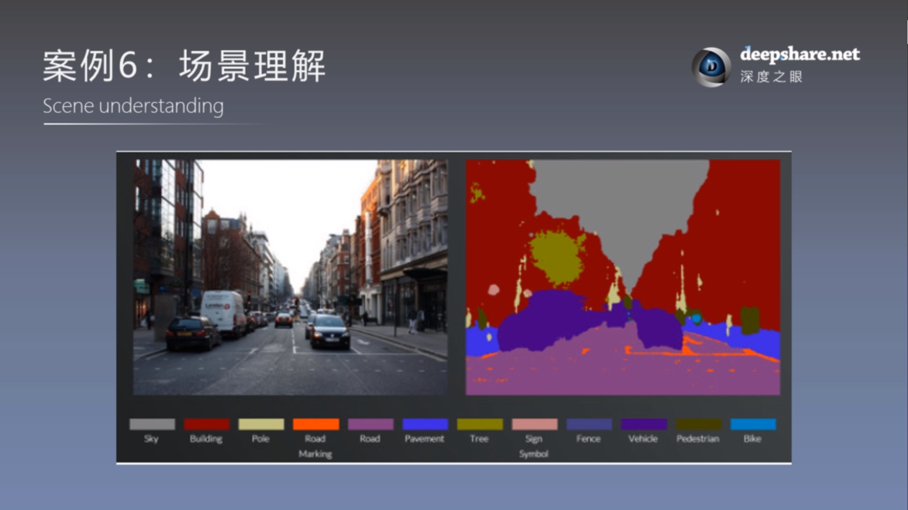
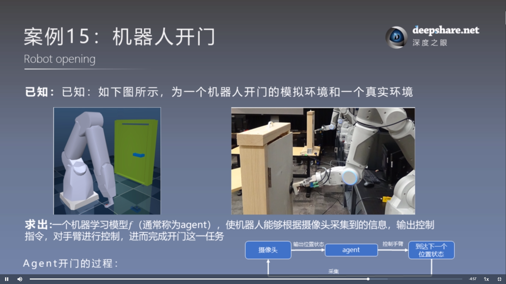
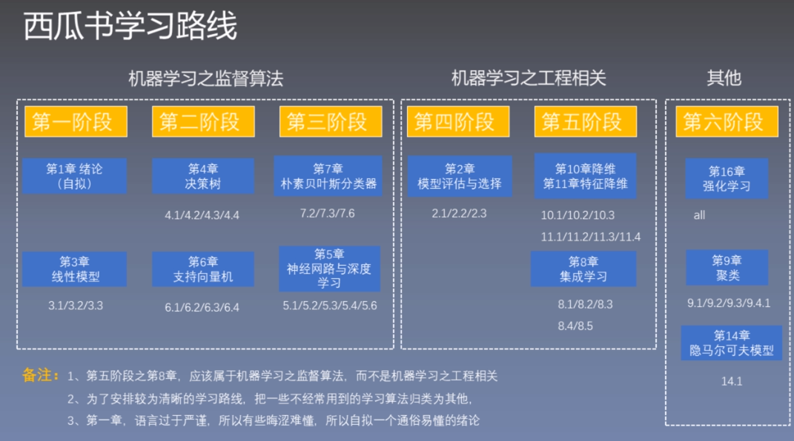

# 机器学习西瓜书训练营

# 机器学习中比较活跃的四大应用领域
- 数据挖掘（发现数据之间的关系）
- 计算机视觉（像人一样看懂世界）
- 自然语言处理（像人一样看懂文字）
- 机器人决策（像人一样具有决策能力）

# 案例
## 案例1：血糖值的预测

## 案例2：有无糖尿病预测

# 机器学习的两大基本问题
- 回归问题
- 分类问题

什么是机器学习？
根据已知的数据，学习出一个数学函数f(x1,x2,x3,...,xn)=y使其能够有更强的预测能力

语义分割的典型应用

# 机器学习理论分类

