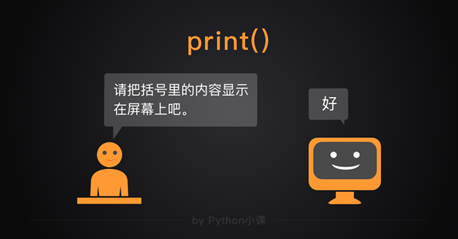

Python是什么？它从何而来，如何诞生呢？当前有何应用？它有何优劣势呢？
# 1  PYTHON简介
## 1.1  Python背景
Python是什么？它从何而来，如何诞生呢？当前有何应用？它有何优劣势呢？
### 1.1.1  诞生
- **诞生时间:** 1989圣诞节期间
- **创始人:** Guido van Rossum(荷兰)
- **Python的命名:** 源于一个喜剧团Monty Python
- **Python的官网:** www.python.org
- **Python的版本:** 
  - Python v2.7（2020年结束维护）
  - Python v3.5（当前学习环境）
  - Python v3.8（最新版本）
### 1.1.2 应用
- 应用领域: 
数学（最早）、系统运维、网络编程、科学计算、人工智能，机器人、web开发、大数据及数据库编程、云计算、教育、游戏、图像、其他
### 1.1.3 关于这门语言的评价
- Python优缺点: 
  - 优点: 
	面向对象（Java，C++，Python）
	免费，简单易学，可移植，可混合编程（C/C++/Java/.net）
	开发效率高，开源
  - 缺点: 
	和C/C++相比执行速度不够快（最高的是C，其次C++）
	不能封闭源代码

执行效率vs开发效率，两者几乎不能兼得。
所以涉及效率的部分可以C/C++开发，这种特性使得Python被称为胶水语言。
### 1.1.4 版本与兼容区别
#### 1.1.4.1 python3版本比python2的优势
- **数值计算更符合数学思维: **
如: “/”在python2中是地板除，python3中则是数学意义上的除法
  python2: 1/2=0
  python3: 1/2=0.5

- **数据处理速度更快: **
    实例: 实测迭代300M大小的文件
    测试方法: 读取文件，for循环迭代每一行，再用for循环迭代每一个字符，pass填充语句
    结果: 
    python2平均花了20秒，二进制流花了17秒
    python3平均花了13秒，二进制流花了11秒

- **对于一些数值类型定义更明确: **
    python3会尽量减少一些BUG，如数值类型比较，: 
    ```python
    $ python2
    >>> 1000 < "1500" < 2000
    False
    >>> 1000 < 1500 < 2000
    True

    $ python3
    >>> 1000 < "1500" < 2000
    Traceback (most recent call last):
    File "<stdin>", line 1, in <module>
    TypeError: '<' not supported between instances of 'int' and 'str'
    >>> 1000 < 1500 < 2000
    True
    ```

## 1.2  Python的安装及环境搭建
### 1.2.1  Python 的安装:
  windows / Mac OS X / Unix ...
### 1.2.2  	Python的解释执行器

```
CPython (python)    ——C写的
Jython              ——Java写的
IronPython          ——.net
Pypy                ——python
```
## 1.3 Hello world: Python的运行
### 1.3.1 在Linux中Python执行的三种方式
- 方法一: 命令行交互提示模式
    打开命令窗口: 
    ```python
    $ python3
    >>> print("hello")
    >>> quit()    #退出交互模式，exit()，或 Ctrl + D
    ```
- 方法二: 调用系统python程序执行文件
  - 指定系统程序调用，运行脚本文件。（文件外去指定python程序运行脚本）
      1. 编写文本文件如下，存储为文件: hello.py
          ```python
          print("hello world!")
          print("today is friday!")
          ```
      2. 随后在同级目录下打开命令窗口运行命令: 
          ```bash
          $ python3 hello.py
          ```

          <font color="#090909" face="仿宋">
          补充(运行方式):<br>
          1.Linux/Win-cmd/Win-PowerShell/Other等命令行窗口运行脚本；<br>
          2.第三方软件sublime, vscode, pycharm等运行脚本。
          </font>
          <br>
  - 脚本文件直接运行（将文本文件直接作为执行文件，第一句写入解释语句，脚本内指定调用程序，该方法一般用于Linux下）
    1. 编写文本文件如下，存储为: hello.py 
    ```python
    #! /usr/bin/python3
    print("hello world!")
    print("today is friday!")
    ```
    2. 随后在同级目录下打开命令窗口运行命令: 
    ```bash
    $ chmod a+x hello.py   #给文件增加可执行权限
    $ ./python.py		#要求文件里须有解释语句 #! /usr/bin/python3
    ```

### 1.3.2 基本“输入”、“输出”
- 基本输入函数: input()
  - 返回  
  str。返回输入的字符串，自动删除末尾回车。
  - 格式及用法:   
    ```
    a = input("自定义输入提示语(可空)")
    ```
  - 使用方法: 交互界面输入内容，按回车结束，此时系统自动捕捉输入内容（字符串）
- 基本输出函数: print()
  - 返回:   
    None
  - 功能:   
    打印显示表达式结果于屏幕。如果是内容是一个表达式（如函数），则打印其“返回结果”。
  - 格式:
    ```
    print(a , b , c , … , sep=" ",end="\n")
    ```
    a, b, c ... 为表达式（包括数字、字符串等）
    sep为输出间隔字符，默认为空格，可自定义
    end为末尾默认字符，默认为回车，可自定义

<font>小知识:</font> 
<font color="#090909" face="仿宋">
交互模式下的print和表达式都会打印，有什么区别？
如：
```bash
>>> 'hello'
'hello'
>>> print('hello')
hello
>>> a = 1 + 1; 2 - 1
1
```
如何理解print和表达式中的打印？  
- “表达式打印”是交互模式下，特有的功能。表达式操作数据对象，一般表达式的返回值结果在未绑定变量时则打印表达式结果基本信息，当放在脚本执行时将不会打印。  
- “print打印”是一个函数执行功能，是一个功能语句，放在脚本执行仍然执行打印操作。
如图  
  
——（摘自Python小课团队制作图片）
</font>

## 1.4  	Python程序基本介绍
### 1.4.1  	Python程序的组成
```
程序由模块组成
模块由语句，函数，类，数据等组成
语句包含表达式
表达式建立并处理数据对象
```
#### 1.4.1.1	语句和表达式
1. **语句statement**   
  由表达式、运算符、变量等组成的执行某件事的完整句子
  （执行完整句子，如i=1+3，pass，等）
2. **表达式**  
  表达式，是由数字、运算符、数字分组符号（括号）、自由变量和约束变量等以能求得数值的有意义排列方法所得的组合。  
  它是执行语句的一部分，运算返回结果，可赋值给变量，例如: 1+2  
  表达式操作数据对象，若结果值未赋值给变量，该行语句执行完后数据对象将在内存销毁。

- 注意:  
  表达式不是语句，表达式能赋值给变量，语句则不能。
  表达式的最终返回内容为运算后结果，print(表达式)

- Python3中有哪些内容被称为表达式？  

  简单的区别方法，在交互界面，print(表达式)，按Enter后能正常返回结果于下一行的都是表达式，表达式一般都有返回值，至少为None。  
  包括: 算式，数值对象（数值、字符串、列表等），函数，类对象等。  

  示例: 创建表达式和打印表达式结果  
  ```python
  >>> print(10+2.5)   #算式
  12.5
  >>> print(12.5)     #数值对象（数值）
  12.5
  >>> print("hello")  #数值对象（字符串）
  hello
  >>> print([1,2,3])  #数值对象（列表）
  [1, 2, 3]
  >>> print(print(666))  #函数
  666
  None
  >>> print(list)   #类对象
  <class 'list'>   #Python自带的类对象
  ```
  示例: 表达式和语句简单区别
  ```
  >>> print(1+2)
  3
  >>> print(i=1+2)
  Traceback (most recent call last):
    File "<stdin>", line 1, in <module>
  TypeError: 'i' is an invalid keyword argument for print()
  >>> print(pass)
    File "<stdin>", line 1
      print(pass)
              ^
  SyntaxError: invalid syntax
  ```

#### 1.4.1.2	Python的标识: 
- 常见标识符：
  ```
  #    注释一行，行开始到行尾。作用: 让注释内容不参加程序解释执行
  \    字符串中的“\”表示转义符
  \    语句末尾的“\”表示语句换行符
  ;    语句分隔符
  :    语句块的开始
  ,    数据对象分割符
  ()   数据对象之间运算优先级表示，元组类型表示
  []   列表类型表示
  {}   字典类型、集合类型等表示
  ' ' / " "  字符串类型表示
  ''' ''' / """ """  多行注释，字符串类型表示，函数,类,模块等文档说明
  =    赋值运算符
  > < ==  比较运算符
  + - * / // % & 数值计算运算符
  ```
  ...

- 关于注释
  1. 单行注释  
      `# 注释内容`
  2. 特殊注释  
      一般文件前两行为特殊注释:   
      第一行为解释执行器路径  
      第二行为当前文件的编码  
      如: 
      ```
      #! /usr/bin/python3
      # -*- coding=utf-8 -*-
      ```

  3. `'''/"""`  
      多行注释，常用作文档，如模块(文件)文档，类文档，函数文档
      如：
      ```
      """
      Doc 
      """
      ```

- 关于换行: 
  ```
  一般一条语句一行；
  多条语句在一行中用“;”分隔；
  一行语句在多行中用“\”连接，或在“括号”中进行单或多次换行。

  \		可实现显式换行，实现语句连贯
  ()[]{}	可实现隐式换行，实现语句连贯
  ```

#### 1.4.1.3	注意事项
python里面非字符串的所有符号尽量保证是英文的  
中文符号可以存在于字符串  

## 1.5  	基本概念

### 1.5.1  	对象——Python程序本质
Python中一切皆对象（数值，字符串等）。  
如函数的参数是对象构成。函数中的多个对象，逗号分隔，函数本身也是一个对象  
`>>> 函数(对象1，对象2，对象3，…)	## 如print`  

### 1.5.2  	变量——用于绑定对象的名字对象
#### 1.5.2.1	变量
- **变量基本概念:**   
变量是用来绑定数据对象的标识符  
变量可以绑定任何东西，如数据类型，函数，类实例等对象  
- **作用:**   
在内存中用于标识保存数据以便后续使用。  
- **数据类型:**   
变量的数据类型实质是绑定的对象的数据类型。  
它是动态类型，可以被改变，随绑定对象变化。  
查看类型的函数type(a)。  
- **定义变量:**  （先定义后使用）  
  - 变量命名规则
    1) 取名。变量名必须是标识符: [A-Za-z_][A-Za-z0-9_]*  
    2) 赋值创建: 第一次赋值时，创建的变量与对象“绑定”（见下一节）。
    取名规则: 
    ```
    1.由字母or下划线or数字构成；
    2.开头只能是下划线or字母；
    3.大小写不同；
    4.保留关键字。（PEP 8规则包含其他书写规则见官网文档，或附件PEP8编码规范）

    合法的变量名示例: 
    a  a1  b  bbb   _aaa_   _Abcdvara1b2c2
    不合法的变量名示例: 
    1a   123   $ABC  +a  -b   #ab   @ab
    python 的关键字: 
    True ，False,   None is  del  if  elif等
    ```

### 1.5.3  	赋值——用于“绑定对象与变量”的操作
- 赋值（“绑定”）概念:   
赋值/关联/绑定/引用: 变量和一个对象的关联关系。  
- 赋值绑定作用  
暂存数据。每行语句的表达式都会单独生成对象，若对象没有被变量绑定则运行完此语句可能销毁。  
- 赋值格式:   
变量名 = 值（表达式对象）  
（“=”是赋值运算符）  
- 其他变量赋值方式:   
  1）多重赋值
  ```python
  a = a1 = a2 = a3 = 123
  print(a, a1, a2, a3)  # 123 123 123 123
  ```
	2）多元赋值
  ```python
  a, a1, a2, a3 = 1, 2, 3, 4
  print(a, a1, a2, a3)  # 1 2 3 4
  ```
  3）增量赋值  
  ```python
  x += 1  
  x -= 1  
  x *= 2  
  ...
  ```
小知识——多元赋值
```python
# 序列对象可以直接多元赋值
a, b, c = (1024, 2048, 4096)
a, b, c = [1024, 2048, 4096]
(a, b, c) = (1024, 2048, 4096)
[a, b, c] = (1024, 2048, 4096)
# 多元赋值到一个变量, 会创建新元组
t = a, b, c = 1024, 2048, 4096   # 多元赋值: a,b,c: (1, 2, 3)
print(type(t))   # <class 'tuple'>
```
变量互换： x, y = y, x
```python
# 多元赋值交换变量不需要创建变量新对象
a, b, c = 1024, 2048, 4096   # 多元赋值: a,b,c: (1, 2, 3)
print(id(a), id(b), id(c))  # 2210734229392 2210762967664 2210734229520
b, a, c = a, b, c 
print(id(b), id(a), id(c))  # 2210734229392 2210762967664 2210734229520

# 经典交换算法: （该方法会创建变量新对象）
a, b = 100, 200
temp = a
a = b
b = temp
```

## 1.6  	探索对象、变量及赋值的本质的方法
### 1.6.1  	如何查看帮助?

- help(x)
```
help(x)  # 可以查看关于x的信息，x可以是函数名、类名、类方法等

常用：
help(函数名)  # 可以查看函数帮助文档，如help(print)，help(pow)
help(类名)    # 可以查看类的帮助文档，如help(list)
help(模块)    # 查看模块的帮助文档
help(对象.方法)  # 查看某个方法文档

其他用法：
help("keywords")  # 查看所有关键字
help("modules")  # 查看所有可用模块
help("topics")  # 查看常见的topics
help("__main__")
```
如: 
help(print)  # 可查看函数传参属性，如end="\n"

- pydoc程序
```bash
$ pydoc -g  # 生成html帮助文档报表
```
### 1.6.2  	如何查看环境变量？
#### 1.6.2.1	各种变量查看
- 使用函数查看  
```
help("__main__")  # 返回包含变量关系的文档字符串
dir([对象]) # 返回当前对象内（默认为当前环境变量）定义的名字(属性，方法，)的列表
globals()  # 返回当前全局作用域内变量的字典
locals()   # 返回当前局部作用域内的变量的字典
```
- 使用类属性查看  
```
类.__dict__
# 查看类对象实例的变量绑定关系__dict__属性绑定一个存储此实例自身变量的字典
```

示例:

1、help("__main__") 查看本次运行所有的变量及绑定关系的方法
```python
>>> a = 2
>>> help("__main__")   #按q退出
结果: 
 Help on module __main__:

NAME
    __main__

DATA
    __annotations__ = {}
    a = 2

FILE
    (built-in)
```
2、dir([对象])   
示例: 
```python
>>> dir()
['__annotations__', '__builtins__', '__doc__', '__loader__', '__name__', '__package__', '__spec__']
>>> dir(list)
[..., 'append', 'clear', 'copy', 'count', 'extend', 'index', 'insert', 'pop', 'remove', 'reverse', 'sort']
>>> L = [1,2]
>>> dir(L)
[..., 'append', 'clear', 'copy', 'count', 'extend', 'index', 'insert', 'pop', 'remove', 'reverse', 'sort']
```

#### 1.6.2.2	del函数解除变量绑定
解除绑定，引用计数为零时销毁数值对象。  
Python内存管理和引用计数（为零时，对象删除）  
如果数据大于256并且没有其他变量绑定时则销毁  
id(数字)查看的当前操作新建对象的地址，立马被销毁  
```
>>> id(257)
139954784965552
>>> id(258)
139954784965552
>>> id(259)
139954784965552
```
关于更多详细信息参考附录

### 1.6.3  	如何判断对象基本属性是什么？
类型、地址编号、对象判断
- type(obj) 查看对象所属类型  
返回对象的类型  
基本类型都可以用type()判断:   
```
>>> type(123)
<class 'int'>
>>> type('str')
<class 'str'>
>>> type(None)
<type(None) 'NoneType'>
>>> type('abc')==str
True
```
- id(obj) 函数查看对象内存地址编号  
  Python对象有唯一标识。函数id()可查看，id()返回对象的内存地址   
  查看对象存储于计算机内存的地址  
  可用于判断两个不同变量是否是同一个对象  

  小整数对象池:   
  -5到256的数永远存在，不会释放。  
  也就是说，大于或小于这个数字会创建新对象。  
  示例1: 单个赋值  
  ```python
  >>> a=256
  >>> b=256
  >>> print(a is b, id(a)==id(b), a==b)
  True True True
  >>> a=257
  >>> b=257
  >>> print(a is b, id(a)==id(b), a==b)
  False False True 
  ```
  示例2: 多重赋值:
  ```python
  >>> a, b = 256, 256
  >>> print(a is b, id(a)==id(b), a==b)
  True True True
  >>> a, b = 257, 257
  >>> print(a is b, id(a)==id(b), a==b)
  False False True
  ```
- is判断是否是同一个对象  
is判断:   
（判断变量或对象是否为同一个对象）  
is 		#a is b  
is not	#a is not b  
为什么需要判断？值相同不一定对象相同。  
```python
>>> a,b=[],[]
>>> a==b
True
>>> a is b
False

>>> a = 257
>>> b = 257
>>> a is b
False
>>> id(a)
47962736
>>> id(b)
50304160
```
### 1.6.4  	绑定过程: 	
分别创建“变量对象”和“值对象”，单向赋值绑定。  

绑定本质: 建立联系，变量对象--> 对象(值)，指向最终值。  
问题一: 在赋值a=10，b=10的过程中，Python解释器大概做哪几个动作？  
1.内存中有“10”对象  
2.创建变量对象“a”，“b”  
3.“a”和“10”单向绑定（联系），“b”和“10”单向绑定，a、b都绑定到10  
问题二: a=10，当a=20第二次赋值时，改变了绑定联系。  
原来的10会随着运行而销毁，回收。但10是永久保留于系统中的，大于256的数值对象才会被销毁（见下一小节，小整数对象池）  
问题三: 变量b通过变量a绑定的实质，如a绑定到10，b绑定到a，b指向哪呢？  
a和b都指向了绑定的数值对象10  

- 总结:   
变量向另一个变量赋值，绑定是指向变量最终对应的值（对象）。   
多个变量可绑定到一个对象
## 1.7  	Python中的基本数据类型及表示
茫茫大海，计算机是为处理和计算信息而服务，那么Python中的数据又如何分类存储并计算呢？  
Python3 中有六个标准的数据类型:   
```
•	Number（数值: 整数int, 浮点数float，复数complex，布尔型bool）  
•	String（字符串: str）  
•	List（列表: list）  
•	Tuple（元组: tuple）  
•	Set（集合: set、frozenset）  
•	Dictionary（字典: dict）  
```
其中，
```
不可变数据对象（4 个）: 
Number（数值*4）、String（字符串）、Tuple（元组）、frozenset固定集合
可变数据对象（3 个）: 
List（列表）、Dictionary（字典）、Set（集合）。
```
补充: （可变对象的区别方法为: 在对象内有元素发生变化时，该对象地址不变）

字符串、列表、元组被合并称为序列:   
常见序列类型包括字符串(普通字符串和unicode字符串),列表和元组.所谓序列,即成员有序排列,可通过下标访问。——《引用至Python常见序列详解-weelin_area-博客园》

存储基础: 
数据最小单位1Bye(字节)=8位。

