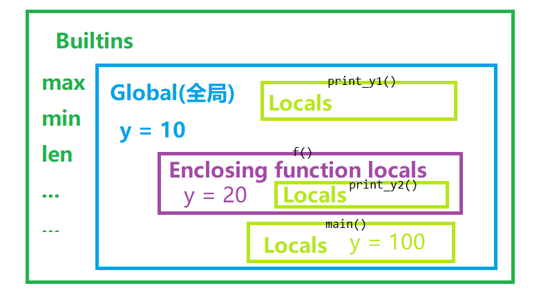

# 6. 函数FUNCTION
## 6.1. 基本概念
基本认识：
- 函数是可以重复执行的语句块；
- 用于封装语句，调高代码重用性；
- 可以重复调用；
- 用于定义用户级别的函数；

语法：
```python
# 函数定义
def 函数名(形参列表):
	  语句块
    return 返回值

# 函数调用
函数名(实参列表)
```
说明：
- 参数列表可以为空。
- 语句部分不能为空，如果为空需要用pass填充。
- 实参与形参区别：
  - 形参是指调用函数时传递的参数。
  - 实参是指被调用函数接收传入的参数。
  - 形参和实参可以理解为调用函数与被调用函数之间的数据传输接口。
  - 过程：实参传递-->形参接收


概括：（第一次学习时不必看懂，后续小节会逐步展开）
- 函数初始化：
  - 函数名
    - 理解为普通变量，初始化时绑定创建的一个具有功能方法的函数对象。
  - 形参的初始化
    - 当给定缺省值时，首次初始化就将对象创建并赋值给形参，后续如果没有定义则一直使用该对象操作。
  - 函数的返回值定义
    - 函数调用语句是一个表达式，一定会有返回值，能赋值给一个变量。
    - 如果没有return语句，函数执行完毕后返回None对象；如果函数需要返回其它的对象需要用到return语句。
- 函数的参数传递：
  - 实参的传递方式
    - 位置传参、序列传参、关键字传参、字典关键字传参
  - 形参的接收方式
    - 普通接收、序列接收、字典接收
  - 函数的参数传递过程同赋值一样，可以理解为赋值发生于从实参赋值到形参。
  - 函数传递的内容可以是任意内容，函数中可以再传递函数，函数中也可以再调用函数。
- 命名空间
  - 函数有自己的命名空间，在函数外部不可访问函数内部的变量，在函数内部可以访问外部的变量，要让函数处理外部数据需要用参数给函数传入一些数据。
  - 命名空间的访问遵循LEGB查找规则
- 高级函数
  - lambda表达式
  - eval()与exec
- 函数式编程
  - map, filter, sorted, 递归, 闭包, 装饰器
- 函数文档

---
函数自定义简易示例：
```python
# 定义函数f用于调用系统函数print执行打印hello
def f():
    print('hello')

# 调用函数f()执行打印hello
f()
```
运行结果：
```
hello
```

## 6.2. 函数的初始化
### 6.2.1. 函数名的定义与理解
函数名与普通变量相同，初始化时绑定创建的一个具有功能方法的函数对象。

- 函数名的命名规则与变量名相同（函数名必须是标识符）
  - 既然函数名是变量，那么函数名同样满足变量的命名规范和特性：
    - 只能以字母和下划线开头
    - 可以重新赋值绑定
    - 可以被del
    - ...
- 假设定义函数`func`，则`func`与`func()`的区别是什么？
  - `func`是函数名，它是一个变量, 它绑定一个函数。若打印该对象返回该函数对象内存地址描述。
  - `func()`是函数的具体调用，它是一个表达式，表达式执行并返回运算结果。
  - 示例：

    ```python
    def func():
        return 1
    a = func
    b = func()
    print(a)  # <function func at 0x00000180A4A8E048>
    print(b)  # 1
    ```

---

示例：探索变量名的本质

code1 函数名的交换调用
```python
def f1():
    print("f1被调用")

def f2():
    print("f2被调用")

print('f1绑定的是', f1)
print('f2绑定的是', f2)
f1, f2 = f2, f1
f1()  # 实际调用的是f2
f2()  # 实际调用的是f1
print('f1绑定的是', f1)
print('f2绑定的是', f2)
```
运行结果：
```
f1绑定的是 <function f1 at 0x00000180A3613798>
f2绑定的是 <function f2 at 0x00000180A4A72828>
f2被调用
f1被调用
f1绑定的是 <function f2 at 0x00000180A4A72828>
f2绑定的是 <function f1 at 0x00000180A3613798>
```

code2 嵌套函数的调用
```python
def f1():
    print("f1被调用")

def f2():
    print("f2被调用")

def fx(fn):
    print("fn绑定的是: ", fn)
    fn()   # 调用fn绑定的函数, 此处等同于调用谁呢?
           # 这里的fn可以代表任意传入的函数对象

fx(f1)  # 调用f1
fx(f2)  # 调用f2
```
运行结果：
```
fn绑定的是:  <function f1 at 0x00000180A3613708>
f1被调用
fn绑定的是:  <function f2 at 0x00000180A3522678>
f2被调用
```


> PS： Python之禅，看事物一定不要只看表象（变量），要看表象背后真正的内容是什么（对象）。

### 6.2.2. 函数的返回值定义与理解
<!-- - 定义函数的5种思路方法【？待总结】 -->
- return语句
  - 作用：结束函数的运行，并返回return的结果
- 注意事项：
  1. 函数中默认返回`None对象`，即无`return语句`时也返回一个`None对象`。函数中没有`return语句`相当于函数末尾加了`return None`
  2. 函数中`return语句`执行后不再返回该函数执行。如递归函数的过程中，return跳转到另一层函数后，将不会返回原函数中继续执行。

---
示例1：return基本用法
```python
def myfunc():
    return 'hello'

a = myfunc()
print(a)
```
```
hello
```

---
示例2：return的默认返回值理解

code1 内置函数print测试，return之深入理解
```python
>>> print(print('hello'))  # 打印什么？
hello
None
```

```python
>>> s = print('hello')  # 会有打印么？
hello
>>> print(s)  # 返回什么？
None
```

code2 自定义函数理解
```python
def myfunc():
    pass

a = myfunc()
print(a)  # 打印什么
```
```
None
```

---
示例3：return使函数结束执行的理解

code1：有return时的函数执行直接跳转不再回来

```python
def myfunc(x):
    if x==0:
        print('到达末端')
    else:
        print('开始执行')
        return myfunc(x-1)
        print('结束执行')

myfunc(3)
```
运行结果：
```
开始执行
开始执行
开始执行
到达末端
```

code2 无return时，执行完的函数将返回原函数继续执行
```python
def myfunc(x):
    if x==0:
        print('到达末端')
    else:
        print('开始执行')
        myfunc(x-1)
        print('结束执行')

myfunc(3)
```
运行结果：
```
开始执行
开始执行
开始执行
到达末端
结束执行
结束执行
结束执行
```

### 6.2.3. 函数的形参初始化

```python
# 函数定义
def 函数名(形参列表):
	语句块

# 函数调用
函数名(实参列表)
```

#### 6.2.3.1. 函数的形参缺省值

- 缺省值
  - 在形参加入初始值，传参时便可省略一部分值。
  - 缺省参数规则：
    - 缺省参数可以有零个和多个，甚至全部。
    - 若函数中有缺省参数存在，则必须遵循从右到左依次定义的规则。即缺省参数必须放在参数后面。如`(x, y=0, z=0)`
- 注：函数在初始化的时候，初始的形参就创建了一个值绑定形参对象，这可能影响后续的重复调用操作。具体见下一小节。

---
示例：自己定义的range函数
```python
def myrange(s, end=0, n=1):
    x = s   #代表数开始
    y = end #代表数结束
    if end == 0:
        x = end
        y = s
    L = []
    while x < y:
        L.append(x)
        x += n
    print(L)

myrange(10)
myrange(5, 10)
myrange(5, 10, 2)
myrange(s=5, end=10, n=2)  #报错
```

```
[0, 1, 2, 3, 4, 5, 6, 7, 8, 9]
[5, 6, 7, 8, 9]
[5, 7, 9]
[5, 7, 9]
```


#### 6.2.3.2. 缺省形参定义的理解

函数的创建过程与缺省形参理解：
- Python程序自上而下运行，函数的初始化一般只能执行一次；函数在一开始初始化时，就创建对象，并被形参(变量)绑定。
- 若函数对象不再改变（改变是指：如函数重新初始化，或形参绑定的对象重新创建、赋值），绑定的对象将在之后的调用处理中也一直是该对象；假如是可变对象，将一直持续受到影响。 

（当然也可以使用嵌套函数进行重复定义，或者对初始化变量进行判定重新生成，使得某些可变对象得以重新初始化创建。）

---
题目示例：

经典题目：函数中的形参理解。  

code1:

```python
def f(x, L=[123, 1234]):
    L.append(x)
    print(L)

f(2)  # _______
f(3)  # _______
f(3, [3, 2, 1])  # __________
f(4)  # ____________ 此处是精髓
```
答案：
```
[123, 1234, 2]
[123, 1234, 2, 3]
[3, 2, 1, 3]
[123, 1234, 2, 3, 4]
```

code2:
```python
def g():
    def f(x, L=[123, 1234]):
        L.append(x)
        print(L)
    return f

f = g()
f(2)  # _______
f(3)  # _______
f(3, [3, 2, 1])  # __________
f(4)  # ____________ 此处是精髓
f = g()
f(4)  # ____________ 此处是精髓
```
运行结果：
```
[123, 1234, 2]
[123, 1234, 2, 3]
[3, 2, 1, 3]
[123, 1234, 2, 3, 4]
[123, 1234, 4]
```

---
思考：面试题2  
如下代码的打印结果是什么？

code1:
```python
L = [1, 2, 3]

def f(n=0, lst=[]):
    lst.append(n)
    print(lst)

f(4, L)  # ________
f(5, L)  # ________
f(100)   # ________
f(200)   # ________
```
答案：
```
[1, 2, 3, 4]
[1, 2, 3, 4, 5]
[100]
[100, 200]
```

code2: 
```python
L = [1, 2, 3]

def f(n=0, lst=None):
    if lst is None:
        lst = []
    lst.append(n)
    print(lst)

f(4, L)  # _______
f(5, L)  # _______
f(100)   # _______
f(200)   # _______ 此处特别对比
```
答案：
```
[1, 2, 3, 4]
[1, 2, 3, 4, 5]
[100]
[200]
```

## 6.3. 函数的参数传递
- 函数的参数传递：
  - 实参的传递方式
    - 位置传参、序列传参、关键字传参、字典关键字传参
  - 形参的接收方式
    - 普通接收、序列接收、字典接收
  - 函数的参数传递过程同赋值一样，可以理解为赋值发生于从实参赋值到形参。
  - 函数可以传递的内容可以是任意内容，函数中可以再传递函数，函数中也可以再调用函数。

### 6.3.1. 实参传递与形参接收的方式
```python
# 函数定义
def 函数名(形参列表):
	语句块

# 函数调用
函数名(实参列表)
```

函数传参的方式：

1. 位置传参：
   - 实际传递参数(以下简称"实参")与形式参数(形参)的对应关系按位置来依次对应
   - 实参传递：`func(x1, x2, x3)`
   - 形参接收：`def func(xx1, xx2, xx3):`简单接收

2. 序列传参：
   - 序列传参是指在函数调用过程中用 `*` 将序列拆解后按位置进行传递的传参方式
   - 实参的`*`使用：
       - 实参传递：`func(*[x1, x2, ...])`，用`*`将序列拆解后按位置一一对应传参；等同于`func(x1, x2, ...)`
       - 形参接收：`def func(xx1, xx2, ...):`简单接收
   - 对应的，形参的`*`使用：
       - 实参传递：`func(x1, x2, ...)`简单传入
       - 形参接收：`def func(*args):`，用`*args`来收集位置传参的时候多余的实参，并组成一个元组`(x1, x2, ...)`由变量`args`绑定。

3. 关键字传参：
    - 关键字传参是指传参时, 按着形参的“名称”给形参赋值
    - 实参和形参按名称进行匹配, 实参和形参通过关键字名称一一对应，定义时参数顺序可以任意。
    - 实参传递：`func(xx1=1, xx2=2, xx3=3)`
    - 形参接收：`def func(xx1, xx2, xx3):`简单接收

4. 字典关键字传参:
    - 是指实参为字典,将字典用 `**` 拆解后进行关键传参的传参方式
    - 实参的`**`使用：
        - 实参部分：`func(**{'a':1, 'b':2})`，用`**`将字典拆解后按关键字传参
        - 形参部分：`def func(a, b)`简单接收
    - 对应的，形参的`**`使用：
        - 实参部分：`func(a=1, b=2, ...)`简单传入
        - 形参部分：`def func(**kwargs)`，用`**kwargs`来收集关键字传参的时候多余的实参，并组成一个字典`{'a':1, 'b':2, ...}`由变量`kwargs`绑定。


实参的位置规则：
- `位置传参`必须位于最前面；
- `关键字传参`必须位于所有`位置传参`之后；
- `序列传参`不可位于`字典关键字传参`之后；
- `字典关键字传参`必须位于所有传参最后面，不过后面可以尾随`关键字传参`。
- 如：
  - 实参传递或形参设置初始值，都必须要定义在无关键字参数之后。或者说关键字传参，要定义在位置形参之后。
  - 错误：形参, `def func(a=1, b, c)`; 实参,`func(a=10, 2, 3)`
  - 正确：形参, `def func(b, c, a=1)`; 实参,`func(2, 3, a=10)`
    
    ```python
    def func(b, c, a=1):
        print(a, b, c)
    
    func(2, 3, a=10)  # 10 2 3
    ```

---

示例1：一个实例看懂所有传参方式

```python
def myfun(a, b=0, *args, **kwargs):
    print('a:', a, ' b:', b, ' args:', args, 
          ' kwargs:', kwargs, sep='')

# 位置传参
myfun(1, 2, 3)  # 位置传参
myfun(*(1, 2, 3))  # 序列传参
myfun(*[1, 2, 3])  # 序列传参

# 关键字传参
myfun(d=4, c=3, b=2, a=1)  # 关键字传参
myfun(**{'a': 1, 'b': 2, 'c': 3, 'd':4})  # 字典关键字传参

# 混合传参
myfun(1, 2, *[-1], -2, c=3, *[-3], d=4, **{'e':5})
```
运行结果：
```
a:1 b:2 args:(3,) kwargs:{}
a:1 b:2 args:(3,) kwargs:{}
a:1 b:2 args:(3,) kwargs:{}
a:1 b:2 args:() kwargs:{'d': 4, 'c': 3}
a:1 b:2 args:() kwargs:{'c': 3, 'd': 4}
a:1 b:2 args:(-1, -2, -3, -4, -5) kwargs:{'c': 3, 'd': 4, 'e': 5}
```

---

示例2：序列传参的应用
- 如何打印一个可迭代对象

```python
L = [1, 2, 3, 4, 5]

# 1 常规方法
print('常规方法：')
for x in L:
    print(x, end=' ')
# 2 *序列传参方法，注意对比1
print('\n序列传参方法：')
print(*L)

# 其他的一些示例
print('\n序列传参，还可以应用于一切可迭代对象：\nrange:')
print(*range(6))
print('iter:')
print(*iter(range(6)))
```

### 6.3.2. 传参过程理解
- 传参的过程，类似于多重赋值 —— 从实参赋值到形参。

- 理解：
  - 如：以下函数计算了传入的两个数值，并计算返回结果，这个过程如何理解呢？

    ```python
    def f(x, y):
        return x + y

    a = f(1000, 2000)
    print(a)
    ```
  
  1. 数据准备部分：
     - 创建数值对象`1000`和`2000`
  2. 函数调用部分：
     - 函数外：
       - 在实参部分按照位置传参。
     - 函数内：（在函数的命名空间内，命名空间描述见后续小节）
       - 在形参部分 `x=1000, y=2000` 分别赋值
       - 计算部分：`x + y`
       - 返回结果部分：`return 结果对象`
  3. 结果接收部分：`a = f(..)`

- 注意事项：
  - 由于形参接收的这个特性，我们在调用函数时，务必注意控制函数对可变对象的改变。

---
示例：

我们想计算 `[19, 20, 21]` 和 `[9, 10, 11]` 两个列表组合的和与平均值，以下示例能计算出正确结果吗？

code1: 

```python
def func_sum(L):
    print('传入的列表是：', L)
    L0 = [9, 10, 11]
    L.extend(L0)
    print('计算的列表是：', L)
    return sum(L)

def func_avg(L):
    print('传入的列表是：', L)
    L0 = [9, 10, 11]
    L.extend(L0)
    print('计算的列表是：', L)
    return sum(L)/len(L)

a = [19, 20, 21]
print(func_sum(a))
print(func_avg(a))
```
运行结果：
```
传入的列表是： [19, 20, 21]
计算的列表是： [19, 20, 21, 9, 10, 11]
90
传入的列表是： [19, 20, 21, 9, 10, 11]
计算的列表是： [19, 20, 21, 9, 10, 11, 9, 10, 11]
13.333333333333334
```

code2:

```python
def func_sum(L):
    print('传入的列表是：', L)
    L0 = [9, 10, 11]
    L.extend(L0)
    print('计算的列表是：', L)
    return sum(L)

def func_avg(L):
    print('传入的列表是：', L)
    L0 = [9, 10, 11]
    L.extend(L0)
    print('计算的列表是：', L)
    return sum(L)/len(L)

a = [19, 20, 21]
print(func_sum(a.copy()))
print(func_avg(a.copy()))
```
运行结果：
```
传入的列表是： [19, 20, 21]
计算的列表是： [19, 20, 21, 9, 10, 11]
90
传入的列表是： [19, 20, 21]
计算的列表是： [19, 20, 21, 9, 10, 11]
15.0
```

> code1和code2唯一的区别就在于实参部分code1传入的是L原始列表，code2则是L的copy。  
> 两者计算结果不同。  
> 很显然，code1中计算的第二个数值avg是有问题的，为什么会这样？  
> - 原因就在于函数传参的实质是直接赋值；
> - 而形参的接收，就相当于赋值于内部形参名(变量)；
> - `L = a = [19, 20, 21]`，随后的操作`L.extend`，当然会引起a的改变。（如果需要深入理解，请回顾第一章[对象的赋值过程](00.Python/Chapter01.PythonReview#Understanding_assignment)）

### 6.3.3. 函数中传递函数
Python语言相较于其他语言的一个特点：参数还可以传函数

- 一个函数可以作为另一个函数实参传递
- 函数作为另一个函数参数进行传递，从调用函数实参中传入函数名，被调用函数接收。

---
示例1： 灵活传max, min, sum函数进形参

```python
def myinput(fn, L):
    return fn(L)  # <<< 注意此处

L = list(range(10))
print(myinput(max, L))  # 9
print(myinput(min, L))  # 0
print(myinput(sum, L))  # 45
```

示例2：此示例示意get_op这个函数可以返回其它的函数
```python
def get_op():
    s = input("请输入您要做的操作: ")
    if s == '求最大':
        return max
    elif s == '求最小':
        return min
    elif s == '求和':
        return sum

L = list(range(10))
fx = get_op()
print(fx(L))
```

## 6.4. 函数的命名空间（作用域范围）
问题引入： 函数内可使用外部变量，但不可更改变量所绑定的对象。
```python
def func(x):
    print('x:', x, 'y:', y)
    # y += 10  # 报错，域名空间之外变量绑定对象不可变
    print(L)  # [0]
    L[0] += 1
    print(L)  # [1]  # 对象可变
L = [0]
y = 0
func(9)  # 同一命名空间，函数可使用，但不可更改变量和其绑定的对象
print(L)
```
(若对象是可变的，当然其内部数据也可变)

### 6.4.1. 局部变量与全局变量
- 局部变量
  - 定义在函数内部的变量称为局部变量（函数的形参也是局部变量）。
  - 局部变量只能在函数内部使用。
  - 局部变量在函数调用时会创建，被调用后会被销毁
- 全局变量
  - 定义在函数外部,模块内部的变量称为全局变量
  - 所有的函数都可以直接访问"全局"变量,但函数内部不能直接通过赋值语句来改变全局变量

- 局部变量说明：
  1. 在函数内首次对变量赋值是创建局部变量, 再次为变量赋值是修改局部变量的绑定关系
  2. 在函数内部的赋值语句不会对全局变量造成影响
  3. 局部变量只能在其被声明的函数内部访问, 而全局变量可以在整个模块同访问

---
注意事项1：
- 内部可以访问外部，但外部不可访问内部
  - 函数内部可以访问函数外部的变量,但不能修改函数外部变量的绑定关系
  - 函数外部无法访问函数内部的局部变量

注意事项2：
- 局部变量若有同名全局变量，在使用后将不能再被赋值。
  - 该局部变量可以直接重新赋值，但不会改变影响全局变量空间。
  - 该局部变量，如果先调用后，再重新赋值，则会报错

注意事项3：
  - 新的作用域命名空间只在函数以及后面类和模块中才会开辟，在if/for/while等语句块中是不会重新开辟局部命名空间(局部变量)的。
  - 使用时应注意，局部变量概念只存在于函数(以及后面的类，模块)内部。

---
示例1:
```python
x = 0
def myadd(a, b):
    c = 1
    x = a + b
    print('内部x:', x)
myadd(100, 200)
print('外部x:', x)  # 0
# print(c)  # NameError: name 'c' is not defined
```

---
示例2：

code1
```python
def f():
    y = 20    # 先改变
    print(y)  # 再使用，正常打印20
y = 10
f()
print(y)  # 正常打印10
```

code2
```python
def f():
    print(y)  # y先使用
    y = 20    # y再改变
    # 报错：UnboundLocalError: local variable 'y' referenced before assignment
y = 10
f()
```

code3
```python
def f():
    c = 20 + y  # y先使用
    y = 20      # y再改变
    # 报错：UnboundLocalError: local variable 'y' referenced before assignment
y = 10
f()
```

code4
```python
def f():
    y += 10  # +=符号必须先获取y值，y先使用
    # 报错：UnboundLocalError: local variable 'y' referenced before assignment
y = 10
f()
```

---
示例3：

code1
```python
data = '123'
if True:
    if True:
        data = 'hello'
print(data)  # 正常输出'hello'
```
code2
```python
data = '123'
def f():
    if True:
        if True:
            data = 'hello'
f()
print(data)  # 依然输出123
```

### 6.4.2. Python中的作用域
作用域也叫命名空间，是访问变量时查找变量名的范围空间。
#### 6.4.2.1. Python的四个作用域类别：LEGB

|              作用域              |      英文解释      | 英文简写 |
| -------------------------------- | ------------------ | -------- |
| 局部作用域（函数内）             | Local（function）  | L        |
| 外部嵌套函数作用域               | Enclosing function | E        |
| 函数定义所在模块（文件）的作用域 | Globals（module）  | G        |
| Python内置模块的作用域           | Builtin（python）  | B        |

说明：
```
包含关系：Builtin > Globals > Enclosing > Local
            模块      文件       外部函数   当前函数

变量名的查找规则:
  1. 在访问变量时先查找本地变量, 
     然后是包裹此函数外部的函数内部的变量, 
     之后是全局变量, 
     最后是内置(内建)变量
            L --->  E  ---> G ---> B
  2. 在默认情况下,变量名赋值会创建或者改变本地作用域变量
```

- 说明：
  - 一般全局变量为Globals，本地变量为Local。
  - `globals()`和`locals()`函数可以打印作用域字典。
    - `globals()` 返回当前全局作用域内变量的字典；
    - `locals()`  返回当前局部作用域内的变量的字典；
    - 调用示例见示例1。
  - 变量赋值和del都是在操作Globals或Local作用域。
    - 如重新赋值max，会增加Globals或Local的变量，由于调用Local/Globals比Builtin优先级更高，优先访问Globals。Builtin内建作用域变量如max, min, len等是只读的不能改变。
    - 调用示例见示例2，
  - Python程序自上而下运行，函数在定义之初就已经确定作用域，与后续多重嵌套调用无关。
    - 调用示例见示例3，print_y1的打印。该示例更深入讲解了LEGB关系。

---
示例1：locals和globals的调用
```python
a = 1
b = 2
c = 3

def fx(c, d):
    e = 300
    # 此处有几个局部变量?
    print('locals():', locals())  # 3个变量：c,d,e
    print("\nglobals():", globals())  # a,b,c,fx，及其他
    print('\nlocals c:', c)  # 100
    print('\nglobals c:', globals()['c'])  # 3

fx(100, 200)
```

```
locals(): {'c': 100, 'd': 200, 'e': 300}

globals(): {'__name__': '__main__', '__doc__': None, '__package__': None, '__loader__': <_frozen_importlib_external.SourceFileLoader object at 0x000001F3D8CF1608>, '__spec__': None, '__annotations__': {}, '__builtins__': <module 'builtins' (built-in)>, '__file__': 'test.py', '__cached__': None, 'a': 1, 'b': 2, 'c': 3, 'fx': <function fx at 0x000001F3D8D7FEE8>}

locals c: 100

globals c: 3
```

---
示例2：解释LEGB原理中的 B和G 关系

code1：重定义max

```python
def max(a, b):
    return min(a, b)
print(max(10, 9))  #9
```

code2: 重定义str
- 在 Global下 str定义为123，调用 str时，就会先调用 Global 下的 str（即 123）。由于 Locals 和 Global 优先于 builtin，该命名的优先级就高于 Builtin。

```python
print('\nstr:', str)  # <class 'str'>
print(dir())  # [..., '__spec__']

str = 123
print('\nstr:', str)  # 123
print(dir())  # [..., '__spec__', 'str']

del str
print('\nstr:', str)  # <class 'str'>
print(dir())  # [..., '__spec__']
```
运行结果
```
str: <class 'str'>
['__annotations__', '__builtins__', '__cached__', '__doc__', '__file__', '__loader__', '__name__', 
        '__package__', '__spec__']

str: 123
['__annotations__', '__builtins__', '__cached__', '__doc__', '__file__', '__loader__', '__name__', 
        '__package__', '__spec__', 'str']

str: <class 'str'>
['__annotations__', '__builtins__', '__cached__', '__doc__', '__file__', '__loader__', '__name__', 
        '__package__', '__spec__']
```

---
示例3：解释LEGB原理中的 BGEL 关系
- 嵌套函数Enclosing function调用

```python
def print_y1():
    print('\nprint_y1 locals:', locals())
    print('y:', y)

def f():  # 属于print_y2的外部嵌套函数（Enclosing function空间）
    y = 20
    print_y1()  # ______________? 此处y打印多少

    def print_y2():
        print('\nprint_y2 locals:', locals())
        print('y:', y)  # ______________? 此处y打印多少
        print_y1()  # ______________? 此处y打印多少
    print_y2()  

def main():
    y = 100  # main的作用域内，对其他函数无影响
    f()

y = 10
main()
```
运行结果：
```
print_y1 locals: {}
y: 10

print_y2 locals: {'y': 20}
y: 20
```
原理解释：



#### 6.4.2.2. global 和 nonlocal 语句

- global 语句
  - 作用:
    1. 告诉解释器, global语句声明的一个或多个变量,这些变量的作用域为模块级的作用域(也称作全局变量)
    2. 全局声明(global) 将赋值的变量映射到模块文件内部的作用域
  - 语法:
    - `global 变量1, 变量2, ...`  
    - 如:  
      - `global v, a, b, c`  
      - `global d`  

  - global说明
    1. 全局变量如果要在函数内部被赋值,则必须经过全局 声明(否则会被认为是局部变量)
    2. 全局变量在函数内部不经过声明就可以直接访问
    3. 不能先创建局部变量,再用global声明为全局变量,此做法不附合规则
    4. global变量列表里的变量名不能出现在此作用域内形参列表里
  - 示例：
    
    ```python
    v = 100
    def fn():
        # 添加全局声明,告诉解释执行器,本函数内的变量v为全局变量
        global v
        v = 200  # 本意想要修改全局变量v让它绑定200
    
    fn()
    print("v =", v)  # v = 200
    ```
  - 练习:  
    写一个函数
    
    ```python
    def hello(name):
        ...  此处自己实现

    count = 0  # 此变量用来记录hello函数被调用的次数
    hello("小张")
    hello("小李")
    print("函数hello已经被调用%d次" % count ) # 2
    hello("小赵")
    print("函数hello已经被调用%d次" % count ) # 3
    ```
    
- nonlocal
  - 作用:
    - 告诉解释器,nonlocal声明的变量不是局部变量,也不是全局变量,而是外部嵌套函数内的变量

  - nonlocal的语法
    `nonlocal 变量名1, 变量名2, ...`
  - 说明:
    1. nonlocal 语句只能在被嵌套的函数内部进行使用
    2. 访问nonlocal变量将对外部嵌套函数作用域内的变量进行操作
    3. 当有两层或两层以上函数嵌套时,访问nonlocal变量只对最近一层的变量进行操作
    4. nonlocal语句的变量列表里的变量名,不能出现在此函数参数列表中
  - 示例:
    
    ```python
    var = 100
    def f1():
        var = 200
        print("f1里的 var =", var)

        def f2():
            nonlocal var  # 声明var为f2以外,全局变量以内的变量
            var = 300
        f2()
        print('f1调用结束时 var =', var)

    f1()
    print("全局的 var =", var)
    ```
    运行结果：
    ```
    f1里的 var = 200
    f1调用结束时 var = 300
    全局的 var = 100
    ```

#### 6.4.2.3. 利用可变对象“穿透”作用域限制
- 前面我们提到，当局部作用域的变量名和外部同名时，如果没有直接引用，直接创建新对象进行重新赋值绑定后，会在当前局部作用域创建一个同名局部变量，并且与外部互相不干扰。
- <font color="red">但当外界的这个变量绑定的是一个可变对象，并且我们不创建新对象进行重新绑定，直接对这个可变对象操作改动会发生什么？</font>
- 对这个可变对象内部进行数据修改，将能实现内部影响外界空间，内部数据可以同外界共通，实现“穿透”作用域限制。

示例：
```python
v=[100]
def f():
    v.append(200)
    v.extend([300])
    v[0] = 200
    # v+=[400]  # 报错，猜测虽然+=不更改原对象，但+=的操作中v被重新赋值
f()
print(v)  # [200, 200, 300]
```

注意：这个特性很可能带来未预料到的问题发生，比如只是想传递一个数据进入函数做某些操作计算，结果对外层的数据对象也发生了修改。

```python
L=[100]
def f(v):
    v.append(200)
    v.extend([300])
    v[0] = 200
    v+=[400]
f(L)
print(L)  # [200, 200, 300, 400]
```

<span id='lambda'></span>

## 6.5. 高级函数
### 6.5.1. lambda表达式（lambda匿名函数）
引入：
- 除了def语句可以创建函数之外，lambda表达式也可以创建函数。

概念：
- lambda表达式（又称匿名函数），用于封装有限的逻辑的函数
- lambda的主体是一个表达式，而不是一个代码块。仅仅能在lambda表达式中封装有限的逻辑进去。

语法格式：
- `lambda [变量1，变量2，… ]:表达式`

说明：
- 可以省略变量
- 只能包含一条表达式

---
示例：lambda函数理解
```python
# 1) 普通函数func_add的定义
def func_add(x, y):
    return x + y
print(func_add(10, 20))  # 30

# 2) 对于函数func_add, 可以使用lambda表达式一行定义
myadd = lambda x, y: x + y
print(myadd(10, 20))  # 30

# 3) 语法理解 x 为形参接收值, 后面紧跟表达式返回值
myfunc = lambda x: 123 + x
print(myfunc(100))  # 223

# lambda可以行使正常函数的所有功能
myfunc = lambda: print('hello', end=' ')
print(myfunc())  # hello None

# 求1到10的平方和
fun = lambda x: sum([x * x for x in range(1, x + 1)])
print(fun(10))  # 385
```

### 6.5.2. eval函数 和 exec函数
- eval函数
  - 作用:
    - 把一个字符串当成一个表达式来执行,返回表达式执行后的结果
  - 格式:
    - `eval(source [, globals=None[, locals=None]])`
  - 运行机制：
    - 先将 参数1 字符串表达式 格式化预执行，再用 参数2 变量赋值，再用 参数3 变量赋值，最后进行执行操作
  - 示例1：基本使用
    
    ```python
    a = eval('1')  # 创建数值1对象
    b = eval('[]')  # 创建列表空对象
    c = eval('a + 10')  # 计算 a + 10
    print(a, b, c)  # 1 [] 11
    ```
  - 示例2：高级使用
    
    ```python
    x = 10
    y = 20
    # 自定义global环境变量，local环境变量
    print(eval('x + y'))  # 30
    print(eval('x + y', {'x':1, 'y':2}))  # 3
    print(eval('x + y', {'x':1, 'y':2}, {'x':100}))  # 102
    # print(eval('x + y', {'x':1}))  # 报错，无变量y
    ```

- exec函数:
  - 作用:
    - 把一个字符串当成'程序'（语句）来执行
  - 格式:
    - `exec(source, globals=None, locals=None)`
  - 示例1:
    
    ```python
    x = 100
    y = 200
    s = '\n'.join(('z = x+y',
                   'print("z =", z)',
                   'print("hello world!")'))
    exec(s)  # 执行 s这个字符串语句
    ```
    ```
    z= 300
    hello world!
    ```
  - 示例2: 执行过后的变量也会更新到给定环境中
    
    ```python
    x = 100
    y = 200
    s = '\n'.join(('z = x+y',
                   'print("z =", z)',
                   'print("hello world!")'))
    dict_local = {'x': 1}
    print(dict_local)
    exec(s, None, dict_local)  # z= 201   # hello world!
    print(dict_local)
    ```
    ```
    {'x': 1}
    z = 201
    hello world!
    {'x': 1, 'z': 201}
    ```
  - 提示：
    - 当字符串过长时，可以使用显式换行或隐式换行：`\`或`('' '' '')`。详细描述见第三章 [长字符串的换行](00.Python/Chapter03.DataContainers.md#huanhang)。

## 6.6. 函数式编程
- 函数式编程
  - 是指用一系列函数解决问题

- 函数是一等公民(Guido)
  1. 函数本身可以赋值给变量,赋值后变量绑定函数
  2. 允许将函数本身作为参数传入另一个函数
  3. 允许函数返回一个函数

- 好处:
  - 用每一个函数完成细小的功能,一系列函数在任意组合可以完成大问题

- 函数的可重入性:
  - 当一个函数在运行时不读取和改变除局部作用域以外的变量时,此函数为可重入函数
  - 可重入函数在每次调用时,如果参数一定,则结果必然一定

示例:
- 可重入函数:
    
    ```python
    def add1(x, y):
        return x + y
    ```

- 不可重入函数示例:
    
    ```python
    y = 200
    def add2(x):
        return x + y
    print(add2(10))  # 210
    y = 300
    print(add2(10))  # 310
    ```

### 6.6.1. 高阶函数
- 概念：什么是高阶函数(high order function)？
  - 满足下列条件中一个的函数即为高阶函数
      1. 函数接收一个或多个函数作为参数传入
      2. 函数返回一个函数
- python中内建的高阶函数:  
  map, filter, sorted
  - map 是用函数取迭代对象的值
  - filter 是用函数判断筛选对象的值
  - sorted 是用函数排序对象的值

#### 6.6.1.1. map 函数
- 格式：
    
    ```python
    map(func, *iterables)
    func是<可传参函数>，*iterables是<可迭代对象>
    ```
- 用函数和对可迭代对象中的每一个元素作为参数返回新的可迭代对象; 当最短的一个可迭代对象不再提供数据时迭代结束

- 返回： 迭代器对象（数据只能取出一次）
- 要求:  func函数接收的参数个数必须与可迭代对象的个数相同

map常于lambda表达式联用

---
示例1: 单个参数个数
```python
def square(x) :            # 计算平方数
    return x ** 2

# 自定义函数
print(*map(square, [1, 2, 3, 4, 5]))   # 计算列表各个元素的平方
# 1 4 9 16 25

# map与lambda联用, 使用 lambda 匿名函数
print(*map(lambda x: x ** 2, [1, 2, 3, 4, 5]))
# 1 4 9 16 25
print(*map(lambda x: x ** 2 , range(1, 6)))
# 1 4 9 16 25

# 字符拼接
L = ['abc', 'def', 'xyz']
print(*map(lambda x: 'str_' + x, L))
# str_abc str_def str_xyz
```

示例2：多个参数个数
```python
# 提供了两个列表，对相同位置的列表数据进行相加
L1 = [1, 3, 5, 7, 9]
L2 = [2, 4, 6, 8, 10]
print(*map(lambda x, y: x + y, L1, L2))
# [3, 7, 11, 15, 19]

# 长度不等时
L1 = [1, 2, 3, 4]
L2 = [5, 6, 7, 8, 9, 10]
print(*map(lambda x, y: x + y, L1, L2))

# 提供3个列表，接收的参数个数必须与可迭代对象的个数相同
L1 = [1, 2, 3]
L2 = [4, 5, 6]
L3 = [7, 8 ,9]
print(*map(lambda x, y, z: x + y + z, L1, L2, L3))
# 12 15 18
```

练习：
- 求: `1**9 + 2**8 + 3**7 + .... + 9**1`的和

```python
print(*map(lambda x, y: x ** y, range(1, 10), reversed(range(1, 10))))
# 1 256 2187 4096 3125 1296 343 64 9
```


#### 6.6.1.2. filter 函数:
- 格式:
  - `filter(function, iterable)`
  - 返回：迭代器对象
- 作用:
  - 筛选可迭代对象iterable中的数据, 返回一个可迭代对象, 此可迭代对象将对iterable提供的数据进行筛选
- 说明:
  - 函数function 将对iteralbe中的每个元素进行求布尔值, 返回True则保留, 返回False则丢弃

---
示例：常与lambda联用
```python
def func1(x):
    if x % 2 == 1:
        return x

print(*filter(func1, range(10)))
# 1 3 5 7 9

print(*filter(lambda x: x % 2 == 1, range(10)))
# 1 3 5 7 9
```


<!-- 练习:
  1. 把之前写的is_prime(x)判断x是否为素数的函数复制过来
     1) 用filter函数把100到200的全部素数求出来,放入列表L中
     2) 求300 ~ 400之间全部素数的和 -->

<span id='sorted'></span>

#### 6.6.1.3. sorted 函数
- 作用:
  - 将原可迭代对象提供的数据进行排序，生成排序后的列表
- 格式:
  - `sorted(iterable, key=None, reverse=False)`
  - 说明:
    - `iterable` 可迭代对象
    - `key` 函数是用来提供一个排序参考值的函数，这个函数的返回值将作为排序的依据
    - `reverse` 标志用来设置是否降序排序
  - 返回
    - 列表`list`
- 理解：
  - 此处的`key=`需要传递一个函数，相当于将`iterable`中的每一个元素迭代取出，传入`key=`处给定的函数，通过函数处理返回的值组成的新的迭代对象，通过该新对象的排序映射回`iterable`完成排序。

- 与列表中自带方法 `L.sort()` 有什么区别？
  - `sorted(L)`
    - 是Building域名空间的一个系统函数；
    - 是将L作为参数输入，返回新列表，对原列表无影响；
  - `L.sort()`
    - 是list类中的一个方法，只能痛殴；
    - 是将L的内部元素进行直接排列，不返回新对象
  - 示例：
    
    ```python
    L = [3, 5, 4, 2, 1]
    L2 = sorted(L)
    print("L:", L, "L2:", L2)
    # L: [3, 5, 4, 2, 1] L2: [1, 2, 3, 4, 5]
    a = L.sort()
    print("L:", L, "a:", a)
    # L: [1, 2, 3, 4, 5] a: None
    ```
---
示例1: sorted的简单示例
```python
L = [5, -2, -4, 0, 3, 1]
print(sorted(L))  # 直接按大小排序
# [-4, -2, 0, 1, 3, 5]
print(sorted(L, key=abs))  # 按绝对值排序
# [0, 1, -2, 3, -4, 5]
print(sorted(L, key=abs, reverse=True)  # 按绝对值降序排序
# [5, -4, 3, -2, 1, 0]
```

---
示例2: sorted原理解析 —— 自定义函数实现sorted
```python
# sorted原理解析 —— 自定义函数实现sorted
def my_sorted(iters, key=None, reverse=None):
    if key:
        DICT = dict()
        for it in iters:
            # 用函数处理过后的值做键, 处理相同的键加入列表
            DICT.setdefault(key(it), []).append(it)
        INDEX = list(DICT)  # 获得函数处理过后的值列表
        INDEX.sort(reverse=reverse)  # 排序
        # 按顺序展开
        return [xx for x in INDEX for xx in DICT[x]]
    else:
        INDEX = list(iters)
        INDEX.sort(reversed=reverse)
        return INDEX


names = ['Tom', 'Spike', 'Jerry', 'Tyke']

L = sorted(names, key=len, reverse=True)
print(L)  # 结果 ['Tom', 'Tyke', 'Jerry', 'Spike']

L = my_sorted(names, key=len, reverse=True)
print(L)  # 结果 ['Tom', 'Tyke', 'Jerry', 'Spike']
```

---
高级示例：
- `lambda`与`sorted`高级联用
1. 对列表里的字典排序

```python
L = [{'a': 1, 'b': 4}, {'a': 1111, 'b': 2}, {'a': 1111, 'b': 3}]
L_sorted = sorted(L, key=lambda d: d['b'], reverse=False)
# [{'a': 1111, 'b': 2}, {'a': 1111, 'b': 3}, {'a': 1, 'b': 4}]
```

2. 对字典进行按key排序

```python
d = {'a':25, 'c':27, 'b':20, 'd':22}
L_sorted = sorted(d.items(), key=lambda x:x[0])
print(L_sorted)
# [('a', 25), ('b', 20), ('c', 27), ('d', 22)]
```

3. 对字典进行按values排序

```python
d = {'a':25, 'c':27, 'b':20, 'd':22}
L_sorted = sorted(d.items(), key=lambda x:x[1])
print(L_sorted)
# [('b', 20), ('d', 22), ('a', 25), ('c', 27)]
```

4. 降序排序的另类写法  

问题一：如何对字母进行数学上写法的降序排序？   
利用`ord()`函数转为编码值，再`*-1`。  

```python
Data = [['y', 2], ['x', 3], ['z', 4], ['a',1]]

# 对每个列表的第一个值进行正常排序
print(sorted(Data, key=lambda x: x[0]))
# [['a', 1], ['x', 3], ['y', 2], ['z', 4]]
# 对每个列表的第一个值进行降序排序
print(sorted(Data, key=lambda x: x[0], reverse=True))
# [['z', 4], ['y', 2], ['x', 3], ['a', 1]]
print(sorted(Data, key=lambda x: ord(x[0])*-1))  # 问题一
# [['z', 4], ['y', 2], ['x', 3], ['a', 1]]

# 对每个列表的第二个值进行正常排序
print(sorted(Data, key=lambda x: x[1]))
# [['a', 1], ['y', 2], ['x', 3], ['z', 4]]
# 对每个列表的第二个值进行降序排序
print(sorted(Data, key=lambda x: x[1], reverse=True))
# [['z', 4], ['x', 3], ['y', 2], ['a', 1]]
print(sorted(Data, key=lambda x: x[1]*-1))
# [['z', 4], ['x', 3], ['y', 2], ['a', 1]]
```

5. 多重排序  
难点：  
如何实现部分列的升序和部分列的降序排序同时存在？

```python
# - 排序规则
#   - 先按照书籍编号降序排序
#   - 再按照书名正序排序
#   - 再按照年份降序排序

# 书籍的编号{书名:编号, ...}
number = {
    "Robinson Crusoe": "B",
    "The Old Man and the Sea": "A",
    "The Little Prince": "C",
    "Secret garden": "A",
    "Thorn bird": "A"
}

# 年份，书籍，销售额
data_text = """2017,126,Robinson Crusoe
2017,110,The Old Man and the Sea
2017,152,The Little Prince
2017,98,Secret garden
2017,89,Thorn bird
2018,116,Robinson Crusoe
2018,98,The Old Man and the Sea
2018,176,The Little Prince
2018,79,Secret garden
2018,90,Thorn bird
2019,122,Robinson Crusoe
2019,102,The Old Man and the Sea
2019,187,The Little Prince
2019,102,Secret garden
2019,103,Thorn bird"""

Datas = [x.split(',') for x in data_text.splitlines()]
# 对数据进行排序
result = sorted(Datas, key=lambda x: (ord(number[x[2]])*-1,
                                      x[2], int(x[0])*-1))
# 结果的打印
for x in result:
    print(number[x[2]], *x, sep='\t')
```
运行结果：
```
C       2019    187     The Little Prince
C       2018    176     The Little Prince
C       2017    152     The Little Prince
B       2019    122     Robinson Crusoe
B       2018    116     Robinson Crusoe
B       2017    126     Robinson Crusoe
A       2019    102     Secret garden
A       2018    79      Secret garden
A       2017    98      Secret garden
A       2019    102     The Old Man and the Sea
A       2018    98      The Old Man and the Sea
A       2017    110     The Old Man and the Sea
A       2019    103     Thorn bird
A       2018    90      Thorn bird
A       2017    89      Thorn bird
```

- itemgetter与attrgetter模块的使用可以简化代码

```python
from operator import itemgetter

student_tuples = [
    ('john', 'A', 15),
    ('jane', 'B', 12),
    ('dave', 'B', 10),
]

# 按照索引为2的数据排序
print(sorted(student_tuples, key=itemgetter(2)))
# [('dave', 'B', 10), ('jane', 'B', 12), ('john', 'A', 15)]

# 多重排序：按照索引为1，再按照2的数据排序
print(sorted(student_tuples, key=itemgetter(1, 2)))
# [('john', 'A', 15), ('dave', 'B', 10), ('jane', 'B', 12)]
```
```python
from operator import attrgetter

 class Student:
        def __init__(self, name, grade, age):
                self.name = name
                self.grade = grade
                self.age = age
        def __repr__(self):
                return repr((self.name, self.grade, self.age))

student_objects = [
        Student('john', 'A', 15),
        Student('jane', 'B', 12),
        Student('dave', 'B', 10),
]

# 按age排序
print(sorted(student_objects, key=attrgetter('age')))
# [('dave', 'B', 10), ('jane', 'B', 12), ('john', 'A', 15)]

# 多重排序，先以grade，然后再以age来排序
print(sorted(student_objects, key=attrgetter('grade', 'age')))
[('john', 'A', 15), ('dave', 'B', 10), ('jane', 'B', 12)]
```

练习:
  - 已知:
    - `names = ['Tom', 'Jerry', 'Spike', 'Tyke']`
  - 排序的依据为原字符串反序的字符串
    - `'moT', 'yrreJ', 'ekipS', 'ekyT'`
  - 结果:
    - `['Spike', 'Tyke', 'Tom', 'Jerry']`

参考：
```python
>>> sorted(['Tom', 'Jerry', 'Spike', 'Tyke'],
           key=lambda x:x[::-1])
['Spike', 'Tyke', 'Tom', 'Jerry']
```

### 6.6.2. 递归函数 recursion

递归函数
  - 直接或间接的调用自身的函数

特征：
  - 递归一定要控制递归的层数，当符合一定条件时要终止递归调用 
  - 几乎所有的递归都能用while循环来代替

核心思想：
  - 递归的实现方法： 先假设函数已经实现

优缺点：
  - 优点:
    - 递归可以把问题简单化，让思路更为清晰,代码更简洁
  - 缺点:
    - 递归因系统环境影响大，当递归深度太大时，可能会得到不可预知的结果

递归的两个阶段：
  - 递推阶段: 从原问题出发，按递归公式递推从未知到已知，最终达到递归的终止条件
  - 回归阶段: 按递归终止条件求出结果，逆向逐步代入递归公式，回归到问题求解

注意事项：
  - 递归要防止栈溢出，有调用层数限制。
  - 当递归层数过多会出现报错，应使用循环替代

#### 6.6.2.1. 递归的简易示例
---

示例1: 直接调用自身
```python
def f(n):
    if n == 0:
        print('递归结束')
    else:
        print('递归中, n:', n)
        f(n-1)  # 直接调用自己，进入递归
        print('函数返回, n:', n)
f(3)
```
```
递归中, n: 3
递归中, n: 2
递归中, n: 1
递归结束
函数返回, n: 1
函数返回, n: 2
函数返回, n: 3
```

---
示例2: 间接调用自身
```python
# 函数间接调用自身
def fa(a):
    if a == 0:
        print('递归结束')
    else:
        print('递归中, n:', a)
        fb(a)
        print('函数返回, n:', a)

def fb(b):
    fa(b-1)

fa(3)
```
```
递归中, n: 3
递归中, n: 2
递归中, n: 1
递归结束
函数返回, n: 1
函数返回, n: 2
函数返回, n: 3
```

---
示例3：递归层数控制

code1：使用递归逆向实现

```python
def f(n):
    if n == 1:
        return 1
    else:
        return n * f(n - 1)

f(998)  # 正常运行
# f(999)  # 报错，RecursionError
```
code2：改用while正向实现
```python
def f(n):
    r = 1
    i = 1
    while i <= n:
        r *= i
        i += 1
    return r

f(998) # 正常运行
f(999) # 正常运行
```

#### 6.6.2.2. 递归的实例应用
---
示例1: 写一个函数求n的阶乘（递归实现）
```python
def myfac(n):
    if n == 1:
        return 1
    return n * myfac(n-1)

print('5的阶乘是:', myfac(5))
```
运行结果：
```
5的阶乘是: 120
```
原理理解：
```
f(5)
= 5 * f(4)
= 5 * 4 * f(3)
= 5 * 4 * 3 * f(2)
= 5 * 4 * 3 * 2 * f(1)
= 5 * 4 * 3 * 2 * 1
= 120
```

---
示例2: 
```python
def fn(n):
    # 当递归进入第三层时，将不再向下走，开始回归
    if n >= 3:
        return 1
    else:
        return fn(n + 1) + fn(n + 2)

s = fn(0)
print("程序结束, s:", s)
```
运行结果：
```
程序结束, s: 5
```
原理理解：
```
f(0)
= f(1) + f(2)
= f(2) + f(3) + f(3) + f(4)
= f(3) + f(4) + f(3) + f(3) + f(4)
= 5
```

---
练习1 :  
写一个函数mysum(n), 用递归方法求`1 + 2 + 3 + 4 + .... + n`的和

```python
def mysum(n):
    if n == 1:
        return 1
    return n + mysum(n-1)

print(mysum(4))
```

练习2 :  
已知:  
第五个人比第四个人大2岁  
第四个人比第三个人大2岁  
第三个人比第二个人大2岁  
第二个人比第一个人大2岁  
第一个人说他10岁  
编写程序算出第5个人几岁?  
(思考是否可以使用递归和循环两种方式来做)  

```python
# 循环实现
x = 1
age = 10
while x < 5:
    age = age + 2
    x += 1
print(age)  # 18
```

```python
# 递归实现
def f(n):
    if n == 1:
        return 10
    return 2 + f(n-1)
print(f(5))  # 18
```

练习3 ：  
- 已知有列表:
  - `L = [[3, 5, 8], 10, [[13, 14], 15, 18], 20]`
- 写一个函数print_list(lst)打印出列表内的所有元素
  - `print_list(L)  # 3 5 8 10 13 14...`
- 写一个函数sum_list(lst): 返回这个列表中所有元素的和
  - `print(sum_list(L))  # 86`

```python
def func(x):
    if type(x) == typeL:  # 判断类型
        for xx in x:
            if type(xx) == typeL:
                # 使用return跳转后将不会回到原函数
                # return func(xx)
                func(xx)
            else:
                newL.append(xx)
    else:
        newL.append(x)

L = [[3, 5, 8], 10, [[13, 14], 15, 18], 20]
typeL = type(L)  # type([3, 5, 8]) is list  # True
newL = []
add_num = 0
func(L)
print('\nnewL:\n', newL)
```

### 6.6.3. 闭包函数 closure
概念：
- 闭包是指引用了此函数外部嵌套函数作用域变量的函数

语法：
- 闭包必须满足三个条件:
  1. 必须有内嵌函数（def一行）
  2. 内嵌函数必须引用外部函数中的变量（y）
  3. 外部函数返回值必须是内嵌函数.（fn）

应用：
- 定义一次以后可以减少传参数量


---
示例1:
```python
def make_power(y):
    def fn(x):
        return x ** y
    return fn

pow2 = make_power(2)
print('5的平方是:', pow2(5))
print('5的平方是:', make_power(2)(5))  # 还可以一句话直接生成

pow3 = make_power(3)
print("6的立方是", pow3(6))

# 利用map函数计算
# 1** 2 + 2**2 + 3**2 + ..... + 9 ** 2
print(sum(map(lambda x: x**2, range(1, 9))))
print(sum(map(make_power(2), range(1, 9))))
```

示例2：在每做一件事之前先执行另一件事
```python
def f(info):
    def fn(x):
        print('do before:', info)
        print('do:', x)
    return fn

do = f('Will do some things.')

do('do my things 1')
do('do my things 2')
```
```
do before: Will do some things.
do: do my things 1
do before: Will do some things.
do: do my things 2
```

示例3：自定义函数myprint，将打印日志写入文件my.log
```python
import time

def f(foname):
    def g(*args):
        print(*args, file=fo)
    fo = open(foname, 'w', buffering=1) # open()见文件读写一章
    return g

myprint = f('my.log')

myprint('hello')
myprint([1, 2], {4: 4}, 1, 2)
```

### 6.6.4. 装饰器 decorators(专业提高往篇)
什么是装饰器？
- 概念： 
  - 装饰器是一个函数，主要作用是用来包装另一个函数或类(类后面会讲)
- 作用：
  - 是在不改变原函数名(或类名)的情况下改变被包装对象的行为
- 函数装饰器:
  - 函数装饰器是指装饰器是一个函数，传入的是一个函数，返回的也是一个函数
- 语法:

```python
def 装饰器函数名(传入的函数):  # 传入某个函数
    def 函数对象(形参列表):
        [语句块]
        传入的函数(形参列表)
        [语句块]
    return 函数对象

@装饰器函数名
def 函数名(形参列表):
    语句块

函数名()
```

- 运行机制，原理描述：
  1. 装饰器实际上是一个闭包函数
  2. 调用顺序，靠近被装饰的函数先装饰

#### 6.6.4.1. 原理解析及简易示例
---
示例1：闭包函数与装饰器之间的联系

code1:
```python
def mydeco(fn):  # 闭包函数
    def fx(args1):  # args1对应
        fn(args1)
        return 'mydeco done.'
    return fx

@mydeco
def myfunc(args1):  # args1对应
    print('do mythings:', args1)
    return 'myfunc done.'

result = myfunc('say hello.')
print(result)
```
运行结果：
```
do mythings: say hello.
mydeco done.
```

code2:
```python
def mydeco(fn):  # 闭包函数
    def fx(args1):  # args1对应
        fn(args1)
        return 'mydeco done.'
    return fx

def myfunc(args1):  # args1对应
    print('do mythings.', args1)
    return 'myfunc done.'

func = mydeco(myfunc)  # 闭包函数使用
result = func('say hello.')
print(result)
```
运行结果：
```
do mythings. say hello.
mydeco done.
```

---
示例2：探索闭包函数与装饰器之间的联系

code1：
```python
def mydeco1(function):
    print('阶段一：程序读取mydeco1（1）')

    def func(x, y=10):
        print('--> 开始mydeco1(myfunc(5))')
        function(x)
        print('mydeco1，over, x=%d,y=%d' % (x, y))

    print('阶段一：程序读取mydeco1（2）')
    return func

def mydeco2(function):
    print('阶段一：程序读取mydeco2（1）')

    def func(x):
        print('--> 开始mydeco2(myfunc(5))')
        function(x)
        print('mydeco2，over, x=%d' % (x,))

    print('阶段一：程序读取mydeco2（2）')
    return func

print('--------------------------')
print('--> 函数的初始化 <--')

@mydeco2
@mydeco1
def myfunc(x):
    print('----> 运行myfunc(x), x=%d' % x)

print('--------------------------')
print('--> 函数的执行 <--')
myfunc(5)
```
code2:
```python
def mydeco1(function):
    print('阶段一：程序读取mydeco1（1）')

    def func(x, y=10):
        print('--> 开始mydeco1(myfunc(5))')
        function(x)
        print('mydeco1，over, x=%d,y=%d' % (x, y))

    print('阶段一：程序读取mydeco1（2）')
    return func

def mydeco2(function):
    print('阶段一：程序读取mydeco2（1）')

    def func(x):
        print('--> 开始mydeco2(myfunc(5))')
        function(x)
        print('mydeco2，over, x=%d' % (x,))

    print('阶段一：程序读取mydeco2（2）')
    return func

print('--------------------------')
print('--> 函数的初始化 <--')

def myfunc(x):
    print('----> 运行myfunc(x), x=%d' % x)

f1 = mydeco1(myfunc)
f2 = mydeco2(f1)

print('--------------------------')
print('--> 函数的执行 <--')
f2(5)
```

它们的运行结果都为：
```
--------------------------
--> 函数的初始化 <--
阶段一：程序读取mydeco1（1）
阶段一：程序读取mydeco1（2）
阶段一：程序读取mydeco2（1）
阶段一：程序读取mydeco2（2）
--------------------------
--> 函数的执行 <--
--> 开始mydeco2(myfunc(5))
--> 开始mydeco1(myfunc(5))
----> 运行myfunc(x), x=5
mydeco1，over, x=5,y=10
mydeco2，over, x=5
```

#### 6.6.4.2. 应用实例

---
示例1：存钱取钱的模拟
```python
# 此示例示意再加一个装饰器用来添加余额变动提醒功能
def send_message(fn):
    # 小姜写了一个装饰器函数用来发送短信
    def fy(name, x):
        mod = fn(name, x)  # 先办业务
        if mod == "无权限":
            print("%s无权限操作" % name)
        elif mod:
            print('发短信给%s存了%s元, 剩余%s元' % (name, x, L[0]))
        else:
            print('发短信给%s取了%s元, 剩余%s元' % (name, x, L[0]))
    return fy


def privillage_check(fn):
    # 小赵写了一个装饰器函数用于权限检查
    def fx(name, x):
        print("\n正在检查权限.....")
        if name in {"小张", "小赵"}:
            mod = fn(name, x)  # 权限通过可以调用相应函数
            return mod
        else:
            return "无权限"
    return fx


@send_message
@privillage_check
def savemoney(name, x):
    # 写一个操作数据的函数(此函数用来示意存钱操作)
    print(name, '存钱', x, '元')
    L[0] += x
    return 1


@send_message
@privillage_check
def withdraw(name, x):
    # 老师写的函数，用于取钱
    print(name, '取钱', x, '元')
    L[0] -= x
    return 0

L = [0]

# 以下是调用程序
savemoney("小张", 2000)
withdraw("小张", 1000)
withdraw('小赵', 100)
savemoney('小赵', 400)
withdraw('小李', 500)
withdraw('小杜', 500)
```
运行结果：
```
正在检查权限.....
小张 存钱 2000 元
发短信给小张存了2000元, 剩余2000元

正在检查权限.....
小张 取钱 1000 元
发短信给小张取了1000元, 剩余1000元

正在检查权限.....
小赵 取钱 100 元
发短信给小赵取了100元, 剩余900元

正在检查权限.....
小赵 存钱 400 元
发短信给小赵存了400元, 剩余1300元

正在检查权限.....
小李无权限操作

正在检查权限.....
小杜无权限操作
```

---
示例2：给运行函数前后加上运行的时间
```python
from datetime import datetime as dt

def gettime():
    return time.strftime("%Y-%m-%d %H:%M:%S", time.localtime())

def print_runtime(func):
    def do(*args, **kwargs):
        t0 = dt.now()
        print('[开始运行]%s' % t0)
        result = func(*args, **kwargs)
        t1 = dt.now()
        print('[运行结束]%s' % t1)
        print('运行了 %s \n' % (t1-t0))
        return result
    return do

@print_runtime
def do(x, y, *args, **kwargs):
    time.sleep(1)
    print(x, y, args, kwargs)


if __name__ == '__main__':
    do(1, 2)
    do(1, 2, 3, 4, n=5, nn=6)
```
运行结果：
```
[开始运行]2020-03-22 15:25:59.089629
1 2 () {}
[运行结束]2020-03-22 15:26:00.096688
运行了 0:00:01.007059

[开始运行]2020-03-22 15:26:00.097688
1 2 (3, 4) {'n': 5, 'nn': 6}
[运行结束]2020-03-22 15:26:01.099187
运行了 0:00:01.001499
```

<!-- def getformattime(n):
    s = '%.3fs' % (n % 60)
    for x in [(n / 60 % 60, 'm'),
              (n / 60**2 % 24, 'h'),
              (n / 60**2 / 24, 'd')]:
        if x[0] < 1:
            break
        s = '%d%s_' % x + s
    return s -->

## 6.7. 函数的文档字符串
定义：
- 函数内第一次未赋值给任何变量的字符串是此函数的文档字符串
说明:
1. 文档字符串通常用来说明本函数的功能和使用方法
2. 在交互模式下，输入:help(函数名) 可以查看函数的文档字符串

语法:
```python
def 函数名(形参列表):
    '''函数的文档字符串'''
    函数语句块
```
查看方法：  
`help(函数名)` 用于查看函数的帮助信息

- 函数的 __doc__ 属性
  - __doc__ 属性用于记录文档字符串。用来绑定函数的文档字符串

- 函数的 __name__ 属性
  - __name__ 用于记录函数的名称。用来绑定函数名(字符串)

示例:
```python
def dec(fn):
    def fx():
        """dec内部的帮助文档"""
        print('Before')
        fn()
    return fx

def hello():
    '''此函数用来打招呼...
    这是函数的文档字符串'''
    print('say hello')

print('hello.__doc__:', hello.__doc__)
print('hello.__name__:', hello.__name__)
help(hello)

hello_dec = dec(hello)
print('hello_dec.__doc__:', hello_dec.__doc__)
print('hello_dec.__name__:', hello_dec.__name__)
help(hello_dec)
```

## 练习

练习:
1. 一个球100米高空落下,每次落下后反弹高度是原高度的一半,再落下, 写程序
   1. 算出皮球在第10次落地后反弹高度是多少,
   2. 打印出球共经过了多少米的路程

2. 分解质因数,输入一个正整数，分解质因数。如:
   - 输入: 90
   - 打印: 90=2*3*3*5
   - (质因数是指最小能被原数整数的素数(不包括1))
