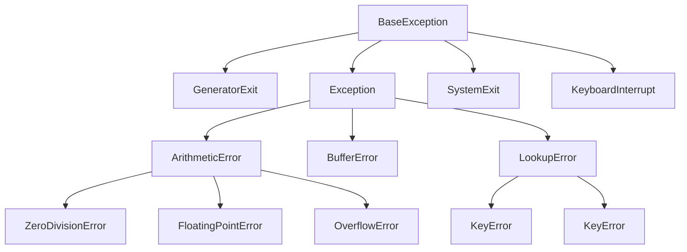

# 7. 错误及异常处理
问题描述：
- 程序语句正常，但是却因为输入值错误、逻辑超出正常处理范畴等错误无法运行。
- 若要继续运行，如何解决？
异常处理意义：
- 传递与处理进程异常信息，类似于公司管理。
## 7.1. 基本概念
### 7.1.1. 错误与异常比较
- 错误
错误是指由于逻辑或语法等导致一个程序无法正常执行的问题
特点： 有些错误是无法预知的
- 异常
异常是程序出错时标识的一种状态。
当异常发生时，程序不会再向下执行，而转去调用此函数的地方待处理此错误并恢复为正常状态。

即便Python程序的语法是正确的，在运行它的时候，也有可能发生错误。运行期检测到的错误被称为异常。
大多数的异常都不会被程序处理，都以报错信息的形式展现。

### 7.1.2. 作用
- 作用:
用作信号,通知上层调用者有错误需要处理

## 7.2. 语法与常用语句
- 五大语句概括：
```python
try-except
    偿试捕获异常，将程序转为正常状态并继续执行；
    捕获异常，偿试接收异常通知，异常时处理；
    (收通知,偿试处理错误，将状态改为正常状态)
try-finally
    通常用try-finally语句来做触发异常时必须要处理的事情,
    执行一定要执行的语句
    无论异常是否发生，finally子句都会被执行
    注:try-finally语句不会改变程序的(正常/异常)状态

raise
    发送异常通知，将程序转为异常状态（进入异常流程) 
    (发错误通知，将状态改为异常状态)
assert
    根据条件来触发AssertionError类型的异常
with 语句(以后再学)
```

- 语法：

```python
try:
	try:
	    可能触发异常的语句
	except 错误类型1 [as 变量1]:
	    异常处理语句1
	except 错误类型2 [as 变量2]:
	    异常处理语句2
	except (错误类型3, 错误类型4, ...) [as 变量3]:
	    异常处理语句3
	...
	except:
	    异常处理语句other
	else:
	    末发生异常时执行的语句
	finally:
	    一定要执行的最终语句
except 错误类型1:
	异常处理语句1
...
```
- 语法说明:
   - as 子句是用于绑定错误对象的变量，可以省略不写。
   - except子句可以有一个或多个，但至少要有一个except或finally
   - else子句最多只能有一个，也可以省略不写
   - finally子句最多只能有一个，也可以省略不写
- 变量绑定及异常自定义说明：
   - as可以用于绑定变量返回错误标识。


- 执行顺序：
  - 若无错：
    - 执行由try --> else   --> finally
  - 若遇错，从错误行立即跳出，若在try中，则
    - 执行由try --> except --> finally


---
开胃菜：

示例1：此示例用于演示try执行顺序

```python
def make_exception(x):
    try:
        if x == 1:
            raise ValueError("This is 我自己定义的一个错误")
        print('1. 该条语句会被打印吗？')
    except ValueError as e:
        print('2. except语句会被打印吗？')
        print("try里出现了值错误通知，已捕获!!!")
        print("接收的异常通知是: ", e)
    else:
        print('3. else语句会被打印吗？')
    finally:
        print('4. finally语句会被打印吗？')

print('\n正常执行')
make_exception(1)
print('\n异常执行')
make_exception(0)
```
运行结果：
```
正常执行
2. except语句会被打印吗？
try里出现了值错误通知，已捕获!!!
接收的异常通知是:  This is 我自己定义的一个错误
4. finally语句会被打印吗？

异常执行
1. 该条语句会被打印吗？
3. else语句会被打印吗？
4. finally语句会被打印吗？
```

### 7.2.1. try-except-else-finally 语句

语句：
- try-except: 尝试捕获异常，将程序转为正常状态并继续执行；
- try-finally：用来做触发异常时必须要处理的事情,

注:
- try-finally语句不会改变程序的(正常/异常)状态
- except只捕获给定的错误类型，若未给定相应类型，则跳过当前捕获语句。
- 在多重捕获中，错误会逐层向外传递，直到错误被相应except捕获接收

---
示例1：一个示例看懂try-except-else-fanally
```python
def f(a, p=None):
    try:
        n = int(a)
        if p:
            print(b)
    except ValueError as e:  # as可以用于绑定变量返回错误标识。
        print("错误的值是:", e)
    except NameError as e:
        print("错误的值是:", e)
    else:
        print('else子句正常执行')
    finally:
        print('函数执行完毕\n')

f("a")
f("1", 1)
f("1")
```
运行结果：
```
错误的值是: invalid literal for int() with base 10: 'a'
函数执行完毕

错误的值是: name 'b' is not defined
函数执行完毕

else子句正常执行
函数执行完毕
```

---
示例2：此示例用于展示try语句逐层向外传递的特性。
```python
def do():
    try:
        int("六")
    except TypeError as e:
        print('1) TypeError异常被捕获：', e)
    finally:
        print('1) finally')

try:
    try:
        do()  # 第一层
    except Exception as e:  # 第二层
        print("2) 捕获：", e)
    finally:
        print('2) finally')
except ValueError as e:  # 第三层
    print('3) TypeError异常被捕获：', e)
finally:
    print('3) finally')
```
运行结果：
```
1) finally
2) 捕获： invalid literal for int() with base 10: '六'
2) finally
3) finally
```

---
练习:
- 与一个函数 get_score() 来获取学生的成绩(0~100), 如果输入出现异常，则此函数返回0,否则返回用户输入的成绩

```python
def get_score(x):
    try:
        r = int(x)
    except Exception:
        return 0
    else:
        return r if 0 <= r <= 100 else 0

print("学生的成绩是:", get_score("九十"))
print("学生的成绩是:", get_score("102"))
print("学生的成绩是:", get_score("90"))
```
运行结果：
```
学生的成绩是: 0
学生的成绩是: 0
学生的成绩是: 90
```

### 7.2.3. raise 语句
作用:
- 触发一个错误,让程序进入异常状态

语法:
```python
raise 异常类型
    或
raise 异常对象
```

---
示例：
```python
def make_exception():
    # raise ValueError
    err = ValueError("这是我自己定义的一个错误")
    raise err
    print('该条语句会被跳过吗？yes')

try:
    make_exception()
    print('该条语句会被跳过吗？yes')  
except ValueError as e:
    print("try里出现了值错误通知，已捕获!!!")
    print("接收的异常通知是: ", e)
```

```python
try里出现了值错误通知，已捕获!!!
接收的异常通知是:  这是我自己定义的一个错误
```

### 7.2.4. assert 语句(断言语句)
作用：
- 用于抛出不满足正常条件的异常

语法：
```python
assert 真值表达式, 错误数据(通常是字符串)
```

说明：
- 当真值表达式为`True`时，程序正常向下执行。
- 当真值表达式为`False`时，用错误数据创建一个 AssertionError 类型的错误，并进入异常状态

原理理解，类似于：
```python
if 真值表达式 == False:
    raise AssertionError(错误数据)
```
 
示例：
```python
# 此示例示意assert语句的用法 
def get_score():
    s = int(input("请输入学生成绩: "))
    # 用assert语句来断言s是否在 0~100之间
    assert 0 <= s <= 100, "用户输入的整数不在0~100之间"
    return s

try:
    score = get_score()
    print("学生成绩为:", score)
except ValueError:
    print("用户输入的成绩无法转化为整数")
except AssertionError as err:
    print("发生了断言错误，原因是:", err)
```

---
示例：输入在`[1, 140]`范围内的整数

code1：
```python
def getnum(s):
    try:
        if s not in range(1, 141):
            raise AssertionError('你输入的数值"%d"不在范围内'%s)
        print("输入年龄：", s)
    except AssertionError as err:
        print('触发错误，', err)

getnum(121)
getnum(150)
```

code2：方法二(断言)
```python
def getnum(s):
    try:
        assert s not in range(1, 141), \
                    '你输入的数值"%d"不在范围内'%s
        print("输入年龄：", s)
    except AssertionError as err:
        print('触发错误，', err)

getnum(121)
getnum(150)
```

运行结果皆为：
```
输入年龄： 121
触发错误， 你输入的数值"150"不在范围内
```

## 7.3. 异常处理机制的应用探索

为什么要用异常处理机制？  
> 在程序调用层数较深时, 向主调函数传递错误信息需要用return语句层层传递比较麻烦, 异常处理机制可以省去这样的麻烦。

---
示例: 嵌套函数间的优化
```python
# 以建房子为例
def f1():
    print("开始建房子打地基")
    err = ValueError("打地基挖出古董")
    raise err
    print("完成打地基工作")
    return "地基完成"

def f2():
    print("开始建设地上部分")
    # err = ValueError("规划要建高压线")
    # return err
    print("地上部分建完..")
    return "地上完成"

def f3():
    # 建地基
    r1 = f1()
    # 建地上部分
    r2 = f2()
    return r1 + r2

def built_house():
    '''接项目的人'''
    return f3()

try:
    h = built_house()  # 建房子的函数,此函数应当返回一个房子对象
    print(h)
except ValueError as e:
    print("错误原因是:", e)
    print('改建博物管')
```


## 7.4. 错误类型

|       错误类型        |                        说明                        |
| --------------------- | -------------------------------------------------- |
| ZeroDivisionError     | 除(或取模)零 (所有数据类型)                        |
| ValueError            | 传入无效的参数                                     |
| AssertionError        | 断言语句失败                                       |
| StopIteration         | 迭代器没有更多的值                                 |
| IndexError            | 序列中没有此索引(index)                            |
| IndentationError      | 缩进错误                                           |
| ImportError           | 导入模块/对象失败                                  |
| OSError               | 输入/输出操作失败                                  |
| NameError             | 未声明/初始化对象 (没有属性)                       |
| AttributeError        | 对象没有这个属性                                   |
|                       |                                                    |
| BaseException         | 所有异常的基类                                     |
| SystemExit            | 解释器请求退出                                     |
| KeyboardInterrupt     | 用户中断执行(通常是输入^C)                         |
| Exception             | 常规错误的基类                                     |
| GeneratorExit         | 生成器(generator)发生异常来通知退出                |
| StandardError         | 所有的内建标准异常的基类                           |
| ArithmeticError       | 所有数值计算错误的基类                             |
| FloatingPointError    | 浮点计算错误                                       |
| OverflowError         | 数值运算超出最大限制                               |
| EOFError              | 没有内建输入,到达EOF 标记                          |
| EnvironmentError      | 操作系统错误的基类                                 |
| OSError               | 操作系统错误                                       |
| WindowsError          | 系统调用失败                                       |
| LookupError           | 无效数据查询的基类                                 |
| KeyError              | 映射中没有这个键                                   |
| MemoryError           | 内存溢出错误(对于Python 解释器不是致命的)          |
| UnboundLocalError     | 访问未初始化的本地变量                             |
| ReferenceError        | 弱引用(Weak reference)试图访问已经垃圾回收了的对象 |
| RuntimeError          | 一般的运行时错误                                   |
| NotImplementedError   | 尚未实现的方法                                     |
| SyntaxError Python    | 语法错误                                           |
| TabError              | Tab 和空格混用                                     |
| SystemError           | 一般的解释器系统错误                               |
| TypeError             | 对类型无效的操作                                   |
| UnicodeError          | Unicode 相关的错误                                 |
| UnicodeDecodeError    | Unicode 解码时的错误                               |
| UnicodeEncodeError    | Unicode 编码时错误                                 |
| UnicodeTranslateError | Unicode 转换时错误                                 |

以下为警告类型

|      以下为警告类型       |                                          |
| ------------------------- | ---------------------------------------- |
| Warning                   | 警告的基类                               |
| DeprecationWarning        | 关于被弃用的特征的警告                   |
| FutureWarning             | 关于构造将来语义会有改变的警告           |
| OverflowWarning           | 旧的关于自动提升为长整型(long)的警告     |
| PendingDeprecationWarning | 关于特性将会被废弃的警告                 |
| RuntimeWarning            | 可疑的运行时行为(runtime behavior)的警告 |
| SyntaxWarning             | 可疑的语法的警告                         |
| UserWarning               | 用户代码生成的警告                       |

备注：
- `except Exception`能捕获绝大多数常规异常，因而使用时应该放于所有异常处理的最后再处理。
- `except`后面如果不给参数，那么默认将接收所有异常，效果等同于`except BaseException`，使用时应注意。

常见异常类之间的继承关系：(了解)



