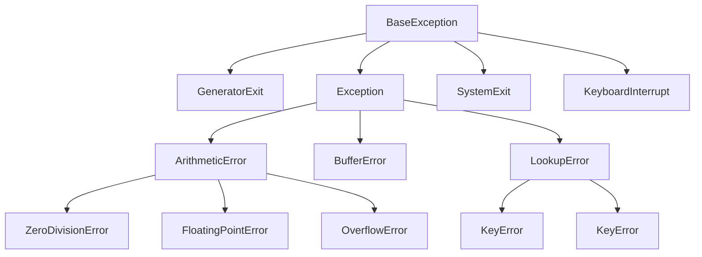

# 7. 错误及异常处理

异常机制己经成为衡量一门编程语言是否成熟的标准之一 ，使用异常处理机制的 Python 程序有更好的容错性，更加健壮 。

异常处理：传递与处理进程异常信息，类似于公司管理。

## 7.1. 基本概念

### 7.1.2. 错误与异常

一句话说明白错误与异常的概念、区别：
- 错误：错误是指当代码不符合规范，或者运算逻辑有问题造成程序无法正常向下执行。
- 异常：有的错误可以通过特定语句处理转为正常状态继续向下执行，这部分也被称为异常，异常是程序出错时标识的一种状态。
- 可以这样理解：`错误 > 异常`

错误大致分为两类：
- 语法错误：
  - 代码不符合解释器或者编译器语法。
  - 语法错误将导致Python程序无法通过编译，这类错误将无法被捕获。
- 逻辑错误：
  - 不完整或者不合法输入或者计算出现问题。这类错误基本可被捕获。被称为异常。
  - 当异常发生时，程序不会再向下执行，而转去调用此函数的地方待处理此错误并恢复为正常状态，若无对应。

作用: 用作信号,通知上层调用者有错误需要处理

ps: 大多数的异常都不会被程序处理，都以报错信息的形式展现。

---
**示例： 错误与异常简易演示**

**code1： 语法错误**
```python
try:
    a = 
except BaseException as e:
    print('捕获到异常', e)  
```
运行报错：（无法被捕获）
```python
  File "<ipython-input-2-8ea574de18bc>", line 2
    a =
        ^
SyntaxError: invalid syntax
```

---
**code2： 逻辑错误** (使用先于定义)
```python
try:
    a = b
except BaseException as e:
    print('捕获到异常：', e)
```
运行结果：
```
捕获到异常： name 'b' is not defined
```

## 7.2. 语法与常用语句

- 五大语句概括

```python
try-except
    偿试捕获异常，将程序转为正常状态并继续执行；
    捕获异常，偿试接收异常通知，异常时处理；
    (收通知,偿试处理错误，将状态改为正常状态)
try-finally
    通常用try-finally语句来做触发异常时必须要处理的事情,
    执行一定要执行的语句；
    无论异常是否发生，finally子句都会被执行
    注:try-finally语句不会改变程序的(正常/异常)状态

raise
    发送异常通知，将程序转为异常状态（进入异常流程) 
    (发错误通知，将状态改为异常状态)

assert
    根据条件来触发AssertionError类型的异常

with 语句(以后再学)
```

### 7.2.1. try-except-else-finally 语句

语句：
- try-except: 尝试捕获异常，将程序转为正常状态并继续执行；
- try-finally：用来做触发异常时必须要处理的事情,

- 语法：

```python
try:
	try:
	    可能触发异常的语句
	except 错误类型1 [as 变量1]:
	    异常处理语句1
	except 错误类型2 [as 变量2]:
	    异常处理语句2
	except (错误类型3, 错误类型4, ...) [as 变量3]:
	    异常处理语句3
	...
	except:
	    异常处理语句other
	else:
	    末发生异常时执行的语句
	finally:
	    一定要执行的最终语句
except 错误类型1:
	异常处理语句1
...
```

- 语法说明:
   - as子句 是用于绑定错误对象的变量，可以省略不写。
   - except子句 可以有一个或多个，但至少要有一个except或finally
   - else子句 最多只能有一个，也可以省略不写
   - finally子句 最多只能有一个，也可以省略不写
- 变量绑定及异常自定义说明：
   - as可以用于绑定变量返回错误标识。
- 执行顺序：
  - 若无错：
    - 执行由try --> else   --> finally
  - 若遇错，从错误行立即跳出，若在try中，则
    - 执行由try --> except --> finally
- 注:
  - except只捕获给定的错误类型，若未给定相应类型，则跳过当前捕获语句。
  - 在多重捕获中，错误会逐层向外传递，直到错误被相应except捕获接收。
  - finally语句不会改变程序的(正常/异常)状态。
  - finally语句不受`break`/`continue`的影响，不论是否存在都要执行。
  - finally语句常用于资源的回收。有时，程序在try块里打开的物理资源都必须被显式回收（如数据库连接、网络连接、磁盘文件等）。

---
示例：一个示例看懂try-except-else-fanally
```python
def f(a, p=None):
    try:
        print('输入  a:', a, ' p:', p)
        n = int(a)
        if p:
            a = b
    except ValueError as e:  # as可以用于绑定变量返回错误标识。
        print("捕获到ValueError异常:", e)
    except NameError as e:
        print("捕获到NameError异常:", e)
    else:
        print('未捕获到异常，else子句正常执行')
    finally:
        print('函数执行完毕, 此处进行资源回收\n')

f("a")
f("1", 1)
f("1")
```
运行结果：
```
输入  a: a  p: None
捕获到ValueError异常: invalid literal for int() with base 10: 'a'
函数执行完毕, 此处进行资源回收

输入  a: 1  p: 1
捕获到NameError异常: name 'b' is not defined
函数执行完毕, 此处进行资源回收

输入  a: 1  p: None
未捕获到异常，else子句正常执行
函数执行完毕, 此处进行资源回收
```

---
示例2：break在try中的使用
```python
for x in range(10):
    try:
        int('六')
    except Exception:
        print('捕获到异常')
        break
    finally:
        print('一定要执行的最终语句', x)
```
运行结果：
```
捕获到异常
一定要执行的最终语句 0
```


---
练习:
- 写一个函数 get_score() 来获取学生的成绩(0~100), 如果输入出现异常，则此函数返回0,否则返回用户输入的成绩

```python
def get_score(x):
    try:
        r = int(x)
    except Exception:
        return 0
    else:
        return r if 0 <= r <= 100 else 0

print("学生的成绩是:", get_score("九十"))
print("学生的成绩是:", get_score("102"))
print("学生的成绩是:", get_score("90"))
```
运行结果：
```
学生的成绩是: 0
学生的成绩是: 0
学生的成绩是: 90
```

### 7.2.2. raise 语句
作用:
- 触发一个错误,让程序进入异常状态

语法:
```python
raise
    或
raise 异常类型
    或
raise 异常对象
```

说明：
- `raise`： 单独一个raise。该语句引发当前上下文中捕获的异常（比如在 except 块中），或默认引发 RuntimeError 异常 。
- `raise 异常类`： raise后带一个异常类。该语句引发指定异常类的默认实例。
- `raise 异常对象`： 引发指定的异常对象 。

---
示例1：raise
```python
try:
    try:
        int('六')
    except ValueError:
        print('ValueError异常被捕获，正在再次抛出相同异常')
        raise
except ValueError as e:
    print('ValueError异常被捕获，异常：\n   ', e)
```
运行结果：
```
ValueError异常被捕获，正在再次抛出相同异常
ValueError异常被捕获，异常：
    invalid literal for int() with base 10: '六'
```

---
示例2： raise 异常类
```python
def make_exception():
    # raise ValueError
    err = ValueError("这是我自己定义的一个错误")
    raise err
    print('该条语句会被跳过吗？')

try:
    make_exception()
    print('该条语句会被跳过吗？')  
except ValueError as e:
    print("try里出现了值错误通知，已捕获!!!")
    print("接收的异常通知是: ", e)
```
运行结果：
```python
try里出现了值错误通知，已捕获!!!
接收的异常通知是:  这是我自己定义的一个错误
```

---
示例3： raise 异常对象
```python
class MyselfError(Exception):
    pass

try:
    raise MyselfError('自定义错误')
except MyselfError as e:
    print('捕获到的异常是：', e, type(e), sep='\n')
```
运行结果：
```
捕获到的异常是：
自定义错误
<class '__main__.MyselfError'>
```

### 7.2.3. assert 语句(断言语句)
作用：
- 用于抛出不满足条件的异常

- 语法：

    ```python
    assert 真值表达式, 错误数据(通常是字符串)
    ```

- 说明：
  - 当真值表达式为`True`时，程序正常向下执行。
  - 当真值表达式为`False`时，用错误数据创建一个 AssertionError 类型的错误，并进入异常状态

- 原理理解，类似于：

    ```python
    if 真值表达式 == False:
        raise AssertionError(错误数据)
    ```

--- 
示例： 此示例示意assert语句的用法 
```python
def get_score(x):
    s = int(x)
    # 用assert语句来断言s是否在 0~100之间
    assert 0 <= s <= 100, "用户输入的整数不在0~100之间"
    return s

for x in ['90', '110', 'a']:
    try:
        print('\n输入：', x)
        score = get_score(x)
        print("学生成绩为:", score)
    except ValueError:
        print("用户输入的成绩无法转化为整数")
    except AssertionError as err:
        print("发生了断言错误，原因是:", err)
```
运行结果：
```
输入： 90
学生成绩为: 90

输入： 110
发生了断言错误，原因是: 用户输入的整数不在0~100之间

输入： a
用户输入的成绩无法转化为整数
```

---
示例2：触发错误的两种方式对比，输入在`[1, 140]`范围内的整数

code1：
```python
def getnum(s):
    try:
        if s not in range(1, 141):
            raise AssertionError('你输入的数值"%d"不在范围内'%s)
        print("输入年龄：", s)
    except AssertionError as err:
        print('触发错误，', err)

getnum(121)
getnum(150)
```

code2：方法二(断言)
```python
def getnum(s):
    try:
        assert s not in range(1, 141), \
               '你输入的数值"%d"不在范围内'%s
        print("输入年龄：", s)
    except AssertionError as err:
        print('触发错误，', err)

getnum(121)
getnum(150)
```

运行结果皆为：
```
输入年龄： 121
触发错误， 你输入的数值"150"不在范围内
```

## 7.3. 异常传播轨迹

### 7.3.1. 基本概念理解
何为异常传播轨迹？
如下示例中，报错信息指向7行do()，再指向2行do1()，再指向5行，这个过程就是Python的异常传播轨迹 。
```python
def do():
    do1()

def do1(): 
    raise ValueError("自定义异常信息")

do()
```
运行报错信息：
```
---------------------------------------------------------------------------
ValueError                                Traceback (most recent call last)
d:\JUN_data\GitHub\PythonNote\docs\00.Python\Chapter07.Exception.md in <module>
      5     raise ValueError("自定义异常信息")
      6
----> 7 do()

d:\JUN_data\GitHub\PythonNote\docs\00.Python\Chapter07.Exception.md in do()
      1 def do():
----> 2     do1()
      3
      4 def do1():
      5     raise ValueError("自定义异常信息")

d:\JUN_data\GitHub\PythonNote\docs\00.Python\Chapter07.Exception.md in do1()
      3
      4 def do1():
----> 5     raise ValueError("自定义异常信息")
      6
      7 do()

ValueError: 自定义异常信息
```

### 7.3.2. 访问异常信息
- `as` 子句
  - 可以将错误信息绑定于一个变量
- `sys模块`
  - `sys.exc_info()` 方法可以获得一个错误信息元组：异常类型、异常值、异常传播轨迹 
- `traceback模块`
  - `traceback.print_exc([limit[, file])` 方法的可以得到所有预打印异常信息，使用traceback输出所有异常信息
    - `limit`：用于限制显示异常传播的层数，比如函数 A 调用函数 B ，函数 B 发生了异常，如果指定 limit=1，则只显示函数 A 里面发生的异常。如果不设置 limit 参数，则默认全部显示。
    - `file`：指定将异常传播轨迹信息输出到指定文件中。如果不指定该参数，则默认输出到控制台。
  - `format_exc()`：将异常传播轨迹信息转换成字符串。

---
示例1： 输出异常信息
```python
import traceback
import sys

def do():
    do1()

def do1(): 
    raise ValueError("自定义异常信息")

try:
    do()
except Exception as e:
    print('\n方法1：as子句绑定方法')
    print('错误信息：', e)

    print('\n方法2：sys.exc_info()方法')
    print(*sys.exc_info(), sep='\n')

    print('\n方法3：traceback模块, traceback.print_exc()方法')
    traceback.print_exc()
    # traceback.print_exc(1)
    # traceback.print_exc(file=open('log.txt', 'a'))

    print('\n方法4：traceback模块, traceback.format_exc()方法')
    print(traceback.format_exc())
```

运行结果：
```
方法1：as子句绑定方法
错误信息： 自定义异常信息

方法2：sys.exc_info()方法
<class 'ValueError'>
自定义异常信息
<traceback object at 0x00000116E713F288>

方法3：traceback模块, traceback.print_exc()方法
Traceback (most recent call last):
  File "<ipython-input-35-3ca564eb045d>", line 11, in <module>
    do()
  File "<ipython-input-35-3ca564eb045d>", line 5, in do
    do1()
  File "<ipython-input-35-3ca564eb045d>", line 8, in do1
    raise ValueError("自定义异常信息")
ValueError: 自定义异常信息

方法4：traceback模块, traceback.format_exc()方法
Traceback (most recent call last):
  File "<ipython-input-35-3ca564eb045d>", line 11, in <module>
    do()
  File "<ipython-input-35-3ca564eb045d>", line 5, in do
    do1()
  File "<ipython-input-35-3ca564eb045d>", line 8, in do1
    raise ValueError("自定义异常信息")
ValueError: 自定义异常信息
```

### 7.3.3. 异常的传播

---
示例：此示例用于展示try语句逐层向外传递的特性，直到报错前被相应语句块捕获。
```python
def do1():
    try:
        int("六")
    except TypeError as e:  # 第一层
        print('1) TypeError 异常被捕获：', e)

def do2():
    try:
        do1()
    except Exception as e:  # 第二层
        print("2) 捕获：", e)

def do3():
    try:
        do2()
    except ValueError as e:  # 第三层
        print('3) ValueError 异常被捕获：', e)

do3()
```
运行结果：
```
1) 捕获： invalid literal for int() with base 10: '六'
```

### 7.3.4. 异常处理机制的应用 —— 信息传递

为什么要用异常处理机制？
> 在程序调用层数较深时, 向主调函数传递信息需要用return语句层层传递比较麻烦, 使用异常处理机制可以省去这样的麻烦，使代码更为简洁。  
> 不过也有缺陷，大多时候异常处理机制运算效率比逻辑判断低，应谨慎使用。

---
**示例:** 多重嵌套函数间的信息传递

code1: 手动使用逻辑判断
```python
# 以建房子为例
def f1(p=0):
    print("开始建房子打地基")
    if p:
        return "打地基挖出古董"
    print("完成打地基工作")
    return "地基完成"

def f2(p=0):
    print("开始建设地上部分")
    if p:
        return "规划要建高压线"
    print("地上部分建完..")
    return "地上完成"

def f3(a, b):
    # 建地基
    r1 = f1(a)
    if r1 == "打地基挖出古董":
        return r1
    # 建地上部分
    r2 = f2(b)
    if r2 == "规划要建高压线":
        return r2
    return r1 + r2

def built_house(a, b):
    '''接项目的人'''
    return f3(a, b)

for a,b in [(0,0), (0,1), (1,0), (1,1)]:
    print('\n输入：', a, b)
    h = built_house(a,b)  # 建房子的函数,此函数应当返回一个房子对象
    if h == "打地基挖出古董":
        print("错误原因是:", h)
        print('改建博物管')
    elif h == "规划要建高压线":
        print("错误原因是:", h)
        print('改建绿植厂')
    else:
        print(h)
```

code2: 异常处理机制
```python
# 以建房子为例
def f1(p=0):
    print("开始建房子打地基")
    if p:
        raise ValueError("打地基挖出古董")
    print("完成打地基工作")
    return "地基完成"

def f2(p=0):
    print("开始建设地上部分")
    if p:
        raise NameError("规划要建高压线")
    print("地上部分建完..")
    return "地上完成"

def f3(a, b):
    # 建地基
    r1 = f1(a)
    # 建地上部分
    r2 = f2(b)
    return r1 + r2

def built_house(a, b):
    '''接项目的人'''
    return f3(a, b)

for a,b in [(0,0), (0,1), (1,0), (1,1)]:
    try:
        print('\n输入：', a, b)
        h = built_house(a,b)  # 建房子的函数,此函数应当返回一个房子对象
        print(h)
    except ValueError as e:
        print("错误原因是:", e)
        print('改建博物管')
    except NameError as e:
        print("错误原因是:", e)
        print('改建绿植厂')
```

以上code运行结果：
```
输入： 0 0
开始建房子打地基
完成打地基工作
开始建设地上部分
地上部分建完..
地基完成地上完成

输入： 0 1
开始建房子打地基
完成打地基工作
开始建设地上部分
错误原因是: 规划要建高压线
改建绿植厂

输入： 1 0
开始建房子打地基
错误原因是: 打地基挖出古董
改建博物管

输入： 1 1
开始建房子打地基
错误原因是: 打地基挖出古董
改建博物管
```

## 7.4. 使用异常处理的一些规则
- 不要过度使用异常
    > 对于不可预知的错误才使用异常。  
    > 异常处理机制的初衷是将不可预期异常的处理代码和正常的业务逻辑处理代码分离，因此绝不要使用异常处理来代替正常的业务逻辑判断。并且异常机制的效率比正常的流程控制效率差，所以不要使用异常处理来代替正常的程序流程控制 。
- 不要使用过于庞大的 try 块。
    > 对于待处理的异常语句，最好单独列出。当有大量的语句需要不同的except语句处理时，后续的检查与维护都是十分不友好的。
- 不要忽略捕获到的异常
    > 不要忽略异常！既然己捕获到异常，那么 except 块理应做些有用的事情处理井修复异常。  
    > 
    > except 块整个为空，或者仅仅打 印简单的异常信息都是不妥的！ except 块为空就是假装不知道甚至瞒天过海，这是最可怕的事情一一程序出了错误，所有人都看不到任何异常，但整个应用可能已经彻底坏了。仅在 except 块里打印异常传播信息稍微好一点，但仅仅比空白多了几行异常信息。  
    > 
    > 通常建议对异常采取适当措施，比如：  
    > - 处理异常。对异常进行合适的修复，然后绕过异常发生的地方继续运行 ；或者用别的数据进行计算，以代替期望的方法返回值； 或者提示用户重新操作 …… 总之，程序应该尽量修复异常 ，使程序能恢复运行。  
    > - 重新引发新异常。把在当前运行环境下能做的事情尽量做完，然后进行异常转译，把异常包装成当前层的异常，重新传给上层调者。  
    > - 在合适的层处理异常。 如果当前层不清楚如何处理异常，就不要在当前层使用except语句来捕获该异常 ，让上层调用者来负责处理该异常。  

## 7.5. 触发的异常类型

|       错误类型        |                        说明                        |
| --------------------- | -------------------------------------------------- |
| ZeroDivisionError     | 除(或取模)零 (所有数据类型)                        |
| ValueError            | 传入无效的参数                                     |
| AssertionError        | 断言语句失败                                       |
| StopIteration         | 迭代器没有更多的值                                 |
| IndexError            | 序列中没有此索引(index)                            |
| IndentationError      | 缩进错误                                           |
| ImportError           | 导入模块/对象失败                                  |
| OSError               | 输入/输出操作失败                                  |
| NameError             | 未声明/初始化对象 (没有属性)                       |
| AttributeError        | 对象没有这个属性                                   |
| :                     |                                                    |
| BaseException         | 所有异常的基类                                     |
| SystemExit            | 解释器请求退出                                     |
| KeyboardInterrupt     | 用户中断执行(通常是输入^C)                         |
| Exception             | 常规错误的基类                                     |
| GeneratorExit         | 生成器(generator)发生异常来通知退出                |
| StandardError         | 所有的内建标准异常的基类                           |
| ArithmeticError       | 所有数值计算错误的基类                             |
| FloatingPointError    | 浮点计算错误                                       |
| OverflowError         | 数值运算超出最大限制                               |
| EOFError              | 没有内建输入,到达EOF 标记                          |
| EnvironmentError      | 操作系统错误的基类                                 |
| OSError               | 操作系统错误                                       |
| WindowsError          | 系统调用失败                                       |
| LookupError           | 无效数据查询的基类                                 |
| KeyError              | 映射中没有这个键                                   |
| MemoryError           | 内存溢出错误(对于Python 解释器不是致命的)          |
| UnboundLocalError     | 访问未初始化的本地变量                             |
| ReferenceError        | 弱引用(Weak reference)试图访问已经垃圾回收了的对象 |
| RuntimeError          | 一般的运行时错误                                   |
| NotImplementedError   | 尚未实现的方法                                     |
| SyntaxError Python    | 语法错误                                           |
| TabError              | Tab 和空格混用                                     |
| SystemError           | 一般的解释器系统错误                               |
| TypeError             | 对类型无效的操作                                   |
| UnicodeError          | Unicode 相关的错误                                 |
| UnicodeDecodeError    | Unicode 解码时的错误                               |
| UnicodeEncodeError    | Unicode 编码时错误                                 |
| UnicodeTranslateError | Unicode 转换时错误                                 |

以下为警告类型

|      以下为警告类型       |                                          |
| ------------------------- | ---------------------------------------- |
| Warning                   | 警告的基类                               |
| DeprecationWarning        | 关于被弃用的特征的警告                   |
| FutureWarning             | 关于构造将来语义会有改变的警告           |
| OverflowWarning           | 旧的关于自动提升为长整型(long)的警告     |
| PendingDeprecationWarning | 关于特性将会被废弃的警告                 |
| RuntimeWarning            | 可疑的运行时行为(runtime behavior)的警告 |
| SyntaxWarning             | 可疑的语法的警告                         |
| UserWarning               | 用户代码生成的警告                       |

备注：
- `except Exception`能捕获绝大多数常规异常，因而使用时应该放于所有异常处理的最后再处理。
- `except`后面如果不给参数，那么默认将接收所有异常，效果等同于`except BaseException`，使用时应注意。

常见异常类之间的继承关系：(了解)



