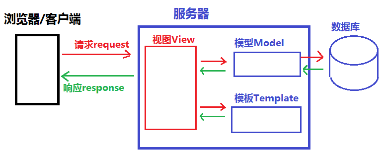

# 1. 概述

## 1.1. Django框架的介绍

### 1.1.1. 概述

**起源、发展及用途**
- 2005年发布,采用Python语言编写的开源web框架
- 早期的时候Django主做新闻和内容管理的
- Django本身提供了强大的后台管理系统
- 一个重量级的 Python Web框架，Django 配备了常用的大部分组件
    1. 基本配置  
    2. 路由系统   
    3. 原生HTML模板系统
    4. 视图 view
    5. Model模型,数据库连接和ORM数据库管理
    6. 中间件
    7. Cookie & Seesion
    8. 分页
    9. 数据库后台管理系统admin

**Django的用途**
- 网站后端开发
- 微信公众号、微信小程序等后台开发
- 基于HTTP/HTTPS协议的后台服务器开发
- tornado/gevent 4层
   - 在线语音/图像识别服务器
   - 在线第三方身份验证服务器等

**Django的版本**
- 最新版本:2.2.x
- 当前教学版本:1.11.8

**Django的开发环境**
- Django 1.11.x 支持 Python 2.7, 3.4, 3.5 和 3.6（长期支持版本 LTS)
- 注: Django 1.11.x 不支持 Python 3.7

**Django的官网**
- 官方网址: <http://www.djangoproject.com>
- 中文文档(第三方):
    - <https://yiyibooks.cn/>
    - <http://djangobook.py3k.cn/>
- Django的离线文档
    1. 解压缩数据包 `django-docs-1.11-en.zip`
    2. 用浏览器打开 `django-docs-1.11-en/index.html`


### 1.1.2. Django 框架

- 1.WEB 与 服务器
  - 1.WEB : 表示用户可以浏览的网页内容(HTML,CSS,JS)
  - 2.服务器 
  	- 专门给用户提供服务的一台机器
  	- 1.硬件与软件
  		- 硬件范畴:一台机器
  		- 软件范畴:一个能够接受用户请求并给出响应的程序
  			- 1.APACHE
  			- 2.TOMCAT
  			- 3.IIS(Internet Information Service)
  			- 4.Nginx
  	- 2.服务器的作用
  		- 1.存储WEB上所需要的信息(HTML,图片,js,css,音视频)
  		- 2.处理用户的请求(request)并给出响应(response)
  		- 3.执行服务器端的程序 : 查找数据库
  	- 3.服务器 与 WEB之间的关系
  		- WEB需要放在服务器上才能够被用户访问
- 2.框架
	- 1.什么是框架
		框架是一个为了解决开放性问题而存在的一种结构.框架本身会提供一些最基本的功能.我们只需要在基本功能之上搭建属于自己的操作- 即可.
	- 2.PYTHON WEB 框架
		- 1.Django : 重量级的WEB框架
		- 2.Tornado : 异步框架
		- 3.Flask : 轻量级框架

#### 1.1.2.1. Django的框架设计模式

- MVC 设计模式
    - MVC 代表 Model-View-Controller（模型-视图-控制器） 模式。
    - 作用: 降低模块间的耦合度(解耦)
    - MVC
        - M 模型层(Model), 主要用于对数据库层的封装
        - V 视图层(View), 用于向用户展示结果
        - C 控制(Controller ，用于处理请求、获取数据、返回结果(重要)
    - MVC模式如图:
        

- MTV 模式
    - MTV 代表 Model-Template-View（模型-模板-视图） 模式。这种模式用于应用程序的分层开发
    - 作用: 
        - 降低模块间的耦合度(解耦)
    - MTV 
        - M -- 模型层(Model)  负责与数据库交互
        - T -- 模板层(Template)  负责呈现内容到浏览器
        - V -- 视图层(View)  是核心，负责接收请求、获取数据、返回结果
    - MTV模式如图:
        


## 1.1.3. Django的安装

查看已安装的版本

```shell
$ python -m django version
1.11.8
$ python
>>> import django
>>> print(django.VERSION)
(1, 11, 8, 'final', 0)
```

安装
1. 在线安装
    - `$ sudo pip3 install django`  安装django的最新版本
    <br>或
    - `$ sudo pip3 install django[==版本]` 安装django的指定版本
    <br>如:
    - `$ sudo pip3 install django==1.11.8`
2. 离线安装
    - 下载安装包:
    - 安装离线包
        ```shell
        $ tar -xvf Django-1.11.8.tar.gz
        $ cd Django-1.11.8
        $ sudo python3 setup.py install
        ```
3. 用wheel离线安装
    - 下载安装包:
        - `pip3 download -d /home/tarena/django_packs django==1.11.8`
    - 安装离线包
      - $ pip3 install Django-1.11.8.whl
4. Django的卸载
    - `$ pip3 uninstall django`
  

## 1.2. Django框架开发基本指令

### 创建项目的指令  

命令： `django-admin startproject 项目名称`

示例:  
```bash
django-admin startproject mysite1
```

### 项目的基本运行

```bash
cd mysite1  # 进入项目目录
# 按照默认配置运行
python3 manage.py runserver
# 指定只能本机使用127.0.0.1的5000端口访问本机
python3 manage.py runserver 5000
# 指定只能任何机器使用IP的5000端口访问本机
python3 manage.py runserver 0.0.0.0:5000
```

---
拓展：端口占用 出现8000端口已占用 解决方案
> 
> 1. 查看是否有django进程启动  
> `ps aux|grep 'runserver'`
> 
> 2. 若grep中出现 相关进程，可直接杀掉！(最好用默认 `-s 15`)  
> `kill -9  pid pid `
> 
> 案例如下：
> 
> ```shell
> # 执行 查！
> $ ps aux|grep 'runserver'
> test    13984  0.0  0.4 125980 39604 pts/0    S+   15:39   0:00 python3 manage.py runserver
> test    14914  1.2  0.5 202864 41312 pts/0    Sl+  16:10   0:05 /usr/bin/python3 manage.py runserver
> test    15056  0.0  0.0  21532  1156 pts/4    S+   16:17   0:00 grep --color=auto runserver
> 
> # 执行 干！
> $ kill -9 13984 14914
> ```


## 1.3. Django项目的目录结构
### 1.3.1. 项目目录结构解析:

- 示例:

    ```shell
    $ django-admin startproject mysite1
    $ tree mysite1/
    mysite1/
    ├── manage.py
    └── mysite1
        ├── __init__.py
        ├── settings.py
        ├── urls.py
        └── wsgi.py
    
    1 directory, 5 files
    ```

- **`manage.py`**
    - 此文件是项目管理的主程序,在开发阶段用于管理整个项目的开发运行的调式
    - `manage.py` 包含项目管理的子命令, 如:
        - `python3 manage.py runserver` 启动服务
        - `python3 manage.py startapp` 创建应用
        - `python3 manage.py migrate` 数据库迁移
        - `...`

- **`mysite1` 项目包文件夹**
    - 项目包的主文件夹(默认与项目名称一致)
    1. `__init__.py`
        - 包初始化文件,当此项目包被导入(import)时此文件会自动运行
    2. `wsgi.py`
        - WSGI 即 Web Server Gateway Interface   与 nginx 相连
        - WEB服务网关接口的配置文件，仅部署项目时使用
    3. `urls.py`
        - 项目的基础路由配置文件，所有的动态路径必须先走该文件进行匹配
    4. `settings.py`
        - Django项目的配置文件, 此配置文件中的一些全局变量将为Django框架的运行传递一些参数
        - setting.py 配置文件,启动服务时自动调用，
        - 此配置文件中也可以定义一些自定义的变量用于作用全局作用域的数据传递
        http://127.0.0.1:8000/admin/

- **其中：`settings.py`的文件介绍**
    1. `BASE_DIR`
        - 用于绑定当前项目的绝对路径(动态计算出来的), 所有文件都可以依懒此路径
    2. `DEBUG`
        - 用于配置Django项目的启用模式, 取值:
            1. True 表示开发环境中使用 `调试模式`(用于开发中)
            2. False 表示当前项目运行在`生产环境中`(不启用调试)
    3. `ALLOWED_HOSTS`
        - 设置允许访问到本项目的网络地址列表,取值:
            1. `[]` 空列表,表示只有`127.0.0.1`, `localhost`能访问本项目
            2. `['*']`，表示任何网络地址都能访问到当前项目
            3. `['192.168.1.3', '192.168.3.3']` 表示只有当前两个主机能访问当前项目
            - 注意:
                - 如果要在局域网其它主机也能访问此主机,启动方式应使用如下模式:
        - `python3 manage.py runserver 0.0.0.0:5000` # 指定网络设备所有主机都可以通过5000端口访问(需加`ALLOWED_HOSTS = ['*']`) 
    4. `INSTALLED_APPS`
        - 指定当前项目中安装的应用列表
    5. `MIDDLEWARE`
        - 用于注册中间件
    6. `TEMPLATES`
        - 用于指定模板的配置信息
    7. `DATABASES`
        - 用于指定数据库的配置信息
    8. `LANGUAGE_CODE`
        - 用于指定语言配置
        - 取值:
            - 英文 : `"en-us"`
            - 中文 : `"zh-Hans"`
    9. `TIME_ZONE`
        - 用于指定当前服务器端时区
        - 取值:
            - 世界标准时间: `"UTC"`
            - 中国时区 : `"Asia/Shanghai"`
    10. `ROOT_URLCONF`
        - 用于配置根级 url 配置 'mysite1.urls'
        - 如:
            - `ROOT_URLCONF = 'mysite1.urls'`
    注: 此模块可以通过 `from django.conf import settings` 导入和使用

