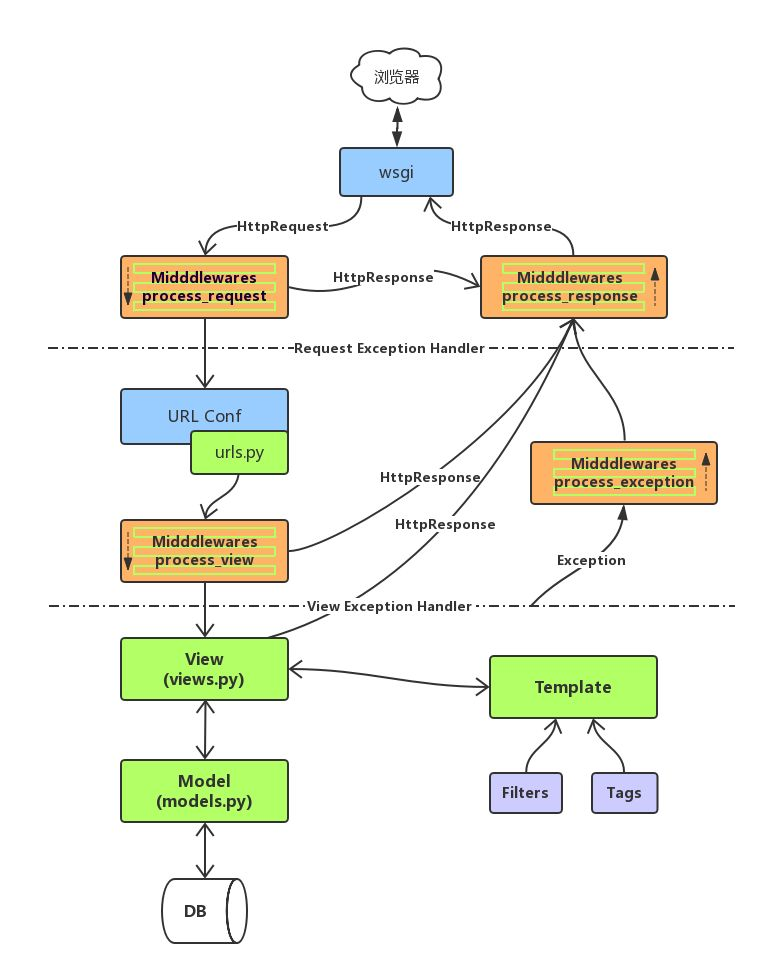

<h1>Django Web框架笔记</h1>

目录

[TOC]

课程特点：

1. 学习难度大，大部分内容需要理解并记忆
2. 文件较多易混淆
3. 学习阶段注重框架使用，工作阶段注重实现业务逻辑
4. 综合应用强，小练习少


# 4. 视图和模板
MTV设计模式，MTV 代表 Model-Template-View（模型-模板-视图） 模式。这种模式用于应用程序的分层开发

## 4.1. 模板 Templates
- 什么是模板
    1. 模板是可以根据字典数据动态变化的html网页
    2. 模板可以根据视图中传递的字典数据动态生成相应的HTML网页。

### 4.1.1. 模板的配置
    - 创建模板文件夹`<项目名>/templates`
    - 在 settings.py 中有一个 TEMPLATES 变量
        1. BACKEND : 指定模板的引擎
        2. DIRS : 模板的搜索目录(可以是一个或多个)
        3. APP_DIRS : 是否要在应用中的 `templates` 文件夹中搜索模板文件
        4. OPTIONS : 有关模板的选项

- 默认的模块文件夹`templates`
- 修改settings.py文件，设置TEMPLATES的DIRS值为`'DIRS': [os.path.join(BASE_DIR, 'templates')],`

```python
# file: settings.py
TEMPLATES = [
    {
        'BACKEND': 'django.template.backends.django.DjangoTemplates',
        # 'DIRS': [],
        'DIRS': [os.path.join(BASE_DIR, 'templates')],  # 添加模板路径
        'APP_DIRS': True,  # 是否索引各app里的templates目录
        ...
    },
]
```


### 4.1.2. Django 模板语言

#### 4.1.2.1. 模板的传参
- 模板传参是指把数据形成字典，传参给模板，为模板渲染提供数据

- 模板的加载方式
    1. 使用 loader 加载模板
        ```python
        from django.template import loader
        # 1.通过loader加载模板
        t = loader.get_template('xxx.html') # xxx.html 模板文件名
        # 2.将t转换成 HTML 字符串
        html = t.render(字典数据)
        # 3.用响应对象将转换的字符串内容返回给浏览器
        return HttpResponse(html)

        # 简写
        # html = loader.get_template("模板文件名").render(字典数据 )
        ```
    2. 使用 render() 直接加载并响应模板
        ```python
        from django.shortcuts import render
        return render(request,'xxx.html', 字典数据)
        ```

#### 4.1.2.2. 模板的变量
1. 在模板中使用变量语法
    - `{{ 变量名 }}`
    - `{{ 变量名.index }}`   list.0
    - `{{ 变量名.key}}`     dict['key']   dict.key
    - `{{ 对象.方法 }}`
    - `{{ 函数名 }}`

- 视图函数中必须将变量封装到字典中才允许传递到模板上
    ```python
    def xxx_view(request)
        dic = {
            "变量1":"值1",
            "变量2":"值2",
        }
        return render(request, 'xxx.html', dic)
    ```

#### 4.1.2.3. 模板的标签
1. 作用

    - 将一些服务器端的功能嵌入到模板中

2. 标签语法
    ```
    
    ...
    
    ```

3. if 标签
    ```
    
    ...
    
    ...
    
    ...
    
    ...
    
    ```

4. if 标签里的布尔运算符

    - if 条件表达式里可以用的运算符 ==, !=, <, >, <=, >=, in, not in, is, is not, not、and、or
    - 在if标签中使用实际括号是无效的语法。 如果您需要它们指示优先级，则应使用嵌套的if标记。
    - 

5. locals函数的使用

    locals() 返回当前函数作用域内全部局部变量形成的字典。

6. for 标签
    1. 语法
        ```
        
            ... 循环语句
        
            ... 可迭代对象无数据时填充的语句
        
        ```
    2. 内置变量 - forloop 

|        变量         |                描述                 |
| :-----------------: | :---------------------------------: |
|   forloop.counter   |    循环的当前迭代（从1开始索引）    |
|  forloop.counter0   |    循环的当前迭代（从0开始索引）    |
| forloop.revcounter  |  循环结束的迭代次数（从1开始索引）  |
| forloop.revcounter0 |  循环结束的迭代次数（从0开始索引）  |
|    forloop.first    |   如果这是第一次通过循环，则为真    |
|    forloop.last     |    如果这是最后一次循环，则为真     |
| forloop.parentloop  | 当嵌套循环，parentloop 表示外层循环 |


#### 4.1.2.4. 过滤器
1. 作用
    - 在变量输出时对变量的值进行处理
    - 您可以通过使用 过滤器来改变变量的输出显示。
2. 语法
   
    - {{ 变量 | 过滤器1:参数值1 | 过滤器2:参数值2 ... }}
3. 常用的过滤器

| 过滤器 | 说明 |
|:-:|:-:|
| lower | 将字符串转换为全部小写。|
| upper | 将字符串转换为大写形式 |
| safe | 默认不对变量内的字符串进行html转义 |
| add: "n" | 将value的值增加 n |
| truncatechars:'n' | 如果字符串字符多于指定的字符数量，那么会被截断。 截断的字符串将以可翻译的省略号序列（“...”）结尾。 |
| ... | |

4. 文档参见:
   
    - <https://docs.djangoproject.com/en/1.11/ref/templates/builtins/>


### 4.1.3. 模板的继承
- 模板继承可以使父模板的内容重用,子模板直接继承父模板的全部内容并可以覆盖父模板中相应的块
- 定义父模板中的块 `block`标签
    - 标识出哪些在子模块中是允许被修改的
    - block标签：在父模板中定义，可以在子模板中覆盖
        ```
        
        定义模板块，此模板块可以被子模板重新定义的同名块覆盖
        
        ```
- 继承模板 `extends` 标签(写在模板文件的第一行)
    - 子模板继承语法标签
        - ``
        - 如:
            - ``
    - 子模板 重写父模板中的内容块
    ```
    
    子模板块用来覆盖父模板中 block_name 块的内容
    
    ```
    - 重写的覆盖规则
        - 不重写,将按照父模板的效果显示
        - 重写,则按照重写效果显示
    - 注意
        - 模板继承时,服务器端的动态内容无法继承

- 参考文档
  
- <https://docs.djangoproject.com/en/1.11/ref/templates/>
  
- 模板的继承示例:
  
    - 

### 4.1.4. url 反向解析
- url 反向解析是指在视图或模板中，用为url定义的名称来查找或计算出相应的路由
- url 函数的语法
    - `url(regex, views, kwargs=None, name="别名")`
    - 例如:
        - `url(r'^user_login$', views.login_view, name="login")`

- url() 的`name`关键字参数
    - 作用:
        - 根据url 列表中的`name=`关键字传参给 url确定了个唯一确定的名字，在模板中，可以通过这个名字反向推断出此url信息
    - 在模板中通过别名实现地址的反向解析
        ```
        
        
        ```
- 练习:
    ```
    写一个有四个自定义页面的网站，对应路由:
    /       主页
    /page1   页面1
    /page2   页面2
    /page3   页面3
    功能: 主页加 三个页面的连接分别跳转到一个页面，三个页面每个页面加入一个链接用于返回主页
    ```

## 4.2. 静态文件
1. 什么是静态文件
    - 不能与服务器端做动态交互的文件都是静态文件
    - 如:图片,css,js,音频,视频,html文件(部分)
2. 静态文件配置
    - 在 settings.py 中配置一下两项内容:
    1. 配置静态文件的访问路径

        https://oimagea1.ydstatic.com/image?id=-5337101211608292607&product=adpublish&w=640&h=480&sc=0&rm=2&gsb=0&gsbd=60

        - 通过哪个url地址找静态文件
        - 127.0.0.1:8000/static/
        - STATIC_URL = '/static/'
        - 说明:
            - 指定访问静态文件时是需要通过 /static/xxx或 127.0.0.1:8000/static/xxx
            - xxx 表示具体的静态资源位置

    2. 配置静态文件的存储路径 `STATICFILES_DIRS`

        - STATICFILES_DIRS保存的是静态文件在服务器端的存储位置

    3. 示例:
        ```python
        # file: setting.py
        STATICFILES_DIRS = (
            os.path.join(BASE_DIR, "static"),
        )
        ```
3. 访问静态文件
    1. 使用静态文件的访问路径进行访问
        - 访问路径: STATIC_URL = '/static/'
        -  示例:
            ```python
            
            
            ```
    2. 通过 标签访问静态文件
        - `` 表示的就是静态文件访问路径

        1. 加载 static
            - ``
        2. 使用静态资源时
            - 语法:
                - ``
            - 示例:
                - ``


# 5. 数据库 和 模型

## 5.1. 模型（Models）
- 模型是一个Python类，它是由django.db.models.Model派生出的子类。
- 一个模型类代表数据库中的一张数据表
- 模型类中每一个类属性都代表数据库中的一个字段。
- 模型是数据交互的接口，是表示和操作数据库的方法和方式


1. Django 的 ORM框架
- ORM（Object Relational Mapping）即对象关系映射，它是一种程序技术，它允许你使用类和对象对数据库进行操作,从而避免通过SQL语句操作数据库
- ORM框架的作用
    1. 建立模型类和表之间的对应关系，允许我们通过面向对象的方式来操作数据库。
    2. 根据设计的模型类生成数据库中的表格。
    3. 通过简单的配置就可以进行数据库的切换。
- ORM 好处:
    1. 只需要面向对象编程, 不需要面向数据库编写代码.
        - 对数据库的操作都转化成对类属性和方法的操作.
        - 不用编写各种数据库的sql语句.
    2. 实现了数据模型与数据库的解耦, 屏蔽了不同数据库操作上的差异.
        - 不在关注用的是mysql、oracle...等数据库的内部细节.
        - 通过简单的配置就可以轻松更换数据库, 而不需要修改代码.
- ORM 缺点
    1. 相比较直接使用SQL语句操作数据库,有性能损失.
    2. 根据对象的操作转换成SQL语句,根据查询的结果转化成对象, 在映射过程中有性能损失.
- ORM 示意
    - 

### 5.1.1. Django下配置使用 mysql 数据库

创建 和 配置数据库

1. 创建数据库
  - 创建 `create database 数据库名 default charset utf8 collate utf8_general_ci;`
  ```sql
  create database mywebdb default charset utf8 collate utf8_general_ci;
  ```
2. 数据库的配置
  - sqlite 数据库配置
      ```python
      # file: settings.py
      DATABASES = {
          'default': {
                  'ENGINE': 'django.db.backends.sqlite3',
                  'NAME': os.path.join(BASE_DIR, 'db.sqlite3'),
          }
      }
      ```
  - mysql 数据库配置
      ```python
      DATABASES = {
          'default' : {
              'ENGINE': 'django.db.backends.mysql',
              'NAME': 'mywebdb',  # 数据库名称,需要自己定义
              'USER': 'root',
              'PASSWORD': '123456',  # 管理员密码
              'HOST': '127.0.0.1',
              'PORT': 3306,
          }
      }
      ```
    - 关于数据为的SETTING设置
        1. ENGINE
            - 指定数据库的后端引擎
            ```
            'django.db.backends.mysql'
            'django.db.backends.sqlite3'
            'django.db.backends.oracle'
            'django.db.backends.postgresql'
            ```
            - mysql引擎如下:
                - 'django.db.backends.mysql'

        2. NAME
            - 指定要连接的数据库的名称
            - `'NAME': 'mywebdb'`
        3. USER
            - 指定登录到数据库的用户名
            - `'USER':'root'`
        4. PASSWORD
            - 接数据库时使用的密码。
            - `'PASSWORD':'123456'`
        5. HOST
            - 连接数据库时使用哪个主机。
            - `'HOST':'127.0.0.1'`
        6. PORT
            - 连接数据库时使用的端口。
            - `'PORT':'3306'`

3. 添加 mysql 支持
    - 安装 pymysql包用作 python 和 mysql 的接口
        - `$ sudo pip3 install pymysql`
    - 安装 mysql 客户端(非必须)
        `$ sudo pip3 install mysqlclient`

    - 修改项目中__init__.py 加入如下内容来提供pymysql引擎的支持
        ```python
        import pymysql
        pymysql.install_as_MySQLdb()
        ```
    - <font color='red'>注，在后续更新的django版本中，将不再支持上述方法，只需pip安装mysqlclient包即可</font>


### 5.1.2. 创建一个模型实例
- 模型示例
    - 此示例为添加一个 bookstore_book 数据表来存放图书馆中书目信息

1. 添加一个 bookstore 的 app
    ```shell
    $ python3 manage.py startapp bookstore
    ```

2. 添加模型类并注册app
    ```python
    # file : bookstore/models.py
    from django.db import models

    class Book(models.Model):
        title = models.CharField("书名", max_length=50, default='')
        price = models.DecimalField('定价', max_digits=7,
                    decimal_places=2, default=0.0)
    ```
    注册app
    ```python
    # file : setting.py
    INSTALLED_APPS = [
        ...
        'bookstore',
    ]
    ```

3. 数据库的迁移
    - 迁移是Django同步您对模型所做更改（添加字段，删除模型等） 到您的数据库模式的方式
    1. 生成或更新迁移文件
        - 将每个应用下的models.py文件生成一个中间文件,并保存在migrations文件夹中
        - `python3 manage.py makemigrations`
    2. 执行迁移脚本程序
        - 执行迁移程序实现迁移。将每个应用下的migrations目录中的中间文件同步回数据库
        - `python3 manage.py migrate`
    - 注:
      - 每次修改完模型类再对服务程序运行之前都需要做以上两步迁移操作。
  ​      
    - 生成迁移脚本文件`bookstore/migrations/0001_initial.py`并进行迁移
        ```shell
        python3 manage.py makemigrations
        python3 manage.py migrate
        ```

    此时，数据库中已自动生成表：
    ```sql
    mysql> use mysite;
    Database changed
    mysql> show tables;
    +----------------------------+
    | Tables_in_mysite           |
    +----------------------------+
    | auth_group                 |
    | auth_group_permissions     |
    | auth_permission            |
    | auth_user                  |
    | auth_user_groups           |
    | auth_user_user_permissions |
    | bookstore_book             |
    | django_admin_log           |
    | django_content_type        |
    | django_migrations          |
    | django_session             |
    +----------------------------+
    11 rows in set (0.04 sec)
    ```

- 数据库迁移的其他指令：
   1. 数据的版本切换
       1. `./manage.py migrate`  
           执行所有应用中最新版本的数据库中间文件
       2. `./manage.py migrate 应用名称 版本号`  
          如：`./manage.py migrate index 0003`
   2. 通过数据库自动导出models  
       `./manage.py inspectdb > 文件名.py`

- 数据库迁移的错误处理方法
  - 当执行 `$ python3 manage.py makemigrations` 出现如下迁移错误时的处理方法
    - 错误信息
        ```shell
        $ python3 manage.py makemigrations
        You are trying to change the nullable field 'title' on book to non-nullable without a default; we can't do that (the database needs something to populate existing rows).
        Please select a fix:
        1) Provide a one-off default now (will be set on all existing rows with a null value for this column)
        2) Ignore for now, and let me handle existing rows with NULL myself (e.g. because you added a RunPython or RunSQL operation to handle NULL values in a previous data migration)
        3) Quit, and let me add a default in models.py
        Select an option: 
        ```

    - 翻译为中文如下:
        ```shell
        $ python3 manage.py makemigrations
        您试图将图书上的可空字段“title”更改为非空字段(没有默认值);我们不能这样做(数据库需要填充现有行)。
        请选择修复:
        1)现在提供一次性默认值(将对所有现有行设置此列的空值)
        2)暂时忽略，让我自己处理空值的现有行(例如，因为您在以前的数据迁移中添加了RunPython或RunSQL操作来处理空值)
        3)退出，让我在models.py中添加一个默认值
        选择一个选项:
        ```

    - 错误原因
        - 当将如下代码

        ```python
        class Book(models.Model):
            title = models.CharField("书名", max_length=50, null=True)
        ```

        - 去掉 null=True 改为如下内容时会出现上述错误

        ```python
        class Book(models.Model):
            title = models.CharField("书名", max_length=50)
        ```

        - 原理是 此数据库的title 字段由原来的可以为NULL改为非NULL状态,意味着原来这个字段可以不填值，现在改为必须填定一个值，那填什么值呢？此时必须添加一个缺省值。

    - 处理方法:
        1. 选择1 手动给出一个缺省值，在生成 bookstore/migrations/000x_auto_xxxxxxxx_xxxx.py 文件时自动将输入的值添加到default参数中
        2. 暂时忽略，以后用其它的命令处理缺省值问题(不推荐)
        3. 退出当前生成迁移文件的过程，自己去修改models.py, 新增加一个`default=XXX` 的缺省值(推荐使用)

- 数据库的迁移文件混乱的解决办法
    1. 删除 所有 migrations 里所有的 000?_XXXX.py (`__init__.py`除外)
    2. 删除 数据表
        - `sql> drop database mywebdb;`
    3. 重新创建 数据表
        - `sql> create database mywebdb default charset utf8 collate utf8_general_ci;`
    4. 重新生成migrations里所有的 000?_XXXX.py
        - `python3 manage.py makemigrations`
    5. 重新更新数据库
        - `python3 manage.py migrate`


### 5.1.3. 编写模型类Models
Models位于每个应用的 [mysite/app/models.py]()
1. **编写模型类Models**
    - 模型类需继承自`django.db.models.Model`
        1. Models的语法规范
            ```python
            from django.db import models
            class 模型类名(models.Model):
                字段名 = models.字段类型(字段选项)
            ```
            > **模型类名** 是数据表名的一部分，建议类名首字母大写  
            > **字段名** 又是当前类的类属性名，此名称将作为数据表的字段名  
            > **字段类型** 用来映射到数据表中的字段的类型  
            > **字段选项** 为这些字段提供附加的参数信息  

2. **字段类型**
    1. BooleanField()
        - 数据库类型: tinyint(1)
        - 编程语言中: 使用True或False来表示值
        - 在数据库中: 使用1或0来表示具体的值
    2. CharField()
        - 数据库类型: varchar
        - 注意: 
            - 必须要指定max_length参数值
    3. DateField()
        - 数据库类型: date
        - 作用: 表示日期
        - 编程语言中: 使用字符串来表示具体值
        - 参数: 
            - DateField.auto_now:  每次保存对象时，自动设置该字段为当前时间(取值: True/False)。
            - DateField.auto_now_add:  当对象第一次被创建时自动设置当前时间(取值: True/False)。
            - DateField.default:  设置当前时间(取值: 字符串格式时间如:  '2019-6-1')。
            - 以上三个参数只能多选一
    4. DateTimeField()
        - 数据库类型: datetime(6)
        - 作用: 表示日期和时间
        - auto_now_add=True

    5. DecimalField()
        - 数据库类型: decimal(x,y)
        - 编程语言中: 使用小数表示该列的值
        - 在数据库中: 使用小数
        - 参数: 
            - DecimalField.max_digits:  位数总数，包括小数点后的位数。 该值必须大于等于decimal_places.
            - DecimalField.decimal_places:  小数点后的数字数量

        - 示例: 
            ```python
            money=models.DecimalField(
                max_digits=7,
                decimal_places=2,
                default=0.0
            )
            ```
    6. FloatField()
        - 数据库类型: double
        - 编程语言中和数据库中都使用小数表示值
    7. EmailField()
        - 数据库类型: varchar
        - 编程语言和数据库中使用字符串
    8. IntegerField()
        - 数据库类型: int
        - 编程语言和数据库中使用整数
    9. URLField()
        - 数据库类型: varchar(200)
        - 编程语言和数据库中使用字符串
    10. ImageField()
        - 数据库类型: varchar(100)
        - 作用: 在数据库中为了保存图片的路径
        - 编程语言和数据库中使用字符串
        - 示例: 
            ```
            image=models.ImageField(
                upload_to="static/images"
            )
            ```
        - upload_to: 指定图片的上传路径
            在后台上传时会自动的将文件保存在指定的目录下
    11. TextField()
        - 数据库类型: longtext
        - 作用: 表示不定长的字符数据
    - 参考文档 <https://docs.djangoproject.com/en/1.11/ref/models/fields/#field-types>

3. **字段选项FIELD_OPTIONS**
    - 字段选项, 指定创建的列的额外的信息
    - 允许出现多个字段选项,多个选项之间使用,隔开
    1. primary_key
        - 如果设置为True,表示该列为主键,如果指定一个字段为主键，则此数库表不会创建id字段
    2. blank
        - 设置为True时，字段可以为空。设置为False时，字段是必须填写的。字符型字段CharField和TextField是用空字符串来存储空值的。 默认值是False。
    3. null
        - 如果设置为True,表示该列值允许为空。日期型、时间型和数字型字段不接受空字符串。所以<font color="red">设置IntegerField，DateTimeField型字段可以为空时，需要将blank，null均设为True。</font>
        - 默认为False,如果此选项为False建议加入default选项来设置默认值
    4. default
        - 设置所在列的默认值,如果字段选项null=False建议添加此项
    5. db_index
        - 如果设置为True,表示为该列增加索引
    6. unique
        - 如果设置为True,表示该字段在数据库中的值必须是唯一(不能重复出现的)
    7. db_column
        - 指定列的名称,如果不指定的话则采用属性名作为列名
    8. verbose_name
        - 设置此字段在admin界面上的显示名称。
    - 示例:
        ```python
        # 创建一个属性,表示用户名称,长度30个字符,必须是唯一的,不能为空,添加索引
        name = models.CharField(
            max_length=30, 
            unique=True, 
            null=False, 
            db_index=True)
        ```
- 文档参见:
    - <https://docs.djangoproject.com/en/1.11/ref/models/fields/#field-options>


## 5.2. 数据库的基本操作
- 数据库的基本操作包括增删改查操作，即(CRUD操作)
- CRUD是指在做计算处理时的增加(Create)、读取查询(Read)、更新(Update)和删除(Delete)

### 5.2.1. 管理器对象
- 每个继承自 models.Model 的模型类，都会有一个 objects 对象被同样继承下来。这个对象叫管理器对象
- 数据库的增删改查可以通过模型的管理器实现
    ```python
    class MyModel(models.Model):
        ...
    MyModel.objects.create(...) # objects 是管理器对象
    ```

### 5.2.2. 创建数据对象
- Django 使用一种直观的方式把数据库表中的数据表示成Python 对象
- 创建数据中每一条记录就是创建一个数据对象
    1. 方式1：
        - `MyModel.objects.create(属性1=值1, 属性2=值1,...)`
        - 成功: 返回创建好的实体对象
        - 失败: 抛出异常

    2. 方式2：
        - 创建 MyModel 实例对象,并调用 save() 进行保存
        ```python
        obj = MyModel(属性=值, 属性=值)  # 方法1
        obj.属性 = 值  # 方法2
        obj.save()
        # 无返回值, 保存成功后, obj会被重新赋值
        ```

    3. 方式3：
        - 使用字典构建对象，并调用 save() 进行保存
        - 方式2的拓展


实例：通过 <http://localhost:8000/bookstore/add> 增加数据
  
- [bookstore/urls.py]() :

```python
from django.conf.urls import url
from .views import *

urlpatterns = [
   url(r'^add$', add_views),
]
```

- [bookstore/views.py]() :

```python
from django.http import HttpResponse
from .models import *  # 导入Book

def add_views(request):
   # 方式1:通过Entry.objects.create() 增加一条数据
   obj = Book.objects.create(title="跃迁", price="12")
   print(obj, obj.title, obj.price)  # obj.title 可访问

   # 方式2:通过obj.save()增加1条数据
   obj = Book.objects.create(title="跃迁2")
   obj.price = "13"
   obj.save()

   # 方式3:通过字典创建对象再通过save()完成增加
   dic = {"title":"老舍", "price":"105"}
   obj = Book(**dic)
   obj.save()
   print("注册的用户ID为:", obj.id)
   return HttpResponse("add ok")
```


### 5.2.3. Django shell 的使用
- 在Django提供了一个交互式的操作项目叫 `Django Shell` 它能够在交互模式用项目工程的代码执行相应的操作
- 利用 Django Shell 可以代替编写View的代码来进行直接操作
- 在Django Shell 下只能进行简单的操作，不能运行远程调式
- 启动方式:
    ```shell
    $ python3 manage.py shell
    ```

- 练习:
    ```
    在 bookstore/models.py 应用中添加两个model类
    1. Book - 图书
        1. title - CharField 书名,非空,唯一
        2. pub - CharField 出版社,字符串,非空
        3. price - 图书定价,,
        4. market_price - 图书零售价
    2. Author - 作者
        1. name - CharField 姓名,非空
        2. age - IntegerField, 年龄,非空，缺省值为1
        3. email - EmailField, 邮箱,允许为空
    ```
    - 然后用 Django Shell 添加如下数据
        - 图书信息
            | 书名   | 定价 | 零售价 | 出版社      |
            |---------|-------|--------------|----------------|
            | Python  | 20.00 |        25.00 | 清华大学出版社 |
            | Python3 | 60.00 |        65.00 | 清华大学出版社 |
            | Django  | 70.00 |        75.00 | 清华大学出版社 |
            | JQuery  | 90.00 |        85.00 | 机械工业出版社 |
            | Linux   | 80.00 |        65.00 | 机械工业出版社 |
            | Windows | 50.00 |        35.00 | 机械工业出版社 |
            | HTML5   | 90.00 |       105.00 | 清华大学出版社 |
        - 作者信息:
            | 姓名   | 年龄 | 邮箱 |
            |-------|------|-----|
            | 王老师 | 28 | wangweichao@tedu.cn |
            | 吕老师 | 31 | lvze@tedu.cn |
            | 祁老师 | 30 | qitx@tedu.cn |


## 5.3. 批量创建数据

`Book.objects.bulk_create([obj1, obj2, obj3])`

一次插入多条数据


## 5.4. 查询数据

数据库的查询需要使用管理器对象进行  
通过 MyModel.objects 管理器方法调用查询接口

|   方法    |               说明                |
| --------- | --------------------------------- |
| all()     | 查询全部记录,返回QuerySet查询对象 |
| get()     | 查询符合条件的单一记录            |
| filter()  | 查询符合条件的多条记录            |
| exclude() | 查询符合条件之外的全部记录        |
| ...       |                                   |

1. all()方法
    - 方法: all()
    - 用法: MyModel.objects.all()
    - 作用: 查询MyModel实体中所有的数据
        - 等同于
            - select * from tabel
    - 返回值: QuerySet容器对象,内部存放 MyModel 实例
    - 示例:
        ```python
        from bookstore import models
        books = models.Book.objects.all()
        for book in books:
            print("书名", book.title, '出版社:', book.pub)
        ```
2. 在模型类中定义 `def __str__(self): ` 方法可以将自定义默认的字符串
    ```python
    class Book(models.Model):
        title = ...
        def __str__(self):
            return "书名: %s, 出版社: %s, 定价: %s" % (
                self.title, self.pub, self.price)
    ```

3. 查询返回指定列(字典表示)
    - 方法: values('列1', '列2')
    - 用法: MyModel.objects.values(...)
    - 作用: 查询部分列的数据并返回
        - select 列1,列2 from xxx
    - 返回值: QuerySet
        - 返回查询结果容器，容器内存储结构为字典，每个字典代表一条数据,
        - 格式为: {'列1': 值1, '列2': 值2}
    - 示例:
        ```python
        from bookstore import models
        books = models.Book.objects.values("title", "pub")
        for book in books:
            print("书名", book["title"], '出版社:', book['pub'])
            print("book=", book)
        ```
4. 查询返回指定列（元组表示)
    - 方法:values_list('列1','列2')
    - 用法:MyModel.objects.values_list(...)
    - 作用:
        - 返回元组形式的查询结果
    - 返回值: QuerySet容器对象,内部存放 `元组`
        - 会将查询出来的数据封装到元组中,再封装到查询集合QuerySet中
    - 示例:
        ```python
        from bookstore import models
        books = models.Book.objects.values_list("title", "pub")
        for book in books:
            print("book=", book)  # ('Python', '清华大学出版社')...
        ```

5. 排序查询
    - 方法:order_by
    - 用法:MyModel.objects.order_by('-列','列')
    - 作用:

        - 与all()方法不同，它会用SQL 语句的ORDER BY 子句对查询结果进行根据某个字段选择性的进行排序
    - 说明:

    - 默认是按照升序排序,降序排序则需要在列前增加'-'表示

    - 示例:
        ```python
        from bookstore import models
        books = models.Book.objects.order_by("-price")
        for book in books:
            print("书名:", book.title, '定价:', book.price)
        ```

6. 根据条件查询多条记录
    - 方法: filter(条件)
    - 语法: 
        ```python
        MyModel.objects.filter(属性1=值1, 属性2=值2)
        ```
    - 返回值:
      
        - QuerySet容器对象,内部存放 MyModel 实例
    - 说明:
      
        - 当多个属性在一起时为"与"关系，即当`Books.objects.filter(price=20, pub="清华大学出版社")` 返回定价为20 `且` 出版社为"清华大学出版社"的全部图书
    - 示例:
        ```python
        # 查询书中出版社为"清华大学出版社"的图书
        from bookstore import models
        books = models.Book.objects.filter(pub="清华大学出版社")
        for book in books:
            print("书名:", book.title)
        ```

        1. 查询Author实体中id为1并且isActive为True的
            - authors=Author.objects.filter(id=1,isActive=True)


### 5.4.1. 字段查找
- 字段查询是指如何指定SQL语句中 WHERE 子句的内容。
- 字段查询需要通过QuerySet的filter(), exclude() and get()的关键字参数指定。
- 非等值条件的构建,需要使用字段查询
- 示例:
    ```python
    # 查询作者中年龄大于30
    Author.objects.filter(age__gt=30)
    # 对应
    # SELECT .... WHERE AGE > 30;
    ```

#### 5.4.1.1. 查询谓词
- 每一个查询谓词是一个独立的查询功能
1. `__exact` : 等值匹配

    ```python
    Author.objects.filter(id__exact=1)
    # 等同于select * from author where id = 1
    ```
2. `__contains` : 包含指定值

    ```python
    Author.objects.filter(name__contains='w')
    # 等同于 select * from author where name like '%w%'
    ```
3. `__startswith` : 以 XXX 开始
3. `__endswith` : 以 XXX 结束
5. `__gt` : 大于指定值

    ```python
    Author.objects.filer(age__gt=50)
    # 等同于 select * from author where age > 50
    ```
4. `__gte` : 大于等于
5. `__lt` : 小于
6. `__lte` : 小于等于
9. `__in` : 查找数据是否在指定范围内

    - 示例
    ```python
    Author.objects.filter(country__in=['中国','日本','韩国'])
    # 等同于 select * from author where country in ('中国','日本','韩国')
    ```
10. `__range`: 查找数据是否在指定的区间范围内

    ```python
    # 查找年龄在某一区间内的所有作者
    Author.objects.filter(age__range=(35,50))
    # 等同于 SELECT ... WHERE Author BETWEEN 35 and 50;
    ```
9. 详细内容参见: <https://docs.djangoproject.com/en/1.11/ref/models/querysets/#field-lookups>

- 示例
    ```python
    MyModel.objects.filter(id__gt=4)
    # 等同于 SELECT ... WHERE id > 4;
    ```

- 练习:
    1. 查询Book表中price大于等于50的信息

       Book.objects.filter(price__gte=50)

    2. 查询Author表中姓王的人的信息

       Author.objects.filter(name__startswith='王')

    3. 查询Author表中Email中包含"wc"的人的信息

        Author.objects.filter(email__contains='wc')


2. 不等的条件筛选
    - 语法:
        MyModel.objects.exclude(条件)
    - 作用:
        - 返回不包含此 `条件` 的 全部的数据集
    - 示例:
        - 查询 `清华大学出版社，定价大于50` 以外的全部图书
        ```python
        books = models.Book.objects.exclude(pub="清华大学出版社", price__gt=50)
        for book in books:
            print(book)
        ```
3. 查询指定的一条数据
    - 语法:
        MyModel.objects.get(条件)
    - 作用：
      
        - 返回满足条件的唯一一条数据
    - 返回值:
      
        - MyModel 对象
    - 
    - 说明:
        - 该方法只能返回一条数据
        - 查询结果多余一条数据则抛出,Model.MultipleObjectsReturned异常
        - 查询结果如果没有数据则抛出Model.DoesNotExist异常
    - 示例:
        ```python
        from bookstore import models
        book = models.Book.objects.get(id=1)
        print(book.title)
        ```
## 5.4.2. 修改数据记录
1. 修改单个实体的某些字段值的步骤:
    1. 查
        - 通过 get() 得到要修改的实体对象
    2. 改
        - 通过 对象.属性 的方式修改数据
    3. 保存
        - 通过 对象.save() 保存数据
    - 如:
        ```python
        from bookstore import models
        abook = models.Book.objects.get(id=10)
        abook.market_price = "10.5"
        abook.save()
        ```
2. 通过 QuerySet 批量修改 对应的全部字段
    - 直接调用QuerySet的update(属性=值) 实现批量修改
    - 如:
        ```python
        # 将 id大于3的所有图书价格定为0元
        books = Book.objects.filter(id__gt=3)
        books.update(price=0)
        
        # 将所有书的零售价定为100元
        books = Book.objects.all()
        books.update(market_price=100)
        ```

练习：修改图书得零售价

路由：	/bookstore/mod/5


## 5.4.3. 删除记录

- 删除记录是指删除数据库中的一条或多条记录
- 删除单个MyModel对象或删除一个查询结果集(QuerySet)中的全部对象都是调用 delete()方法
1. 删除单个对象
    - 步骤
        1. 查找查询结果对应的一个数据对象
        2. 调用这个数据对象的delete()方法实现删除
    - 示例:
        ```python
        try:
            auth = Author.objects.get(id=1)
            auth.delete()
        except:
            print(删除失败)
        ```
2. 删除查询结果集
    - 步骤
        1. 查找查询结果集中满足条件的全部QuerySet查询集合对象
        2. 调用查询集合对象的delete()方法实现删除
    - 示例:
        ```python
        # 删除全部作者中，年龄大于65的全部信息
        auths = Author.objects.filter(age__gt=65)
        auths.delete()
        ```

## 5.4.4. 聚合查询
- 聚合查询是指对一个数据表中的一个字段的数据进行部分或全部进行统计查询,查bookstore_book数据表中的全部书的平均价格，查询所有书的总个数等,都要使用聚合查询
1. 不带分组聚合
    - 不带分组的聚合查询是指导将全部数据进行集中统计查询
    - 聚合函数:
        - 定义模块: `django.db.models`
        - 用法: `from django.db.models import *`
        - 聚合函数: 
            - Sum, Avg, Count, Max, Min
    - 语法: 
        - MyModel.objects.aggregate(结果变量名=聚合函数('列'))
    - 返回结果:
        - 由 结果变量名和值组成的字典
        - 格式为:
            - `{"结果变量名": 值}
    - 示例:
        ```python
        # 得到所有书的平均价格
        from bookstore import models
        from django.db.models import Count
        result = models.Book.objects.aggregate(myAvg=Avg('price'))
        print("平均价格是:", result['myAvg'])
        print("result=", result)  # {"myAvg": 58.2}
        
        # 得到数据表里有多少本书
        from django.db.models import Count
        result = models.Book.objects.aggregate(mycnt=Count('title'))
        print("数据记录总个数是:", result['mycnt'])
        print("result=", result)  # {"mycnt": 10}
        ```
2. 分组聚合
    - 分组聚合是指通过计算查询结果中每一个对象所关联的对象集合，从而得出总计值(也可以是平均值或总和)，即为查询集的每一项生成聚合。

    - 语法: 
        - QuerySet.annotate(结果变量名=聚合函数('列'))
    - 用法步骤:
        1. 通过先用查询结果MyModel.objects.value. 查找查询要分组聚合的列
            - MyModel.objects.value('列1', '列2')
            - 如: 
                ```python
                pub_set = models.Book.objects.values('pub')
                print(books)  # <QuerySet [{'pub': '清华大学出版社'}, {'pub': '清华大学出版社'}, {'pub_hou {'pub': '机械工业出版社'}, {'pub': '清华大学出版社'}]>
                ```
        2. 通过返回结果的 QuerySet.annotate 方法分组聚合得到分组结果
            - QuerySet.annotate(名=聚合函数('列'))
            - 返回 QuerySet 结果集,内部存储结果的字典
            - 如:
                ```python
                pub_count_set = pub_set.annotate(myCount=Count('pub'))
                print(pub_count_set)  # <QuerySet [{'pub': '清华大学出版社', 'myCount': 7}, {'pub': '机械工业出版社', 'myCount': 3}]>
                ```
            
        - .values('查询列名')
    - 示例:
        - 得到哪儿个出版社共出版多少本书
        ```python
        def test_annotate(request):
           - from django.db.models import Count
        from . import models

        # 得到所有出版社的查询集合QuerySet
        pub_set = models.Book.objects.values('pub')
        # 根据出版社查询分组，出版社和Count的分组聚合查询集合
        pub_count_set = pub_set.annotate(myCount=Count('pub'))  # 返回查询集合
        for item in pub_count_set:
            print("出版社:", item['pub'], "图书有：", item['myCount'])
        return HttpResponse('请查看服务器端控制台获取结果')
        ```

## 5.4.5. F对象
- 一个F对象代表数据库中某条记录的字段的信息
1. 作用:
    - 通常是对数据库中的字段值在不获取的情况下进行操作
    - 用于类属性(字段)之间的比较。

2.  用法
    - F对象在数据包 django.db.models 中，使用时需要先导入
        - `from django.db.models import F`
3. 语法:
    ```python
    from django.db.models import F
    F('列名')
    ```
4. 说明:
    - 一个 F() 对象代表了一个model的字段的值
    - F对象通常是对数据库中的字段值在不加载到内存中的情况下直接在数据库服务器端进行操作

5. 示例1
    - 更新Book实例中所有的零售价涨10元
    ```python
    models.Book.objects.all().update(market_price=F('market_price')+10)
    # 以下做法好于如下代码
    books = models.Book.objects.all()
    for book in books:
        book.update(market_price=book.marget_price+10)
        book.save()
    ```
6. 示例2
    - 对数据库中两个字段的值进行比较，列出哪儿些书的零售价高于定价?
    ```python
    from django.db.models import F
    from bookstore import models
    books = models.Book.objects.filter(market_price__gt=F('price'))
    for book in books:
        print(book.title, '定价:', book.price, '现价:', book.market_price)
    ```

## 5.4.6. Q对象 - Q()
- 当在获取查询结果集 使用复杂的逻辑或  `|` 、 逻辑非 `~` 等操作时可以借助于 Q对象进行操作
- 如: 想找出定价低于20元 或 清华大学出版社的全部书，可以写成
    ```python
    models.Book.objects.filter(Q(price__lt=20)|Q(pub="清华大学出版社"))
    ```
- Q对象在 数据包 django.db.models 中。需要先导入再使用
  
    - `from django.db.models import Q`

1. 作用
  
    - 在条件中用来实现除 and(&) 以外的 or(|) 或 not(~) 操作
2. 运算符:
    - & 与操作
    - | 或操作
    - 〜 非操作
2. 语法
    ```python
    from django.db.models import Q
    Q(条件1)|Q(条件2)  # 条件1成立或条件2成立
    Q(条件1)&Q(条件2)  # 条件1和条件2同时成立
    Q(条件1)&~Q(条件2)  # 条件1成立且条件2不成立
    ...
    ```
3. 示例
    ```python
    from django.db.models import Q
    # 查找清华大学出版社的书或价格低于50的书
    models.Book.objects.filter(Q(market_price__lt=50) | Q(pub_house='清华大学出版社'))
    # 查找不是机械工业出版社的书且价格低于50的书
    models.Book.objects.filter(Q(market_price__lt=50) & ~Q(pub_house='机械工业出版社'))
    ```

## 5.4.7. 原生的数据库操作方法
- 使用MyModel.objects.raw()进行 数据库查询操作查询
    - 在django中，可以使用模型管理器的raw方法来执行select语句进行数据查询
    1. 语法: 
        - `MyModel.objects.raw(sql语句)`      
    2. 用法
        - `MyModel.objects.raw('sql语句')`
    3. 返回值:
        - QuerySet 集合对象
      
1. 示例

```python
books = models.Book.objects.raw('select * from bookstore_book')

for book in books:
​    print(book)
```

- 使用django中的游标cursor对数据库进行 增删改操作
    - 在Django中可以使用 如UPDATE,DELETE等SQL语句对数据库进行操作。
    - 在Django中使用上述非查询语句必须使用游标进行操作
    - 使用步骤:
        1. 导入cursor所在的包
            - Django中的游标cursor定义在 django.db.connection包中，使用前需要先导入
            - 如：
                - `from django.db import connection`
        2. 用创建cursor类的构造函数创建cursor对象，再使用cursor对象,为保证在出现异常时能释放cursor资源,通常使用with语句进行创建操作
            - 如:
                ```python
                from django.db import connection
                with connection.cursor() as cur:
                    cur.execute('执行SQL语句')
                ```

        - 示例
            ```python
            # 用SQL语句将id 为 10的 书的出版社改为 "XXX出版社"
            from django.db import connection
            with connection.cursor() as cur: 
                cur.execute('update bookstore_book set pub_house="XXX出版社" where id=10;')

            with connection.cursor() as cur:
                # 删除 id为1的一条记录
                cur.execute('delete from bookstore_book where id=10;')
            ```


SELECT `bookstore_book`.`id`, `bookstore_book`.`title`, `bookstore_book`.`pub`, `bookstore_book`.`price`, `bookstore_book`.`market_price` FROM `bookstore_book` WHERE `bookstore_book`.`price` = 1110


SELECT `bookstore_book`.`id`, `bookstore_book`.`title`, `bookstore_book`.`pub`, `bookstore_book`.`price`, `bookstore_book`.`market_price` FROM `bookstore_book` WHERE (`bookstore_book`.`price` = 1110 AND `bookstore_book`.`title` = abc)


<QueryDict: {'title': ['人生啊'], 'pub': ['中信'], 'price': [''], 'market_price': ['']}>


# 6. 《Django Web框架教学笔记》
## 6.1. 目录
[TOC]

## 6.2. admin 后台数据库管理
- django 提供了比较完善的后台管理数据库的接口，可供开发过程中调用和测试使用
- django 会搜集所有已注册的模型类，为这些模型类提拱数据管理界面，供开发者使用
- 使用步骤:
    1. 创建后台管理帐号:
        - 后台管理--创建管理员帐号 

        - guoxiaonao    guoxiaonao123

            - `$ python3 manage.py createsuperuser`            
            - 根据提示完成注册,参考如下:
            ```shell
            $ python3 manage.py createsuperuser
            Username (leave blank to use 'tarena'): tarena  # 此处输入用户名
            Email address: laowei@tedu.cn  # 此处输入邮箱
            Password: # 此处输入密码(密码要复杂些，否则会提示密码太简单)
            Password (again): # 再次输入重复密码
            Superuser created successfully.
            $ 
            ```
    2. 用注册的帐号登陆后台管理界面
        - 后台管理的登录地址:
            - <http://127.0.0.1:8000/admin>

### 6.2.1. 自定义后台管理数据表
- 若要自己定义的模型类也能在 `/admin` 后台管理界中显示和管理，需要将自己的类注册到后台管理界面
- 添加自己定义模型类的后台管理数据表的,需要用`admin.site.register(自定义模型类)` 方法进行注册
    - 配置步骤如下:
        1. 在应用app中的admin.py中导入注册要管理的模型models类, 如:
            ```python
            from . import models
            ```
        2. 调用 admin.site.register 方法进行注册,如:
            ```python
            from django.contrib import admin
            admin.site.register(自定义模型类)
            ```
    - 如: 在 bookstore/admin.py 添加如下代码对Book类进行管理
    - 示例:
        ```python
        # file: bookstore/admin.py
        from django.contrib import admin
        # Register your models here.

        from . import models
        ...
        admin.site.register(models.Book)  # 将Book类注册为可管理页面
        ```

### 6.2.2. 修改后台Models的展现形式
- 在admin后台管理数据库中对自定义的数据记录都展示为 `XXXX object` 类型的记录，不便于阅读和判断
- 在用户自定义的模型类中可以重写 `def __str__(self):` 方法解决显示问题,如:
    - 在 自定义模型类中重写 __str__(self) 方法返回显示文字内容:
    ```python
    class Book(models.Model):
        ...
        def __str__(self):
            return "书名" + self.title
    ```

### 6.2.3. 模型管理器类
- 作用:
  
    - 为后台管理界面添加便于操作的新功能。
- 说明:
  
    - 后台管理器类须继承自 `django.contrib.admin` 里的 `ModelAdmin` 类
- 模型管理器的使用方法:
    1. 在 `<应用app>/admin.py` 里定义模型管理器类
        ```python
        class XXXX_Manager(admin.ModelAdmin):
            ......
        ```
    2. 注册管理器与模型类关联
        ```python
        from django.contrib import admin
        from . import models
        admin.site.register(models.YYYY, XXXX_Manager) # 注册models.YYYY 模型类与 管理器类 XXXX_Manager 关联
        ```
    - 示例:
        ```python
        # file : bookstore/admin.py
        from django.contrib import admin
        from . import models

        class BookAdmin(admin.ModelAdmin):
            list_display = ['id', 'title', 'price', 'market_price']

        admin.site.register(models.Book, BookAdmin)
        ```
        - 进入<http://127.0.0.1:8000/admin/bookstore/book/> 查看显示方式和以前有所不同

 - 模型管理器类ModelAdmin中实现的高级管理功能
    1. list_display 去控制哪些字段会显示在Admin 的修改列表页面中。
    1. list_display_links 可以控制list_display中的字段是否应该链接到对象的“更改”页面。
    2. list_filter 设置激活Admin 修改列表页面右侧栏中的过滤器
    3. search_fields 设置启用Admin 更改列表页面上的搜索框。 
    4. list_editable 设置为模型上的字段名称列表，这将允许在更改列表页面上进行编辑。
    6. 其它参见<https://docs.djangoproject.com/en/1.11/ref/contrib/admin/>


### 6.2.4. 数据库表管理
1. 修改模型类字段的显示名字
    - 模型类各字段的第一个参数为 verbose_name,此字段显示的名字会在后台数据库管理页面显示
    - 通过 verbose_name 字段选项,修改显示名称示例如下：
        ```python
        title = models.CharField(
            max_length = 30,
            verbose_name='显示名称'
        )
        ```
2. 通过Meta内嵌类 定义模型类的属性及展现形式
    - 模型类可以通过定义内部类class Meta 来重新定义当前模型类和数据表的一些属性信息
    - 用法格式如下:
        ```python
        class Book(models.Model):
            title = CharField(....)
            class Meta:
                1. db_table = '数据表名'
                    - 该模型所用的数据表的名称。(设置完成后需要立马更新同步数据库)
                2. verbose_name = '单数名'
                    - 给模型对象的一个易于理解的名称(单数),用于显示在/admin管理界面中
                3. verbose_name_plural = '复数名'
                    - 该对象复数形式的名称(复数),用于显示在/admin管理界面中
        ```
- 练习:
    - 将Book模型类 和 Author 模型类都加入后台管理
    - 制作一个AuthorManager管理器类，让后台管理Authors列表中显示作者的ID、姓名、年龄信息
    - 用后台管理程序 添加三条 Author 记录
    - 修改其中一条记录的年龄
    - 删除最后一条添加的记录
    - 将bookstore_author 数名表名称改为myauthor (需要重新迁移数据库)


## 6.3. 数据表关联关系映射
- 在关系型数据库中，通常不会把所有数据都放在同一张表中，这样做会额外占用内存空间，
- 在关系列数据库中通常用表关联来解决数据库。
- 常用的表关联方式有三种:
    1. 一对一映射
        - 如: 一个身份证对应一个人
    2. 一对多映射
        - 如: 一个班级可以有多个学生
    3. 多对多映射
        - 如: 一个学生可以报多个课程，一个课程可以有多个学生学习

### 6.3.1. 一对一映射
- 一对一是表示现实事物间存在的一对一的对应关系。
- 如:一个家庭只有一个户主，一个男人有一个妻子，一个人有一个唯一的指纹信息等
1. 语法
    ```python
    class A(model.Model):
        ...

    class B(model.Model):
        属性 = models.OneToOneField(A)
    ```
2. 用法示例
    1. 创建作家和作家妻子类
        ```python
        # file : xxxxxxxx/models.py
        from django.db import models
        
        class Author(models.Model):
            '''作家模型类'''
            name = models.CharField('作家', max_length=50)
            #wife 隐式定义
        
        class Wife(models.Model):
            '''作家妻子模型类'''
            name = models.CharField("妻子", max_length=50)
            author = models.OneToOneField(Author)  # 增加一对一属性
        ```
    2. 查询
        - 在 Wife 对象中,通过 author 属性找到对应的author对象
        - 在 Author 对象中,通过 wife 属性找到对应的wife对象
    3. 创始一对一的数据记录
        ```python
        from . import models
        author1 = models.Author.objects.create(name='王老师')
        
        
        wife1 = models.Wife.objects.create(name='王夫人', author=author1)  # 关联王老师
        
        #wife1=models.wife.objects.create(name='王夫人', author_id=author1.id)
        
        author2 = models.Author.objects.create(name='小泽老师')  # 一对一可以没有数据对应的数据 
        ```
    3. 一对一数据的相互获取
        1. 正向查询
            - 直接通过关联属性查询即可
            ```python
            # 通过 wife 找 author
            from . import models
            wife = models.Wife.objects.get(name='王夫人')
            print(wife.name, '的老公是', wife.author.name)
            ```
        2. 反向查询
            - 通过反向关联属性查询
            - 反向关联属性为`实例对象.引用类名(小写)`，如作家的反向引用为`作家对象.wife`
            - 当反向引用不存在时，则会触发异常
            ```python
            # 通过 author.wife 关联属性 找 wife,如果没有对应的wife则触发异常
            author1 = models.Author.objects.get(name='王老师')
            print(author1.name, '的妻子是', author1.wife.name)
            author2 = models.Author.objects.get(name='小泽老师')
            try:
                print(author2.name, '的妻子是', author2.wife.name)
            except:
                print(author2.name, '还没有妻子')
            ```
- 作用:
    - 主要是解决常用数据不常用数据的存储问题,把经常加载的一个数据放在主表中，不常用数据放在另一个副表中，这样在访问主表数据时不需要加载副表中的数据以提高访问速度提高效率和节省内存空间,如经常把书的内容和书名建成两张表，因为在网站上经常访问书名等信息，但不需要得到书的内容。

- 练习:
    1. 创建一个Wife模型类,属性如下
        1. name 
        2. age 
    2. 在Wife类中增加一对一关联关系,引用 Author
    3. 同步回数据库并观察结果

### 6.3.2. 一对多映射
- 一对多是表示现实事物间存在的一对多的对应关系。
- 如:一个学校有多个班级,一个班级有多个学生, 一本图书只能属于一个出版社,一个出版社允许出版多本图书

1. 用法语法
    - 当一个A类对象可以关联多个B类对象时
    ```python
    class A(model.Model):
        ...

    class B(model.Model):
        属性 = models.ForeignKey(多对一中"一"的模型类, ...)
    ```

2. 外键类ForeignKey 
    - 构造函数:
        ```python
        ForeignKey(to, on_delete, **options)
        ```
    - 常用参数:
        - on_delete
            1. models.CASCADE  级联删除。 Django模拟SQL约束ON DELETE CASCADE的行为，并删除包含ForeignKey的对象。
            2. models.PROTECT 抛出ProtectedError 以阻止被引用对象的删除;
            3. SET_NULL 设置ForeignKey null；需要指定null=True
            4. SET_DEFAULT  将ForeignKey设置为其默认值；必须设置ForeignKey的默认值。用于房产继承
            5. ... 其它参请参考文档 <https://docs.djangoproject.com/en/1.11/ref/models/fields/#foreignkey> ForeignKey部分
        - `**options` 可以是常用的字段选项如:
            1. null
            2. unique等
            3. ...

3. 示例
    - 有二个出版社对应五本书的情况.
        1. `清华大学出版社` 有书
            1. C++
            2. Java
            3. Python

        2. `北京大学出版社` 有书
            1. 西游记
            2. 水浒
    1. 定义一对多类
        ```python
        # file: one2many/models.py
        from django.db import models
        class Publisher(models.Model):
            '''出版社'''
            name = models.CharField('名称', max_length=50, unique=True)

        class Book(models.Model):
            title = models.CharField('书名', max_length=50)
            publisher = models.ForeignKey(Publisher, null=True)

        ```
    - 创建一对多的对象
        ```python
        # file: xxxxx/views.py
        from . import models
        pub1 = models.Publisher.objects.create(name='清华大学出版社')
        models.Book.objects.create(title='C++', publisher=pub1)
        models.Book.objects.create(title='Java', publisher=pub1)
        models.Book.objects.create(title='Python', publisher=pub1)

        pub2 = models.Publisher.objects.create(name='北京大学出版社')
        models.Book.objects.create(title='西游记', publisher=pub2)
        models.Book.objects.create(title='水浒', publisher=pub2)
        ```

    - 查询:
        - 通过多查一
        ```python
        # 通过一本书找到对应的出版社
        abook = models.Book.objects.get(id=1)
        print(abook.title, '的出版社是:', abook.publisher.name)
        ```
        - 通过一查多
        ```python
        # 通过出版社查询对应的书
        pub1 = models.Publisher.objects.get(name='清华大学出版社')
        books = pub1.book_set.all()  # 通过book_set 获取pub1对应的多个Book数据对象
        # books = models.Book.objects.filter(publisher=pub1)  # 也可以采用此方式获取
        print("清华大学出版社的书有:")
        for book in books:
            print(book.title)
        ```
- 练习:
    1. 完成Book 和 Publisher 之间的一对多
    2. 查看数据库效果
    3. 登录到后台,查看Book实体

3. 数据查询
    1. 通过 Book 查询 Publisher
        ```
        通过 publisher 属性查询即可
        练习:
            查询 西游记 对应的出版社信息,打印在终端上
        ```
    2. 通过 Publisher 查询 对应的所有的 Books
        ```
        Django会在Publisher中增加一个属性来表示对对应的Book们的查询引用
        属性:book_set(MyModel.objects)
        ```

### 6.3.3. 多对多映射
- 多对多表达对象之间多对多复杂关系，如: 每个人都有不同的学校(小学，初中，高中,...),每个学校都有不同的学生...

1. 语法
    - 在关联的两个类中的任意一个类中,增加:
    ```python
    属性 = models.ManyToManyField(MyModel)
    ```
2. 示例
    - 一个作者可以出版多本图书
    - 一本图书可以被多名作者同时编写
    ```python
    class Author(models.Model):
        ...

    class Book(models.Model):
        ...
        authors = models.ManyToManyField(Author)
    ```
3. 数据查询
    1. 通过 Book 查询对应的所有的 Authors
        ```python
        book.authors.all() -> 获取 book 对应的所有的author的信息
        book.authors.filter(age__gt=80) -> 获取book对应的作者中年龄大于80岁的作者的信息
        ```
    2. 通过 Author 查询对应的所有的Books
        - Django会生成一个关联属性 book_set 用于表示对对应的book的查询对象相关操作
        ```python
        author.book_set.all()
        author.book_set.filter()
        author.book_set.create(...)  # 创建新书并联作用author
        author.book_set.add(book)   # 添加已有的书为当前作者author
        author.book_set.clear()  # 删除author所有并联的书
        ```
4. 示例:
    - 多对多模型
    ```python
    class Author(models.Model):
        '''作家模型类'''
        name = models.CharField('作家', max_length=50)
        def __str__(self):
            return self.name
    class Book(models.Model):
        title = models.CharField('书名', max_length=50)
        author = models.ManyToManyField(Author)
        def __str__(self):
            return self.title
    ```
    
    - 多对多视图操作
    ```python
    from django.http import HttpResponse

    from . import models

    def many2many_init(request):
        # 创建两人个作者
        author1 = models.Author.objects.create(name='吕泽')
        author2 = models.Author.objects.create(name='王老师')

        # 吕择和王老师同时写了一本Python
        book11 = author1.book_set.create(title="Python")
        author2.book_set.add(book11)  #

        # 王老师还写了两本书
        book21 = author2.book_set.create(title="C")  # 创建一本新书"C"
        book22 = author2.book_set.create(title="C++")  # 创建一本新书"C++"

        return HttpResponse("初始化成功")

    def show_many2many(request):
        authors = models.Author.objects.all()
        for auth in authors:
            print("作者:", auth.name, '发出版了', auth.book_set.count(), '本书: ')
            for book in books:
                print('    ', book.title)
        print("----显示书和作者的关系----")
        books = models.Book.objects.all()
        for book in books:
            auths = book.author.all()
            print(book.title, '的作者是:', '、'.join([str(x.name) for x in auths]))
        return HttpResponse("显示成功，请查看服务器端控制台终端")
    ```
    - 多对多最终的SQL结果
    ```sql
    mysql> select * from many2many_author;
    +----+-----------+
    | id | name      |
    +----+-----------+
    | 11 | 吕泽      |
    | 12 | 王老师    |
    +----+-----------+
    2 rows in set (0.00 sec)

    mysql> select * from many2many_book;
    +----+--------+
    | id | title  |
    +----+--------+
    | 13 | Python |
    | 14 | C      |
    | 15 | C++    |
    +----+--------+
    3 rows in set (0.00 sec)

    mysql> select * from many2many_book_author;
    +----+---------+-----------+
    | id | book_id | author_id |
    +----+---------+-----------+
    | 17 |      13 |        11 |
    | 20 |      13 |        12 |
    | 18 |      14 |        12 |
    | 19 |      15 |        12 |
    +----+---------+-----------+
    4 rows in set (0.00 sec)
    ```


## 6.4. cookies 和 session
### 6.4.1. cookies
- cookies是保存在客户端浏览器上的存储空间，通常用来记录浏览器端自己的信息和当前连接的确认信息
- cookies 在浏览器上是以键-值对的形式进行存储的，键和值都是以ASCII字符串的形存储(不能是中文字符串)
- cookies 的内部的数据会在每次访问此网址时都会携带到服务器端，如果cookies过大会降低响应速度
- 在Django 服务器端来设置 设置浏览器的COOKIE 必须通过 HttpResponse 对象来完成
- HttpResponse 关于COOKIE的方法
    - 添加、修改COOKIE
        - HttpResponse.set_cookie(key, value='', max_age=None, expires=None)
            - key:cookie的名字
            - value:cookie的值
            - max_age:cookie存活时间，秒为单位
            - expires:具体过期时间
            - 当不指定max_age和expires 时,关闭浏览器时此数据失效

    - 删除COOKIE
        - HttpResponse.delete_cookie(key)
        - 删除指定的key 的Cookie。 如果key 不存在则什么也不发生。

- Django中的cookies
    - 使用 响应对象HttpResponse 等 将cookie保存进客户端
        1. 方法1
            ```python
            from django.http import HttpResponse
            resp = HttpResponse()
            resp.set_cookie('cookies名', cookies值, 超期时间)
            ```
            - 如:
            ```python
            resp = HttpResponse()
            resp.set_cookie('myvar', "weimz", 超期时间)
            ```
        2. 方法二, 使用render对象
            ```python
            from django.shortcuts import render
            resp = render(request,'xxx.html',locals())
            resp.set_cookie('cookies名', cookies值, 超期时间)
            ```
    3. 获取cookie
        - 通过 request.COOKIES 绑定的字典(dict) 获取客户端的 COOKIES数据
            ```python
            value = request.COOKIES.get('cookies名', '没有值!')
            print("cookies名 = ", value)
            ```
    4. 注:
      
        - Chrome 浏览器 可能通过开发者工具的 `Application` >> `Storage` >> `Cookies` 查看和操作浏览器端所有的 Cookies 值
- cookies 示例
    - 以下示例均在视图函数中调用
    - 添加cookie
        ```python
        # 为浏览器添加键为 my_var1,值为123，过期时间为1个小时的cookie
        responds = HttpResponse("已添加 my_var1,值为123")
        responds.set_cookie('my_var1', 123, 3600)
        return responds
        ```
    - 修改cookie
        ```python
        # 为浏览器添加键为 my_var1,修改值为456，过期时间为2个小时的cookie
        responds = HttpResponse("已修改 my_var1,值为456")
        responds.set_cookie('my_var1', 456, 3600*2)
        return responds
        ```
    - 删除cookie
        ```python
        # 删除浏览器键为 my_var1的cookie
        responds = HttpResponse("已删除 my_var1")
        responds.delete_cookie('my_var1')
        return responds
        ```
    - 获取cookie
        ```python
        # 获取浏览器中 my_var变量对应的值
        value = request.COOKIES.get('my_var1', '没有值!')
        print("cookie my_var1 = ", value)
        return HttpResponse("my_var1:" + value)
        ```


- 综合练习:
    - 实现用户注册功能，界面如下:
        - 注册界面
            - 
    - 要求 ：
        1. 创建一个 user 应用 实现注册逻辑,如:
            - `python3 manage.py startapp user`
        2. 如果用户注册成功，则用当前浏览器的cookies记录当前成功注册的用名名
        3. 注册时如果用户输入数据合法，则在数据库记中记录用户的用户名密码等数据

    - 模型类
        1. 用户模型类
            ```python
            class User(models.Model):
                username = models.CharField("用户名", max_length=30, unique=True)
                password = models.CharField("密码", max_length=30)

                def __str__(self):
                    return "用户" + self.username
            ```
    - 登陆设计规范(在user应用中写代码)
        | 路由正则 | 视图函数 | 模板位置 | 说明 |
        |-|-|-|-|
        | /user/reg | def reg_view(request): | templates/user/register.html| 用户注册 |


### 6.4.2. session 会话控制
- 什么是session
  
- session又名会话控制，是在服务器上开辟一段空间用于保留浏览器和服务器交互时的重要数据
  
- session的起源
    - http协议是无状态的：每次请求都是一次新的请求，不会记得之前通信的状态
    - 实现状态保持的方式：在客户端或服务器端存储与会话有关的数据
    - 推荐使用sesison方式，所有数据存储在服务器端
- 实现方式
    - 使用 session 需要在浏览器客户端启动 cookie，且用在cookie中存储sessionid
    - 每个客户端都可以在服务器端有一个独立的Session
    - 注意：不同的请求者之间不会共享这个数据，与请求者一一对应

- Django启用Session
    - 在 settings.py 文件中
    - 向 INSTALLED_APPS 列表中添加：
        ```python
        INSTALLED_APPS = [
            # 启用 sessions 应用
            'django.contrib.sessions',
        ]
        ```
    - 向 MIDDLEWARE_CLASSES 列表中添加：
        ```python
        MIDDLEWARE = [
            # 启用 Session 中间件
            'django.contrib.sessions.middleware.SessionMiddleware',
        ]
        ```

- session的基本操作:
    - session对于象是一个在似于字典的SessionStore类型的对象, 可以用类拟于字典的方式进行操作
    - session 只能够存储能够序列化的数据,如字典，列表等。

    1. 保存 session 的值到服务器
        - `request.session['KEY'] = VALUE`
    2. 获取session的值
        - `VALUE = request.session['KEY']`
        - `VALUE = request.session.get('KEY', 缺省值)`

    - 删除session的值
        - `del request.session['KEY']`
    - 在 settings.py 中有关 session 的设置
        1. SESSION_COOKIE_AGE
            - 作用: 指定sessionid在cookies中的保存时长(默认是2周)，如下:
            - `SESSION_COOKIE_AGE = 60 * 60 * 24 * 7 * 2`
        2. SESSION_EXPIRE_AT_BROWSER_CLOSE = True
            设置只要浏览器关闭时,session就失效(默认为False)
    - session 缺省配置
        - 模块
            - `import django.conf.global_settings`

- 注: 当使用session时需要迁移数据库,否则会出现错误

```sh
$ python3 manage.py makemigrations
$ python3 manage.py migrate
```


# 7. 《Django 项目之网络云笔记》
## 7.1. 目录
[TOC]

## 7.2. 网络云笔记项目
- 功能:
    1. 注册
    1. 登陆
    1. 退出登陆
    1. 查看笔记列表
    1. 创建新笔记
    1. 修改笔记
    1. 删除笔记
### 7.2.1. 数据库设计
- 模型类
    1. 用户模型类
        ```python
        class User(models.Model):
            username = models.CharField("用户名", max_length=30, unique=True)
            password = models.CharField("密码", max_length=30)
        create_time = models.DateTimeField('创建时间', auto_now_add=True)
        
            def __str__(self):
                return "用户" + self.username
        ```
    2. 笔记模型类

    ~~~python
    from django.db import models
    from user.models import User
    class Note(models.Model):
        title = models.CharField('标题', max_length=100)
        content = models.TextField('内容')
        create_time = models.DateTimeField('创建时间', auto_now_add=True)
        mod_time = models.DateTimeField('修改时间', auto_now=True)
    user = models.ForeignKey(User)
    
    ```
    ~~~


### 7.2.2. 设计规范
- 登陆设计规范(在user应用中写代码)
    | 路由正则 | 视图函数 | 模板位置 | 说明 |
    |-|-|-|-|
    | /user/login | def login_view(request): | templates/user/login.html | 用户登陆 |
    | /user/reg | def reg_view(request): | templates/user/register.html| 用户注册 |
    | /user/logout  | def logout_view(request):| 无 | 退出用户登陆 |

    - 参考界面:
        - 登陆界面
            - 
        - 注册界面
            - 

- 主页设计规范(在index应用中写代码)
    | 路由正则 | 视图函数 | 模板位置 | 说明 |
    |-|-|-|-|
    | / | def index_view(request): | templates/index/index.html | 主页 |

    - 参考界面
        - 登陆前
            - 
        - 登陆后
            - 
    
- 云笔记设计规范
    | 路由正则 | 视图函数 | 模板位置 | 说明 |
    |-|-|-|-|
    | /note/ | def list_view(request): | templates/note/list_note.html | 显示笔记列表功能 |
    | /note/add | def add_view(request): | templates/note/add_note.html| 添加云笔记 |
    | /note/mod/(\d+)  | def mod_view(request, id): | templates/note/mod_note.html | 修改之前云笔记 |
    | /note/del/(\d+) | def del_view(request, id): | 无(返回列表页) | 删除云笔记|
    | /note/(\d+) | def show_view(request, id): | templates/note/note.html | 查看单个云笔记 |
    - 参考界面
        - 登陆界面
            - 
        - 注册界面
            - 
        - 添加新笔记界面
            - 
        - 显示笔记列表
            - 
        - 修改云笔记
            - 
        - 主页
            - 登陆前
                - 
            - 登陆后
                - 


# 8. 《Django Web框架教学笔记》
## 8.1. 目录
[TOC]

## 8.2. 缓存

### 8.2.1. 什么是缓存？

缓存是一类可以更快的读取数据的介质统称，也指其它可以加快数据读取的存储方式。一般用来存储临时数据，常用介质的是读取速度很快的内存

### 8.2.2. 为什么使用缓存？

视图渲染有一定成本，对于低频变动的页面可以考虑使用缓存技术，减少实际渲染次数

案例分析

```python
from django.shortcuts import render

def index(request):
    # 时间复杂度极高的渲染
    book_list = Book.objects.filter（）  #-> 此处假设耗时2s
    return render(request, 'index.html', locals())
```

优化思想

```python
given a URL, try finding that page in the cache
if the page is in the cache:
    return the cached page
else:
    generate the page
    save the generated page in the cache (for next time)
    return the generated page
```


### 8.2.3. 使用缓存场景：

1，博客列表页

2，电商商品详情页

3，缓存导航及页脚


### 8.2.4. Django中设置缓存

https://docs.djangoproject.com/en/1.11/topics/cache/

Django中提供多种缓存方式，如需使用需要在settings.py中进行配置

1,数据库缓存

Django可以将其缓存的数据存储在您的数据库中

```python
CACHES = {
    'default': {
        'BACKEND': 'django.core.cache.backends.db.DatabaseCache',
        'LOCATION': 'my_cache_table',
        'OPTIONS':{
            
            'MAX_ENTRIES': 300, #当前最大缓存数
            'CULL_FREQUENCY': 3 #删除频率  1/cull_frequency
        }
        
        
    }
}
```

创建缓存表

```python
python3 manage.py createcachetable
```


2,文件系统缓存

```python
CACHES = {
    'default': {
        'BACKEND': 'django.core.cache.backends.filebased.FileBasedCache',
        'LOCATION': '/var/tmp/django_cache',#这个是文件夹的路径
        #'LOCATION': 'c:\test\cache',#windows下示例
    }
}
```


3, 本地内存缓存

```python
CACHES = {
    'default': {
        'BACKEND': 'django.core.cache.backends.locmem.LocMemCache',
        'LOCATION': 'unique-snowflake'
    }
}
```

### 8.2.5. Django中使用缓存

- 在视图View中使用
- 在路由URL中使用
- 在模板中使用

在视图View中使用cache

```python
from django.views.decorators.cache import cache_page

@cache_page(30)  -> 单位s
def my_view(request):
    ...
```

在路由中使用

```python
from django.views.decorators.cache import cache_page

urlpatterns = [
    path('foo/', cache_page(60)(my_view)),
]
```

在模板中使用

```python
  
   
    .. sidebar for logged in user ..

```

cache_key =  sidebar +  username

guoxiaonao访问  时 cache_key = sidebar + guoxiaonao


### 8.2.6. 浏览器中的缓存


浏览器缓存分类：

#### 8.2.6.1. 强缓存

**不会向服务器发送请求，直接从缓存中读取资源**

1，Expires

**缓存过期时间，用来指定资源到期的时间，是服务器端的具体的时间点**

Expires=max-age + 请求时间     UTC绝对时间

2019 10 27 xxx 

**Expires 是 HTTP/1 的产物，受限于本地时间，如果修改了本地时间，可能会造成缓存失效**


2, Cache-Control

在HTTP/1.1中，Cache-Control主要用于控制网页缓存。比如当`Cache-Control:max-age=120  `代表请求创建时间后的120秒，缓存失效


横向对比   Expires  VS Cache-Control


#### 8.2.6.2. 协商缓存

**协商缓存就是强制缓存失效后，浏览器携带缓存标识向服务器发起请求，由服务器根据缓存标识决定是否使用缓存的过程

1，Last-Modified和If-Modified-Since

​	第一次访问时，服务器会返回 

  Last-Modified: Fri, 22 Jul 2016 01:47:00 GMT

​	浏览器下次请求时 携带If-Modified-Since这个header , 该值为 Last-Modified

​	服务器接收请求后，对比结果，若资源未发生改变，则返回304， 否则返回200并将新资源返回给浏览器

​	缺点：只能精确到秒，容易发生单秒内多次修改，检测不到


2，ETag和If-None-Match

​	Etag是服务器响应请求时，返回当前资源文件的一个唯一标识(由服务器生成)，只要资源有变化，Etag就会重新生成

​	流程同上


横向对比  Last-Modified VS  ETag  


## 8.3. 中间件 Middleware
- 中间件是 Django 请求/响应处理的钩子框架。它是一个轻量级的、低级的“插件”系统，用于全局改变 Django 的输入或输出。
- 每个中间件组件负责做一些特定的功能。例如，Django 包含一个中间件组件 AuthenticationMiddleware，它使用会话将用户与请求关联起来。
- 他的文档解释了中间件是如何工作的，如何激活中间件，以及如何编写自己的中间件。Django 具有一些内置的中间件，你可以直接使用。它们被记录在 built-in middleware reference 中。
- 中间件类:
    - 中间件类须继承自 `django.utils.deprecation.MiddlewareMixin`类
    - 中间件类须实现下列五个方法中的一个或多个:
        - `def process_request(self, request):` 执行路由之前被调用，在每个请求上调用，返回None或HttpResponse对象 
        - `def process_view(self, request, callback, callback_args, callback_kwargs):` 调用视图之前被调用，在每个请求上调用，返回None或HttpResponse对象
        - `def process_response(self, request, response):` 所有响应返回浏览器之前被调用，在每个请求上调用，返回HttpResponse对象
        - `def process_exception(self, request, exception):` 当处理过程中抛出异常时调用，返回一个HttpResponse对象
        - `def process_template_response(self, request, response):` 在视图刚好执行完毕之后被调用，在每个请求上调用，返回实现了render方法的响应对象
    - 注： 中间件中的大多数方法在返回None时表示忽略当前操作进入下一项事件，当返回HttpResponese对象时表示此请求结束，直接返回给客户端

- 编写中间件类:

```python
# file : middleware/mymiddleware.py
from django.http import HttpResponse, Http404
from django.utils.deprecation import MiddlewareMixin

class MyMiddleWare(MiddlewareMixin):
    def process_request(self, request):
        print("中间件方法 process_request 被调用")

    def process_view(self, request, callback, callback_args, callback_kwargs):
        print("中间件方法 process_view 被调用")

    def process_response(self, request, response):
        print("中间件方法 process_response 被调用")
        return response

    def process_exception(self, request, exception):
        print("中间件方法 process_exception 被调用")

    def process_template_response(self, request, response):
        print("中间件方法 process_template_response 被调用")
        return response
```
- 注册中间件:

python
# file : settings.py
MIDDLEWARE = [
    ...
    'middleware.mymiddleware.MyMiddleWare',
]
```
```python
#单个中间件输出
MyMW process_request do---
MyMW process_views do ---
----this is test cache views ----
MyMW process_response do ---


#多个中间件时 输出
MyMW process_request do---
MyMW2 process_request do---
MyMW process_views do ---
MyMW2 process_views do ---
----this is test cache views ----
MyMW2 process_response do ---
MyMW process_response do ---

```

- 中间件的执行过程
    - 


- 练习
    - 用中间件实现强制某个IP地址只能向/test 发送 5 次GET请求
    - 提示:
        - request.META['REMOTE_ADDR'] 可以得到远程客户端的IP地址
        - request.path_info 可以得到客户端访问的GET请求路由信息
    - 答案:
        ```python
        from django.http import HttpResponse, Http404
        from django.utils.deprecation import MiddlewareMixin
        import re
        class VisitLimit(MiddlewareMixin):
            '''此中间件限制一个IP地址对应的访问/user/login 的次数不能改过10次,超过后禁止使用'''
            visit_times = {}  # 此字典用于记录客户端IP地址有访问次数
            def process_request(self, request):
                ip_address = request.META['REMOTE_ADDR']  # 得到IP地址
                if not re.match('^/test', request.path_info):
                    return
                times = self.visit_times.get(ip_address, 0)
                print("IP:", ip_address, '已经访问过', times, '次!:', request.path_info)
                self.visit_times[ip_address] = times + 1
                if times < 5:
                    return

                return HttpResponse('你已经访问过' + str(times) + '次，您被禁止了')
        ```


### 8.3.1. 跨站请求伪造保护 CSRF
- 跨站请求伪造攻击
  
    - 某些恶意网站上包含链接、表单按钮或者JavaScript，它们会利用登录过的用户在浏览器中的认证信息试图在你的网站上完成某些操作，这就是跨站请求伪造(CSRF，即Cross-Site Request Forgey)。 
- 说明:
  
- CSRF中间件和模板标签提供对跨站请求伪造简单易用的防护。 
  
- 作用:  
  
    - 不让其它表单提交到此 Django 服务器
- 解决方案:
    1. 取消 csrf 验证(不推荐)
       
        - 删除 settings.py 中 MIDDLEWARE 中的 `django.middleware.csrf.CsrfViewMiddleware` 的中间件
    3. 通过验证 csrf_token 验证
        ```python
        需要在表单中增加一个标签 
        
        ```

 

## 8.4. 分页
- 分页是指在web页面有大量数据需要显示，为了阅读方便在每个页页中只显示部分数据。
- 好处:
    1. 方便阅读
    2. 减少数据提取量，减轻服务器压力。
- Django提供了Paginator类可以方便的实现分页功能 
- Paginator类位于`django.core.paginator` 模块中。

### 8.4.1. Paginator对象
- 对象的构造方法
    - Paginator(object_list, per_page)
    - 参数
        - object_list 需要分类数据的对象列表
        - per_page 每页数据个数
    - 返回值:
        - 分页对象

- Paginator属性
    - count：需要分类数据的对象总数
    - num_pages：分页后的页面总数
    - page_range：从1开始的range对象, 用于记录当前面码数
    - per_page 每页数据的个数

- Paginator方法
    - Paginator.page(number)
        - 参数 number为页码信息(从1开始)
        - 返回当前number页对应的页信息
        - 如果提供的页码不存在，抛出InvalidPage异常

- Paginator异常exception
    - InvalidPage：当向page()传入一个无效的页码时抛出
    - PageNotAnInteger：当向page()传入一个不是整数的值时抛出
    - EmptyPage：当向page()提供一个有效值，但是那个页面上没有任何对象时抛出

### 8.4.2. Page对象
- 创建对象
Paginator对象的page()方法返回Page对象，不需要手动构造
- Page对象属性
    - object_list：当前页上所有数据对象的列表
    - number：当前页的序号，从1开始
    - paginator：当前page对象相关的Paginator对象
- Page对象方法
    - has_next()：如果有下一页返回True
    - has_previous()：如果有上一页返回True
    - has_other_pages()：如果有上一页或下一页返回True
    - next_page_number()：返回下一页的页码，如果下一页不存在，抛出InvalidPage异常
    - previous_page_number()：返回上一页的页码，如果上一页不存在，抛出InvalidPage异常
    - len()：返回当前页面对象的个数
- 说明:
    - Page 对象是可迭代对象,可以用 for 语句来 访问当前页面中的每个对象

- 参考文档<https://docs.djangoproject.com/en/1.11/topics/pagination/>


- 分页示例:
    - 视图函数
    ```python
    from django.core.paginator import Paginator
    def book(request):
        bks = models.Book.objects.all()
        paginator = Paginator(bks, 10)
        print('当前对象的总个数是:', paginator.count)
        print('当前对象的面码范围是:', paginator.page_range)
        print('总页数是：', paginator.num_pages)
        print('每页最大个数:', paginator.per_page)
    
        #  /index？page=1
        cur_page = request.GET.get('page', 1)  # 得到默认的当前页
        page = paginator.page(cur_page)
        return render(request, 'bookstore/book.html', locals())
    ```
    - 模板设计
    ```html
    <html>
    <head>
        <title>分页显示</title>
    </head>
    <body>
    
        <div>{{ b.title }}</div>
    
    
    {# 分页功能 #}
    {# 上一页功能 #}
    
    <a href="?page={{ page.previous_page_number }}">上一页</a>
    
    上一页
    
    
    
        
            {{ p }}
        
            <a href="?page={{ p }}">{{ p }}</a>
        
    
    
    {#下一页功能#}
    
    <a href="?page={{ page.next_page_number }}">下一页</a>
    
    下一页
    
    总页数: {{ page.len }}
    </body>
    </html>
    ```


## 8.5. 文件上传
- 文件上传必须为POST提交方式
- 表单`<form>`中文件上传时必须有带有`enctype="multipart/form-data"` 时才会包含文件内容数据。
- 表单中用`<input type="file" name="xxx">`标签上传文件
    - 名字`xxx`对应`request.FILES['xxx']` 对应的内存缓冲文件流对象。可通能过`request.FILES['xxx']` 返回的对象获取上传文件数据
    - `file=request.FILES['xxx']` file 绑定文件流对象，可以通过文件流对象的如下信息获取文件数据
        file.name 文件名
        file.file 文件的字节流数据


- 上传文件的表单书写方式
    ```html
    <!-- file: index/templates/index/upload.html -->
    <html>
    <head>
        <meta charset="utf-8">
        <title>文件上传</title>
    </head>
    <body>
        <h3>上传文件</h3>
        <form method="post" action="/upload" enctype="multipart/form-data">
            <input type="file" name="myfile"/><br>
            <input type="submit" value="上传">
        </form>
    </body>
    </html>
    ```

- 在setting.py 中设置一个变量MEDIA_ROOT 用来记录上传文件的位置
    ```python
    # file : settings.py
    ...
    MEDIA_ROOT = os.path.join(BASE_DIR, 'static/files')
    ```
- 在当前项目文件夹下创建 `static/files` 文件夹
    ```shell
    $ mkdir -p static/files
    ```
- 添加路由及对应的处理函数
    ```python
    # file urls.py
    urlpatterns = [
        url(r'^admin/', admin.site.urls),
        url(r'^upload', views.upload_view)
    ]
    ```
- 上传文件的视图处理函数
    ```python
    # file views.py
    from django.http import HttpResponse, Http404
    from django.conf import settings
    import os

    def upload_view(request):
        if request.method == 'GET':
            return render(request, 'index/upload.html')
        elif request.method == "POST":
            a_file = request.FILES['myfile']
            print("上传文件名是:", a_file.name)

            filename =os.path.join(settings.MEDIA_ROOT, a_file.name)
            with open(filename, 'wb') as f:
                data = a_file.file.read()
                f.write(data)
                return HttpResponse("接收文件:" + a_file.name + "成功")
        raise Http404
    ```
- 访问地址: <http://127.0.0.1:8000/static/upload.html>


后端缓存：

1， 将视图函数最终结果 转存到其他介质里

【mysql表里，文件里， 内存里】

2，解决了 views重复计算问题  【有效降低视图层时间复杂度】

3，http 1.1  cache头 触发了 浏览器强缓存


浏览器缓存：

1，带有强缓存的响应头 的响应数据，存储自己的硬盘中或内存里

2，当强缓存有数据时，可以完全不给服务器发送请求，直接读取缓存内容 【减少 浏览器与服务器之间的请求次数】


# 9. 《Django Web框架教学笔记》
## 9.1. 目录
[TOC]


## 9.2. Django中的用户认证 (使用Django认证系统)
- Django带有一个用户认证系统。 它处理用户账号、组、权限以及基于cookie的用户会话。
- 作用:
    1. 添加普通用户和超级用户
    2. 修改密码

- 文档参见
  
- <https://docs.djangoproject.com/en/1.11/topics/auth/>
  
- User模型类
  
- 位置: `from django.contrib.auth.models import User`
  
- 默认user的基本属性有：
    | 属性名 |  类型 | 是否必选 |
    |-|-|-|
    | username | 用户名 | 是 |
    | password | 密码 | 是 |
    | email | 邮箱 | 可选 |
    | first_name | 名 |
    | last_name | 姓 |
    | is_superuser | 是否是管理员帐号(/admin) |
    | is_staff | 是否可以访问admin管理界面 |
    | is_active | 是否是活跃用户,默认True。一般不删除用户，而是将用户的is_active设为False。 |
    | last_login | 上一次的登录时间 |
    | date_joined | 用户创建的时间 |

- 数据库表现形式

```sql
mysql> use myauth;
mysql> desc auth_user;
+--------------+--------------+------+-----+---------+----------------+
| Field        | Type         | Null | Key | Default | Extra          |
+--------------+--------------+------+-----+---------+----------------+
| id           | int(11)      | NO   | PRI | NULL    | auto_increment |
| password     | varchar(128) | NO   |     | NULL    |                |
| last_login   | datetime(6)  | YES  |     | NULL    |                |
| is_superuser | tinyint(1)   | NO   |     | NULL    |                |
| username     | varchar(150) | NO   | UNI | NULL    |                |
| first_name   | varchar(30)  | NO   |     | NULL    |                |
| last_name    | varchar(30)  | NO   |     | NULL    |                |
| email        | varchar(254) | NO   |     | NULL    |                |
| is_staff     | tinyint(1)   | NO   |     | NULL    |                |
| is_active    | tinyint(1)   | NO   |     | NULL    |                |
| date_joined  | datetime(6)  | NO   |     | NULL    |                |
+--------------+--------------+------+-----+---------+----------------+
11 rows in set (0.00 sec)
```

### 9.2.1. auth基本模型操作:
- 创建用户
    - 创建普通用户create_user
        ```python
        from django.contrib.auth import models
        user = models.User.objects.create_user(username='用户名', password='密码', email='邮箱',...)
        
        ...
        user.save()
        ```
    - 创建超级用户create_superuser
        ```python
        from django.contrib.auth import models
        user = models.User.objects.create_superuser(username='用户名', password='密码', email='邮箱',...)
        ...
        user.save()
        ```
- 删除用户
    ```python
    from django.contrib.auth import models
    try:
        user = models.User.objects.get(username='用户名')
        user.is_active = False  # 记当前用户无效
        user.save()
        print("删除普通用户成功！")
    except:
        print("删除普通用户失败")
    return HttpResponseRedirect('/user/info')
    ```
- 修改密码set_password
    ```python
    from django.contrib.auth import models
    try:
        user = models.User.objects.get(username='xiaonao')
        user.set_password('654321')
        user.save()
        return HttpResponse("修改密码成功！")
    except:
        return HttpResponse("修改密码失败！")
    ```
- 检查密码是否正确check_password
    ```python
    from django.contrib.auth import models
    try:
        user = models.User.objects.get(username='xiaonao')
        if user.check_password('654321'):  # 成功返回True,失败返回False
            return HttpResponse("密码正确")
        else:
            return HttpResponse("密码错误")
    except:
        return HttpResponse("没有此用户！")
    ```


## 9.3. 生成CSV文件

Django可直接在视图函数中生成csv文件 并响应给浏览器

```python
import csv
from django.http import HttpResponse
from .models import Book

def make_csv_view(request):
    response = HttpResponse(content_type='text/csv')
    response['Content-Disposition'] = 'attachment; filename="mybook.csv"'
	all_book = Book.objects.all()
    writer = csv.writer(response)
    writer.writerow(['id', 'title'])
    for b in all_book:    
    	writer.writerow([b.id, b.title])
    return response
```

- 响应获得一个特殊的MIME类型*text / csv*。这告诉浏览器该文档是CSV文件，而不是HTML文件
- 响应会获得一个额外的`Content-Disposition`标头，其中包含CSV文件的名称。它将被浏览器用于“另存为...”对话框
- 对于CSV文件中的每一行，调用`writer.writerow`，传递一个可迭代对象，如列表或元组。


## 9.4. 电子邮件发送

- 利用QQ邮箱发送电子邮件
- django.core.mail 子包封装了 电子邮件的自动发送SMT协议
- 前期准备:
  1. 申请QQ号
  2. 用QQ号登陆QQ邮箱并修改设置
     - 用申请到的QQ号和密码登陆到 <https://mail.qq.com/>
     - 修改 `QQ邮箱->设置->帐户->“POP3/IMAP......服务”`
  3. 设置Django服务器端的，用简单邮件传输协议SMTP(Simple Mail Transfer Protocol) 发送电子邮件
- settings.py 设置

```python
# 发送邮件设置
EMAIL_BACKEND = 'django.core.mail.backends.smtp.EmailBackend' # 固定写法
EMAIL_HOST = 'smtp.qq.com' # 腾讯QQ邮箱 SMTP 服务器地址
EMAIL_PORT = 25  # SMTP服务的端口号
EMAIL_HOST_USER = 'xxxx@qq.com'  # 发送邮件的QQ邮箱
EMAIL_HOST_PASSWORD = '******'  # 邮箱的授权码(即QQ密码)
EMAIL_USE_TLS = True  # 与SMTP服务器通信时，是否启动TLS链接(安全链接)默认false

mail.send_mail(subject='test1111', message='123',from_email='ding_t_f@163.com',recipient_list=['572708691@qq.com'], auth_password='gjy19881227')


```

视图函数中

```python
from django.core import mail
mail.send_mail(
            subject,  #题目
            message,  # 消息内容
            from_email,  # 发送者[当前配置邮箱]
            recipient_list=['xxx@qq.com'，],  # 接收者邮件列表
            auth_password='xxxxxxx'  # 在QQ邮箱->设置->帐户->“POP3/IMAP......服务” 里得到的在第三方登录QQ邮箱授权码
            )
```


## 9.5. 项目部署

- 项目部署是指在软件开发完毕后，将开发机器上运行的开发板软件实际安装到服务器上进行长期运行
- 部署要分以下几个步骤进行
    1. 在安装机器上安装和配置同版本的数据库
    1. django 项目迁移(在安装机器上配置与开发环境相同的python版本及依懒的包)
    1. 用 uwsgi 替代`python3 manage.py runserver` 方法启动服务器
    1. 配置 nginx 反向代理服务器
    1. 用nginx 配置静态文件路径,解决静态路径问题

1. 安装同版本的数据库
   
    - 安装步骤略
2. django 项目迁移
    1. 安装python
       
        - `$ sudo apt install python3`
    2. 安装相同版本的包
        - 导出当前模块数据包的信息:
            - `$ pip3 freeze > package_list.txt`
        - 导入到另一台新主机
            - `$ pip3 install -r package_list.txt`
    3. 将当前项目源代码复制到远程主机上(scp 命令)

        - $ sudo scp -a 当前项目源代码 远程主机地址和文件夹

        - ```
          sudo scp -a /home/tarena/django/mysite1.zip root@88.77.66.55:/home/root/xxx
          请输入root密码：
          ```


### 9.5.1. WSGI Django工作环境部署
- WSGI (Web Server Gateway Interface)Web服务器网关接口，是Python应用程序或框架和Web服务器之间的一种接口，被广泛使用
- 它实现了WSGI协议、http等协议。Nginx中HttpUwsgiModule的作用是与uWSGI服务器进行交换。WSGI是一种Web服务器网关接口。

### 9.5.2. uWSGI 网关接口配置 (ubuntu 18.04 配置)
- 使用 `python manage.py runserver` 通常只在开发和测试环境中使用。

- 当开发结束后，完善的项目代码需要在一个高效稳定的环境中运行，这时可以使用uWSGI

- uWSGI是WSGI的一种,它可以让Django、Flask等开发的web站点运行其中.

-  安装uWSGI
    - 在线安装 uwsgi
        ```shell
        $ sudo pip3 install uwsgi
        ```
    - 离线安装
        1. 在线下载安装包: 
            ```shell
            $ pip3 download uwsgi
            ```
            - 下载后的文件为 `uwsgi-2.0.18.tar.gz`
        2. 离线安装
            ```shell
            $ tar -xzvf uwsgi-2.0.18.tar.gz
            $ cd uwsgi-2.0.18
            $ sudo python3 setup.py install
            ```

- 配置uWSGI
    - 添加配置文件 `项目文件夹/uwsgi.ini`
        - 如: mysite1/uwsgi.ini
        ```ini
        [uwsgi]
        # 套接字方式的 IP地址:端口号
        # socket=127.0.0.1:8000
        
        
        # Http通信方式的 IP地址:端口号
        http=127.0.0.1:8000
        # 项目当前工作目录
        chdir=/home/tarena/.../my_project 这里需要换为项目文件夹的绝对路径
        # 项目中wsgi.py文件的目录，相对于当前工作目录
        wsgi-file=my_project/wsgi.py
        # 进程个数
        process=4
        # 每个进程的线程个数
        threads=2
        # 服务的pid记录文件
        pidfile=uwsgi.pid
        # 服务的目志文件位置
        daemonize=uwsgi.log
        ```

    - 修改settings.py将 DEBUG=True 改为DEBUG=False

    - 修改settings.py 将　ALLOWED_HOSTS = [] 改为　ALLOWED_HOSTS = ['*']

- uWSGI的运行管理
  
    - 启动 uwsgi
        ```shell
        $ cd 项目文件夹
        $ sudo uwsgi --ini 项目文件夹/uwsgi.ini
        ```
    - 停止 uwsgi
        ```shell
        $ cd 项目文件夹
        $ sudo uwsgi --stop uwsgi.pid
        ```
    - 说明:
      
        - 当uwsgi 启动后,当前django项目的程序已变成后台守护进程,在关闭当前终端时此进程也不会停止。
    
- 测试:
    - 在浏览器端输入<http://127.0.0.1:8000> 进行测试
    - 注意，此时端口号为8000

### 9.5.3. nginx 反向代理配置
- Nginx是轻量级的高性能Web服务器，提供了诸如HTTP代理和反向代理、负载均衡、缓存等一系列重要特性，在实践之中使用广泛。
- C语言编写，执行效率高

- nginx 作用
    - 负载均衡， 多台服务器轮流处理请求
    - 反向代理
- 原理:
  
- 客户端请求nginx,再由nginx 请求 uwsgi, 运行django下的python代码
  
- ubuntu 下 nginx 安装
    $ sudo apt install nginx

- nginx 配置 
    - 修改nginx 的配置文件 /etc/nginx/sites-available/default
    ```
    # 在server节点下添加新的location项，指向uwsgi的ip与端口。
    server {
        ...
        location / {
            uwsgi_pass 127.0.0.1:8000;  # 重定向到127.0.0.1的8000端口
            include /etc/nginx/uwsgi_params; # 将所有的参数转到uwsgi下
        }
        ...
    }
    ```
- nginx服务控制
    ```shell
    $ sudo /etc/init.d/nginx start|stop|restart|status
    # 或
    $ sudo service nginx start|stop|restart|status
    ```
    > 通过 start,stop,restart,status 可能实现nginx服务的启动、停止、重启、查扑克状态等操作
- 修改uWSGI配置 
    - 修改`项目文件夹/uwsgi.ini`下的Http通信方式改为socket通信方式,如:
    ```ini
    [uwsgi]
    # 去掉如下
    # http=127.0.0.1:8000
    # 改为
    socket=127.0.0.1:8000
    ```
    - 重启uWSGI服务
    ```shell
    $ sudo uwsgi --stop uwsgi.pid
    $ sudo uwsgi --ini 项目文件夹/uwsgi.ini
    ```

- 测试:
    - 在浏览器端输入<http://127.0.0.1> 进行测试
    - 注意，此时端口号为80(nginx默认值)

### 9.5.4. nginx 配置静态文件路径
- 解决静态路径问题
    ```ini
    # file : /etc/nginx/sites-available/default
    # 新添加location /static 路由配置，重定向到指定的绝对路径
    server {
        ...
        location /static {
            # root static文件夹所在的绝对路径,如:
            root /home/tarena/my_django_project; # 重定向/static请求的路径，这里改为你项目的文件夹
        }
        ...
    }
    ```

- 修改配置文件后需要重新启动 nginx 服务

### 9.5.5. 404 界面
- 在模板文件夹内添加 404.html 模版，当视图触发Http404 异常时将会被显示
- 404.html 仅在发布版中(即setting.py 中的 DEBUG=False时) 才起作用
- 当向应处理函数触发Http404异常时就会跳转到404界面
    ```python
    from django.http import Http404
    def xxx_view(request):
        raise Http404  # 直接返回404
    ```

