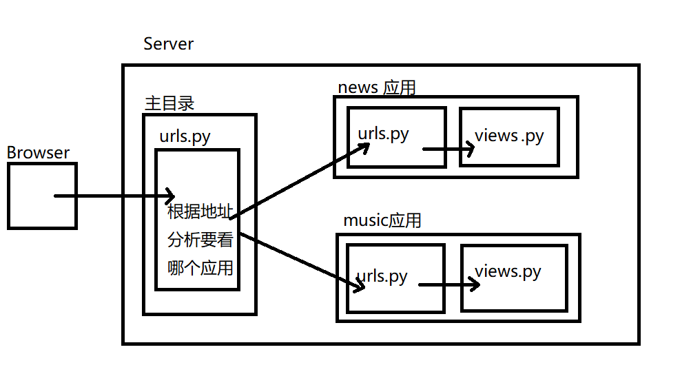
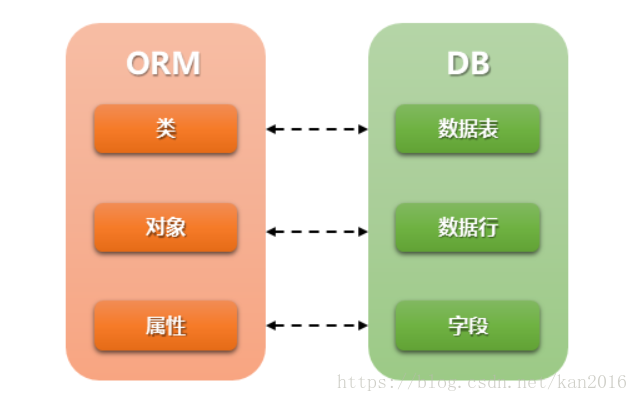

# 《Django Web框架教学笔记》
## 目录
[TOC]

## 静态文件
1. 什么是静态文件
    - 不能与服务器端做动态交互的文件都是静态文件
    - 如:图片,css,js,音频,视频,html文件(部分)
2. 静态文件配置
    - 在 settings.py 中配置一下两项内容:
    1. 配置静态文件的访问路径

        https://oimagea1.ydstatic.com/image?id=-5337101211608292607&product=adpublish&w=640&h=480&sc=0&rm=2&gsb=0&gsbd=60

        - 通过哪个url地址找静态文件
        - 127.0.0.1:8000/static/
        - STATIC_URL = '/static/'
        - 说明:
            - 指定访问静态文件时是需要通过 /static/xxx或 127.0.0.1:8000/static/xxx
            - xxx 表示具体的静态资源位置

    2. 配置静态文件的存储路径 `STATICFILES_DIRS`

        - STATICFILES_DIRS保存的是静态文件在服务器端的存储位置

    3. 示例:
        ```python
        # file: setting.py
        STATICFILES_DIRS = (
            os.path.join(BASE_DIR, "static"),
        )
        ```
3. 访问静态文件
    1. 使用静态文件的访问路径进行访问
        - 访问路径: STATIC_URL = '/static/'
        -  示例:
            ```python
            
            
            ```
    2. 通过 标签访问静态文件
        - `` 表示的就是静态文件访问路径

        1. 加载 static
            - ``
        2. 使用静态资源时
            - 语法:
                - ``
            - 示例:
                - ``

## Django中的应用 - app
- 应用在Django项目中是一个独立的业务模块,可以包含自己的路由,视图,模板,模型

###  创建应用app
- 创建步骤
    1. 用manage.py 中的子命令 startapp 创建应用文件夹
    2. 在settings.py 的 INSTALLED_APPS 列表中配置安装此应用

- 创建应用的子命令
    - python3 manage.py startapp 应用名称(必须是标识符命令规则)
    - 如:
        - python3 manage.py startapp music

- Django应用的结构组成
    1. `migrations` 文件夹
        - 保存数据迁移的中间文件
    2. `__init__.py`
        - 应用子包的初始化文件
    3. `admin.py`
        - 应用的后台管理配置文件
    4. `apps.py`
        - 应用的属性配置文件
    5. `models.py`
        - 与数据库相关的模型映射类文件
    6. `tests.py`
        - 应用的单元测试文件
    7. `views.py`
        - 定义视图处理函数的文件

- 配置安装应用
    - 在 settings.py 中配置应用, 让此应用能和整个项目融为一体
        ```python
        # file : settings.py 
        INSTALLED_APPS = [
            ... ...,
            '自定义应用名称'
        ]

        ```
    - 如:
        ```python
        INSTALLED_APPS = [
            # ....
            'user',  # 用户信息模块
            'music',  # 收藏模块
        ]
        ```

### 应用的分布式路由
- Django中，基础路由配置文件(urls.py)可以不处理用户具体路由，基础路由配置文件的可以做请求的分发(分布式请求处理)。具体的请求可以由各自的应用来进行处理
- 如图:
    - 
#### include 函数
- 作用:
  
    - 用于分发将当前路由转到各个应用的路由配置文件的 urlpatterns 进行分布式处理
- 函数格式
    - include('app命字.url模块名')
    > 模块`app命字/url模块名.py` 文件件里必须有urlpatterns 列表
    > 使用前需要使用 `from django.conf.urls import include` 导入此函数

- 练习:
    ```
    1.创建四个应用
        1.创建 index 应用,并注册
        2.创建 sport 应用,并注册
        3.创建 news  应用,并注册
        4.创建 music 应用,并注册
    2.创建分布式路由系统
        主路由配置只做分发
        每个应用中处理具体访问路径和视图
        1. 127.0.0.1:8000/music/index
            交给 music 应用中的 index_view() 函数处理
        2. 127.0.0.1:8000/sport/index
            交给 sport 应用中的 index_view() 函数处理
        3. 127.0.0.1:8000/news/index
            交给 news  应用中的 index_view() 处理处理
    ```

## 数据库 和 模型
### Django下配置使用 mysql 数据库
1. 安装 pymysql包
    - 用作 python 和 mysql 的接口
        - `$ sudo pip3 install pymysql`
    - 安装 mysql 客户端(非必须)
        `$ sudo pip3 install mysqlclient`

2. 创建 和 配置数据库
    1. 创建数据库
        - 创建 `create database 数据库名 default charset utf8 collate utf8_general_ci;`
        ```sql
        create database mywebdb default charset utf8 collate utf8_general_ci;
        ```
    2. 数据库的配置
        - sqlite 数据库配置
            ```python
            # file: settings.py
            DATABASES = {
                'default': {
                        'ENGINE': 'django.db.backends.sqlite3',
                        'NAME': os.path.join(BASE_DIR, 'db.sqlite3'),
                }
            }
            ```
        - mysql 数据库配置
            ```python
            DATABASES = {
                'default' : {
                    'ENGINE': 'django.db.backends.mysql',
                    'NAME': 'mywebdb',  # 数据库名称,需要自己定义
                    'USER': 'root',
                    'PASSWORD': '123456',  # 管理员密码
                    'HOST': '127.0.0.1',
                    'PORT': 3306,
                }
            }
            ```
    3. 关于数据为的SETTING设置
        1. ENGINE
            - 指定数据库的后端引擎
            ```
            'django.db.backends.mysql'
            'django.db.backends.sqlite3'
            'django.db.backends.oracle'
            'django.db.backends.postgresql'
            ```
            - mysql引擎如下:
                - 'django.db.backends.mysql'

        2. NAME
            - 指定要连接的数据库的名称
            - `'NAME': 'mywebdb'`
        3. USER
            - 指定登录到数据库的用户名
            - `'USER':'root'`
        4. PASSWORD
            - 接数据库时使用的密码。
            - `'PASSWORD':'123456'`
        5. HOST
            - 连接数据库时使用哪个主机。
            - `'HOST':'127.0.0.1'`
        6. PORT
            - 连接数据库时使用的端口。
            - `'PORT':'3306'`
    3. 添加 mysql 支持
        - 安装pymysql 模块
          
            - `$ sudo pip install pymysql`
        - 修改项目中__init__.py 加入如下内容来提供pymysql引擎的支持
            ```python
            import pymysql
            pymysql.install_as_MySQLdb()
            ```

### 模型（Models）
- 模型是一个Python类，它是由django.db.models.Model派生出的子类。
- 一个模型类代表数据库中的一张数据表
- 模型类中每一个类属性都代表数据库中的一个字段。
- 模型是数据交互的接口，是表示和操作数据库的方法和方式


### Django 的 ORM框架
- ORM（Object Relational Mapping）即对象关系映射，它是一种程序技术，它允许你使用类和对象对数据库进行操作,从而避免通过SQL语句操作数据库
- ORM框架的作用
    1. 建立模型类和表之间的对应关系，允许我们通过面向对象的方式来操作数据库。
    2. 根据设计的模型类生成数据库中的表格。
    3. 通过简单的配置就可以进行数据库的切换。
- ORM 好处:
    1. 只需要面向对象编程, 不需要面向数据库编写代码.
        - 对数据库的操作都转化成对类属性和方法的操作.
        - 不用编写各种数据库的sql语句.
    2. 实现了数据模型与数据库的解耦, 屏蔽了不同数据库操作上的差异.
        - 不在关注用的是mysql、oracle...等数据库的内部细节.
        - 通过简单的配置就可以轻松更换数据库, 而不需要修改代码.
- ORM 缺点
    1. 相比较直接使用SQL语句操作数据库,有性能损失.
    2. 根据对象的操作转换成SQL语句,根据查询的结果转化成对象, 在映射过程中有性能损失.
- ORM 示意
    - 


2. 模型示例:
    - 此示例为添加一个 bookstore_book 数据表来存放图书馆中书目信息
    - 添加一个 bookstore 的 app
        ```shell
        $ python3 manage.py startapp bookstore
        ```
    - 添加模型类并注册app
        ```python
        # file : bookstore/models.py
        from django.db import models

        class Book(models.Model):
            title = models.CharField("书名", max_length=50, default='')
            price = models.DecimalField('定价', max_digits=7, decimal_places=2, default=0.0)
        ```
    - 注册app
        ```python
        # file : setting.py
        INSTALLED_APPS = [
            ...
            'bookstore',
        ]
        ```
3. 数据库的迁移
    - 迁移是Django同步您对模型所做更改（添加字段，删除模型等） 到您的数据库模式的方式
    1. 生成或更新迁移文件
        - 将每个应用下的models.py文件生成一个中间文件,并保存在migrations文件夹中
        - `python3 manage.py makemigrations`
    2. 执行迁移脚本程序
        - 执行迁移程序实现迁移。将每个应用下的migrations目录中的中间文件同步回数据库
        - `python3 manage.py migrate`
    - 注:
      
- 每次修改完模型类再对服务程序运行之前都需要做以上两步迁移操作。
  ​      
    - 生成迁移脚本文件`bookstore/migrations/0001_initial.py`并进行迁移
        ```shell
        $ python3 manage.py makemigrations
        $ python3 manage.py migrate
        ```

2. 编写模型类Models
    - 模型类需继承自`django.db.models.Model`
        1. Models的语法规范
            ```
            from django.db import models
            class 模型类名(models.Model):
                字段名 = models.字段类型(字段选项)
            ```
        > 模型类名是数据表名的一部分，建议类名首字母大写
        > 字段名又是当前类的类属性名，此名称将作为数据表的字段名
        > 字段类型用来映射到数据表中的字段的类型
        > 字段选项为这些字段提供附加的参数信息
    
3. 字段类型
    1. BooleanField()
        - 数据库类型:tinyint(1)
        - 编程语言中:使用True或False来表示值
        - 在数据库中:使用1或0来表示具体的值
    2. CharField()
        - 数据库类型:varchar
        - 注意:
            - 必须要指定max_length参数值
    3. DateField()
        - 数据库类型:date
        - 作用:表示日期
        - 编程语言中:使用字符串来表示具体值
        - 参数:
            - DateField.auto_now: 每次保存对象时，自动设置该字段为当前时间(取值:True/False)。
            - DateField.auto_now_add: 当对象第一次被创建时自动设置当前时间(取值:True/False)。
            - DateField.default: 设置当前时间(取值:字符串格式时间如: '2019-6-1')。
            - 以上三个参数只能多选一
    4. DateTimeField()
        - 数据库类型:datetime(6)
        - 作用:表示日期和时间
        - auto_now_add=True

    5. DecimalField()
        - 数据库类型:decimal(x,y)
        - 编程语言中:使用小数表示该列的值
        - 在数据库中:使用小数
        - 参数:
            - DecimalField.max_digits: 位数总数，包括小数点后的位数。 该值必须大于等于decimal_places.
            - DecimalField.decimal_places: 小数点后的数字数量

        - 示例:
            ```
            money=models.DecimalField(
                max_digits=7,
                decimal_places=2,
                default=0.0
            )
            ```
    6. FloatField()
        - 数据库类型:double
        - 编程语言中和数据库中都使用小数表示值
    7. EmailField()
        - 数据库类型:varchar
        - 编程语言和数据库中使用字符串
    8. IntegerField()
        - 数据库类型:int
        - 编程语言和数据库中使用整数
    9. URLField()
        - 数据库类型:varchar(200)
        - 编程语言和数据库中使用字符串
    10. ImageField()
        - 数据库类型:varchar(100)
        - 作用:在数据库中为了保存图片的路径
        - 编程语言和数据库中使用字符串
        - 示例:
            ```
            image=models.ImageField(
                upload_to="static/images"
            )
            ```
        - upload_to:指定图片的上传路径
            在后台上传时会自动的将文件保存在指定的目录下
    11. TextField()
        - 数据库类型:longtext
        - 作用:表示不定长的字符数据
    - 参考文档 <https://docs.djangoproject.com/en/1.11/ref/models/fields/#field-types>

4. 字段选项FIELD_OPTIONS
    - 字段选项, 指定创建的列的额外的信息
    - 允许出现多个字段选项,多个选项之间使用,隔开
    1. primary_key
        - 如果设置为True,表示该列为主键,如果指定一个字段为主键，则此数库表不会创建id字段
    2. blank
        - 设置为True时，字段可以为空。设置为False时，字段是必须填写的。字符型字段CharField和TextField是用空字符串来存储空值的。 默认值是False。
    3. null
        - 如果设置为True,表示该列值允许为空。日期型、时间型和数字型字段不接受空字符串。所以设置IntegerField，DateTimeField型字段可以为空时，需要将blank，null均设为True。
        - 默认为False,如果此选项为False建议加入default选项来设置默认值
    4. default
        - 设置所在列的默认值,如果字段选项null=False建议添加此项
    5. db_index
        - 如果设置为True,表示为该列增加索引
    6. unique
        - 如果设置为True,表示该字段在数据库中的值必须是唯一(不能重复出现的)
    7. db_column
        - 指定列的名称,如果不指定的话则采用属性名作为列名
    8. verbose_name
        - 设置此字段在admin界面上的显示名称。
    - 示例:
        ```python
        # 创建一个属性,表示用户名称,长度30个字符,必须是唯一的,不能为空,添加索引
        name = models.CharField(max_length=30, unique=True, null=False, db_index=True)
        ```
- 文档参见:
    - <https://docs.djangoproject.com/en/1.11/ref/models/fields/#field-options>


### 数据库迁移的错误处理方法
- 当执行 `$ python3 manage.py makemigrations` 出现如下迁移错误时的处理方法
    - 错误信息
        ```
        $ python3 manage.py makemigrations
        You are trying to change the nullable field 'title' on book to non-nullable without a default; we can't do that (the database needs something to populate existing rows).
        Please select a fix:
        1) Provide a one-off default now (will be set on all existing rows with a null value for this column)
        2) Ignore for now, and let me handle existing rows with NULL myself (e.g. because you added a RunPython or RunSQL operation to handle NULL values in a previous data migration)
        3) Quit, and let me add a default in models.py
        Select an option: 
        ```
    - 翻译为中文如下:
        ```
        $ python3 manage.py makemigrations
        您试图将图书上的可空字段“title”更改为非空字段(没有默认值);我们不能这样做(数据库需要填充现有行)。
        请选择修复:
        1)现在提供一次性默认值(将对所有现有行设置此列的空值)
        2)暂时忽略，让我自己处理空值的现有行(例如，因为您在以前的数据迁移中添加了RunPython或RunSQL操作来处理空值)
        3)退出，让我在models.py中添加一个默认值
        选择一个选项:
        ```
    - 错误原因
        - 当将如下代码
        ```
        class Book(models.Model):
            title = models.CharField("书名", max_length=50, null=True)
        ```
        - 去掉 null=True 改为如下内容时会出现上述错误
        ```
        class Book(models.Model):
            title = models.CharField("书名", max_length=50)
        ```
        - 原理是 此数据库的title 字段由原来的可以为NULL改为非NULL状态,意味着原来这个字段可以不填值，现在改为必须填定一个值，那填什么值呢？此时必须添加一个缺省值。
    - 处理方法:
        1. 选择1 手动给出一个缺省值，在生成 bookstore/migrations/000x_auto_xxxxxxxx_xxxx.py 文件时自动将输入的值添加到default参数中
        2. 暂时忽略，以后用其它的命令处理缺省值问题(不推荐)
        3. 退出当前生成迁移文件的过程，自己去修改models.py, 新增加一个`default=XXX` 的缺省值(推荐使用)

- 数据库的迁移文件混乱的解决办法
    1. 删除 所有 migrations 里所有的 000?_XXXX.py (`__init__.py`除外)
    2. 删除 数据表
        - sql> drop database mywebdb;
    3. 重新创建 数据表
        - sql> create datebase mywebdb default charset...;
    4. 重新生成migrations里所有的 000?_XXXX.py
        - python3 manage.py makemigrations
    5. 重新更新数据库
        - python3 manage.py migrate


## 数据库的基本操作
- 数据库的基本操作包括增删改查操作，即(CRUD操作)
- CRUD是指在做计算处理时的增加(Create)、读取查询(Read)、更新(Update)和删除(Delete)

### 管理器对象
- 每个继承自 models.Model 的模型类，都会有一个 objects 对象被同样继承下来。这个对象叫管理器对象
- 数据库的增删改查可以通过模型的管理器实现
    ```python
    class MyModel(models.Model):
        ...
    MyModel.objects.create(...) # objects 是管理器对象
    ```

### 创建数据对象
- Django 使用一种直观的方式把数据库表中的数据表示成Python 对象
- 创建数据中每一条记录就是创建一个数据对象
    1. MyModel.objects.create(属性1=值1, 属性2=值1,...)
        - 成功: 返回创建好的实体对象
        - 失败: 抛出异常
    2. 创建 MyModel 实例对象,并调用 save() 进行保存
        ```python
        obj = MyModel(属性=值,属性=值)
        obj.属性=值
        obj.save()
        无返回值,保存成功后,obj会被重新赋值
        ```

### Django shell 的使用
- 在Django提供了一个交互式的操作项目叫 `Django Shell` 它能够在交互模式用项目工程的代码执行相应的操作
- 利用 Django Shell 可以代替编写View的代码来进行直接操作
- 在Django Shell 下只能进行简单的操作，不能运行远程调式
- 启动方式:
    ```shell
    $ python3 manage.py shell
    ```

- 练习:
    ```
    在 bookstore/models.py 应用中添加两个model类
    1. Book - 图书
        1. title - CharField 书名,非空,唯一
        2. pub - CharField 出版社,字符串,非空
        3. price - 图书定价,,
        4. market_price - 图书零售价
    2. Author - 作者
        1. name - CharField 姓名,非空
        2. age - IntegerField, 年龄,非空，缺省值为1
        3. email - EmailField, 邮箱,允许为空
    ```
    - 然后用 Django Shell 添加如下数据
        - 图书信息
            | 书名   | 定价 | 零售价 | 出版社      |
            |---------|-------|--------------|----------------|
            | Python  | 20.00 |        25.00 | 清华大学出版社 |
            | Python3 | 60.00 |        65.00 | 清华大学出版社 |
            | Django  | 70.00 |        75.00 | 清华大学出版社 |
            | JQuery  | 90.00 |        85.00 | 机械工业出版社 |
            | Linux   | 80.00 |        65.00 | 机械工业出版社 |
            | Windows | 50.00 |        35.00 | 机械工业出版社 |
            | HTML5   | 90.00 |       105.00 | 清华大学出版社 |
        - 作者信息:
            | 姓名   | 年龄 | 邮箱 |
            |-------|------|-----|
            | 王老师 | 28 | wangweichao@tedu.cn |
            | 吕老师 | 31 | lvze@tedu.cn |
            | 祁老师 | 30 | qitx@tedu.cn |
        


拓展：

settings.py里  APPEND_SLASH

APPEND_SLASH  -> 自动补全  /

案例：

  url(r'^page1/$', xx)  ，访问浏览器时 地址栏输入 127.0.0.1:8000/page1  ,此时 django接到请求后

返回301【永久重定向】，并在响应头中指定重定向地址为 /page1/ ，从而出现自动补全 / 效果

若要关闭此功能，可将 APPEND_SLASH = False


出现8000端口已占用 解决方案

1，查看是否有django进程启动

ps aux|grep 'runserver'

2，若grep中出现 相关进程，直接干！

kill -9  pid pid 

案例如下：

```shell
执行 查！
tarena@tedu:~/aid1906/django/day03/mysite3$ ps aux|grep 'runserver'
tarena    13984  0.0  0.4 125980 39604 pts/0    S+   15:39   0:00 python3 manage.py runserver
tarena    14914  1.2  0.5 202864 41312 pts/0    Sl+  16:10   0:05 /usr/bin/python3 manage.py runserver
tarena    15056  0.0  0.0  21532  1156 pts/4    S+   16:17   0:00 grep --color=auto runserv

#执行 干！
kill -9 13984 14914
```


