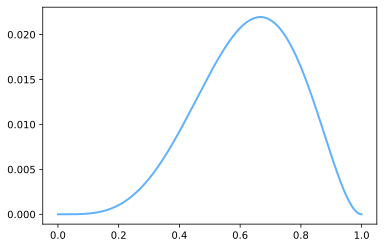

# 硬币问题的最大似然估计

不等概率的硬币扔了6次，结果是D={H,T,T,H,H,H}。假设已知的样本为D，最大似然估计通过最大化`P(D|θ)`来求解未知参数。

因此，想要求得最大概率，取P(D|θ)的最大值，需要对其进行求导 P'(D|θ) = 0，算得x的值。


```python
import numpy as np
import matplotlib.pyplot as mp
# 拆1000个点
x = np.linspace(0, 1, 1000)
y = x**4 * (1-x)**2
mp.plot(x, y,
    # linestyle='--',
    alpha=0.7,
    linewidth=2, color='dodgerblue', 
    label=r'$-\frac{\pi}{2}$')
mp.show()
```


    

    


```python

```
