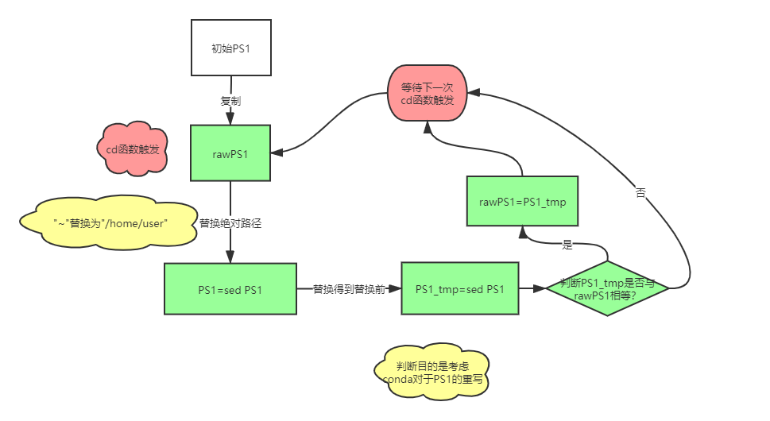

## Linux 系统中 PS1 显示全路径\w模式时替换 ~ 为 /home/user 的解决方案
Linux 系统中 PS1 显示全路径`\w`模式时替换`~`为`/home/user`的解决方案

说明：
- 可以显示PS1全路径，将linux默认将$HOME替换为~的操作还原为全路径
- 可以配合conda等环境管理使用，多次切换不会引起改变PS1


Code: （将以下代码放入`~/.bashrc`）
```bash
## 30黑,31红,32绿, 33黄,34蓝,35洋红,36青,37白
PS1="\[\e[1;32m\][\u@\h:\[\e[1;36m\] \t \[\e[31m\]\w]\n\[\e[32m\]$ \[\e[m\]"
rawPS1="$PS1"
fcd(){
    builtin cd $@
    PS1=`echo ${PS1}|sed 's#\\\\w#$PWD#'`
    PS1_tmp=`echo ${rawPS1}|sed 's#$PWD#\\\\w#'`
    if [ "$PS1_tmp" == "$rawPS1" ] ;then rawPS1=$PS1_tmp ; fi
}
alias cd=fcd
cd .
```

## 原理解析




## 效果展示
```shell
[chenjun@linux: 12:49:08 /home/chenjun]
$ cat /home/chenjun/.conda_bashrc_my
# >>> conda initialize >>>
# !! Contents within this block are managed by 'conda init' !!
__conda_setup="$('/home/chenjun/miniconda3/bin/conda' 'shell.bash' 'hook' 2> /dev/null)"
if [ $? -eq 0 ]; then
    eval "$__conda_setup"
else
    if [ -f "/home/chenjun/miniconda3/etc/profile.d/conda.sh" ]; then
        . "/home/chenjun/miniconda3/etc/profile.d/conda.sh"
    else
        export PATH="/home/chenjun/miniconda3/bin:$PATH"
    fi
fi
unset __conda_setup
# <<< conda initialize <<<

[chenjun@linux: 12:49:28 /home/chenjun]
$ source /home/chenjun/.conda_bashrc_my;

(base) [chenjun@linux: 12:49:54 /home/chenjun]
$ conda activate bio

(bio) [chenjun@linux: 12:49:54 /home/chenjun]
$ cd software

(bio) [chenjun@gzscbioinfo: 12:54:07 /home/chenjun/software]
$ 
```

