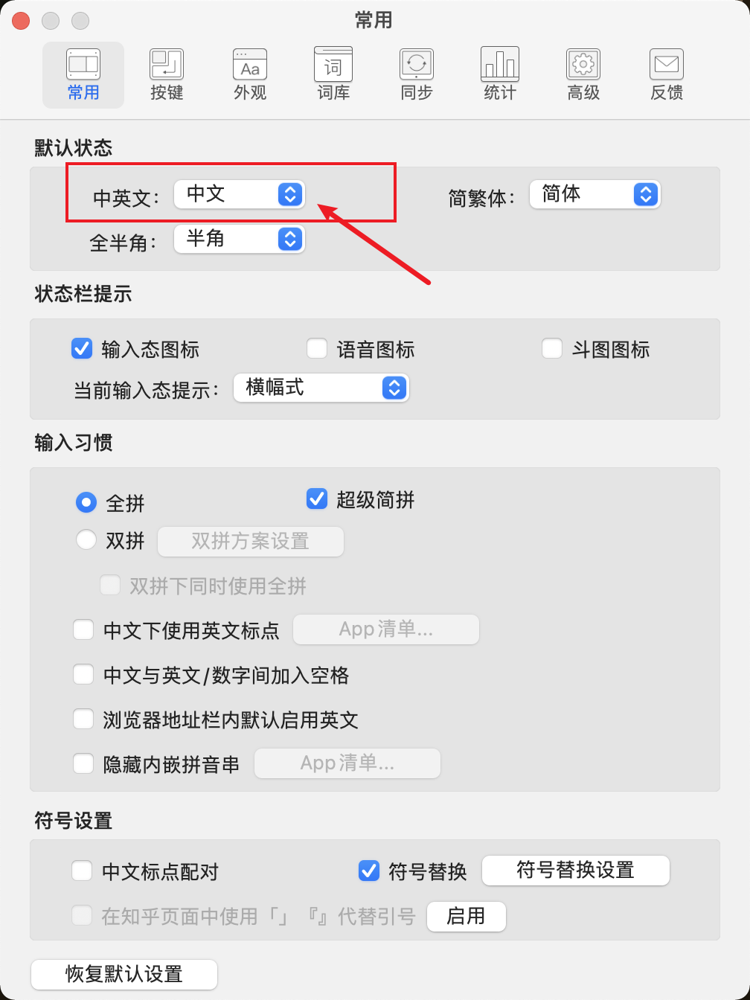
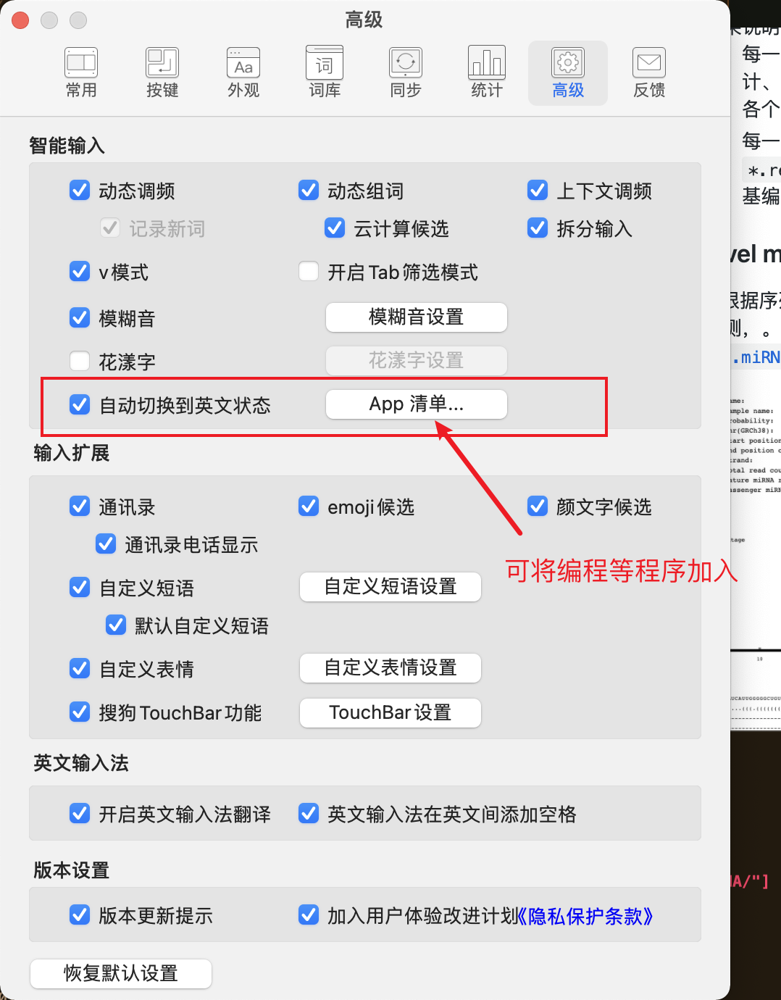
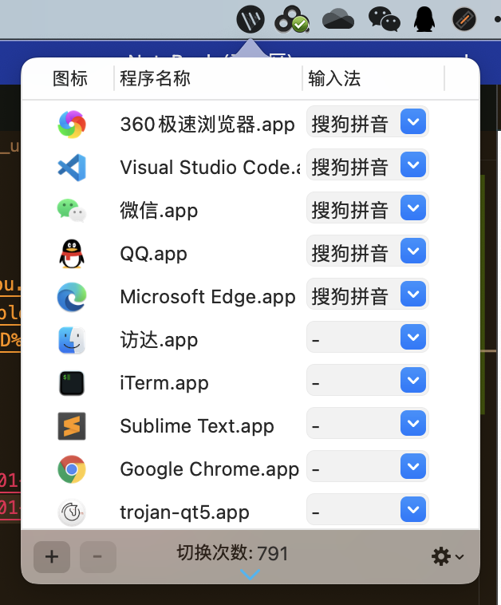
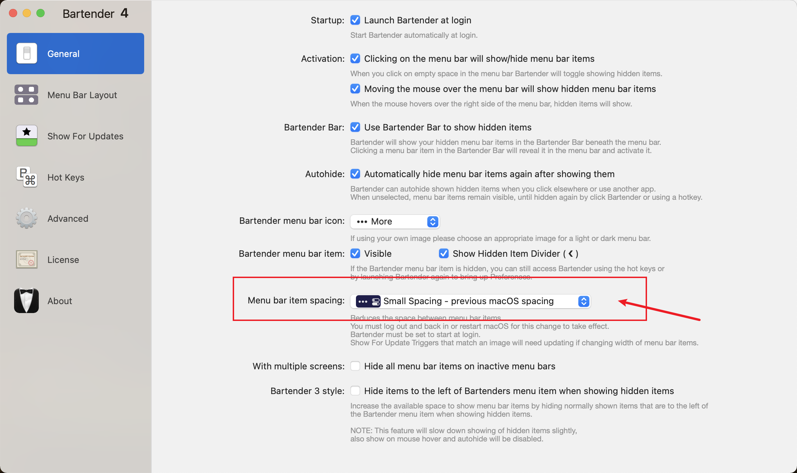
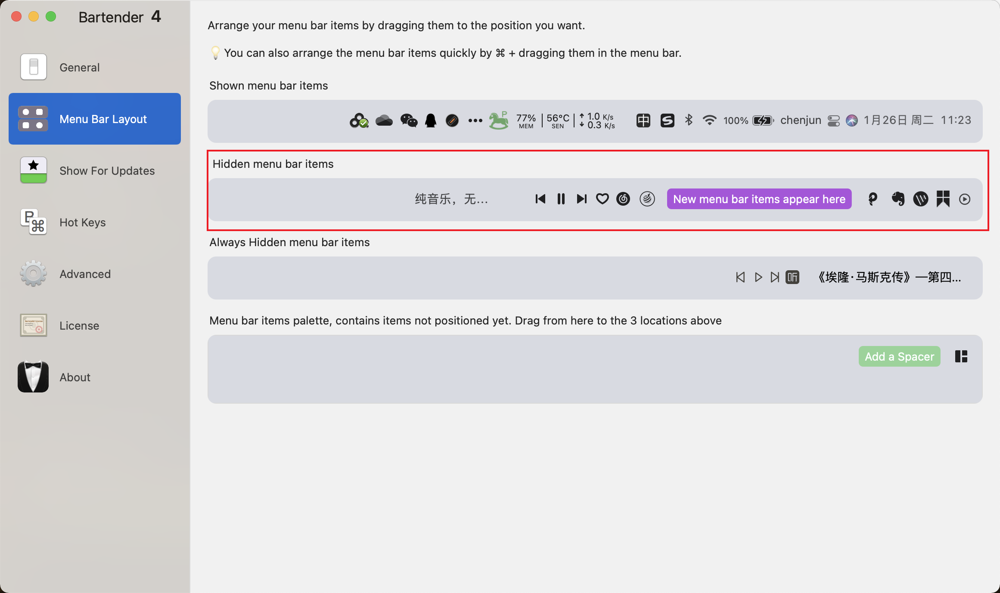

# Mac 配置大全

---
## 输入法问题

APP：
- [搜狗输入法](https://pinyin.sogou.com/mac/)
- [自动切换输入法](https://apps.apple.com/cn/app/%E8%87%AA%E5%8A%A8%E5%88%87%E6%8D%A2%E8%BE%93%E5%85%A5%E6%B3%95/id1470350547?mt=12)


搜狗输入法配置：
-   
-   

自动切换输入法配置：
-   

---
## 顶部状态栏无法显示完全问题

APP:
- [Bartender 4 - Take control of your Menu bar](https://www.macbartender.com/Bartender4/)

配置问题：
-   
-   


## 代理问题


使用代理打开软件：

```bash
proxychains4 open -a /Applications/IGV_2.8.6.app
```