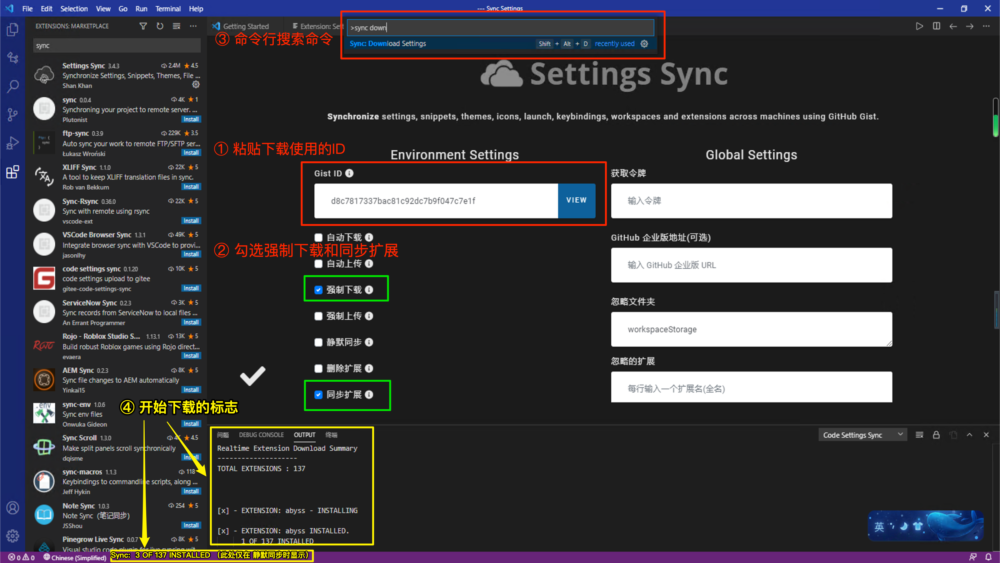

## 1. 开始

项目下载clone：  
```bash
git clone https://github.com/wan230114/PythonNote.git
```

---
## 2. 高效食用软件 vscode 基本配置

### 2.1. vscode 软件安装及配置

1. 下载及安装软件。
   - 打开vscode官网下载界面：https://code.visualstudio.com/Download
   - 下载并根据向导安装

2. 安装拓展插件`Settings Sync`
   - 1）打开左边侧边栏的扩展商店（快捷键方法， win: `ctrl+shift+x` / mac: `command+shift+x`）  
   - 2）搜索插件：`Settings Sync`
   - 3）点击安装（插件装好之后的弹出主页不要关闭，后续有用）  
        

3. 使用`Settings Sync`插件下载一套相对成型的完善设置。
   - 1）打开刚刚弹出的主页点击 `Download Public Gist`。
   - 2）在弹出的界面中，粘贴`Gist ID`，并按Enter确认。
        
     - Gist ID：
      - 稳定版：
        ```text
        9119aa6c385cce49769343cd90e5dc7d
        ```
      - 最新版：
        ```text
        d8c7817337bac81c92dc7b9f047c7e1f
        ```
   - 3）开始正常下载的标志：  
     如下图所示，在 标注① OUTPUT输出栏中出现下载日志，或者在图中最下面的紫色状态栏中出现如 类似 `34 OF 118 INSTALLED` 的状态信息  
       

> ***补充：***
> 
> 若遇到无法下载的BUG时，可尝试如下步骤。
> - **准备工作：`Settings Sync`插件设置面板的打开。** 打开vscode命令面板 （点击 >设置 >命令面板。或使用快捷键 win: `ctrl+shift+p` / mac: `command+shift+p`）。 输入关键词`sync advanced`定位并选择第一条命令`>Sync: Advanced Options`，按Enter。接着再第二次按Enter选中`Sync 打开设置`。 打开后的设置面板如下图所示。
> - **step1.** 在`Gist ID`输入框内输入上面的 Gist ID。
> - **step2.** 开启`Gist ID`输入框下方的 “强制下载” 和 “同步拓展” 的按钮。<font color="red"> （若按钮没有展示完全，可尝试 `ctrl/cmd + -` 缩小窗口即可。） </font>
> - **step3.** 再次打开vscode命令面板，输入命令：`sync Download Settings`，选中第一条命令按Enter，此即开始下载。
> - **step4.** 若正常将出现如下图正常下载标志，等待完成即可。
>   

> 
> PS：该 `Gist ID` DIY设置的相关介绍见下一小节


---
### 2.2. vscode - Sync.gist ID 的内容简介

#### 2.2.1. 本套同步设置特点
- 丰富的实用插件：Markdown、Python及其相关插件，可以完成语法检测，格式化文本等操作，便捷的文本与终端交互。
- 丰富的 VsCode 软件设置：如自定义的终端设置，鼠标融合，双击复制，右击粘贴。（复制的分隔符设置位于 `设置 --> 功能 --> 终端 --> 最后一项terminal.integrated.wordSeparators` ）；可在终端中打开目录或文件。
- 方便的 VsCode 快键键设置（基于Sublime text3习惯，以下将着重介绍）

#### 2.2.2. 便捷的快捷键定义

（以下快捷键以 mac 系统为准，windows 的部分快捷键设置未及时测试更新，一般而言windows的快捷键直接将cmd换成ctrl即可）

**文本编辑器中：**

|    win    |        mac        |  生效条件   |          说明           |
|:---------:|:-----------------:|:-----------:|:---------------------:|
| <b>  </b> | `command+shift+d` | *unlimited* |     向下复制当前行      |
| <b>  </b> |     `alt+↑/↓`     | *unlimited* |    快速向上/下移动行    |
| <b>  </b> |     `cmd+↑/↓`     | *unlimited* | 光标移动至文件首位/末尾 |
| <b>  </b> |     `cmd+←/→`     | *unlimited* |    光标移动至行左/右    |
| <b>  </b> |     `ctrl+-`      | *unlimited* | 跳转至上次光标所在位置  |
| <b>  </b> |  `ctrl+shift+-`   | *unlimited* | 跳转至下次光标所在位置  |
| <b>  </b> |      `cmd+c`      | *unlimited* |        复制(行)         |
| <b>  </b> |      `cmd+x`      | *unlimited* |        剪切(行)         |
| <b>  </b> |      `cmd+v`      | *unlimited* |          粘贴           |
| <b>  </b> |      `cmd+/`      | *unlimited* |          注释           |
| <b>  </b> |   `cmd+shift+c`   | *unlimited* |          注释           |


**Markdown：**

|     win      |      mac       |  生效条件   |                    说明                     |
|:------------:|:--------------:|:-----------:|:-----------------------------------------:|
|   `ctrl+g`   |    `cmd+g`     | *unlimited* |         快速选择markdown中的代码块          |
| `ctrl+enter` |  `ctrl+enter`  | *unlimited* |   快速于IPython终端运行选中命令行或当前行   |
|  <b>  </b>   |    `ctrl+l`    | *unlimited* |           创建/取消 无序列表 `- `           |
|  <b>  </b>   |   `ctrl+m+k`   | *unlimited* |           创建/取消 段落格式 `> `           |
|  <b>  </b>   | `ctrl+shift+c` | *unlimited* | 创建/取消 checkbox<br>(可单行多行) `- [ ] ` |


**窗口管理及切换交互：**

|      win       |        mac        |          生效条件          |           说明           |
|:--------------:|:-----------------:|:--------------------------:|:------------------------:|
|    `ctrl+e`    |    `command+e`    |     当光标聚焦于终端时     | 将光标聚焦于文本编辑窗口 |
|    `ctrl+e`    |    `command+e`    | 当光标聚焦于文本编辑窗口时 |   将光标聚焦于终端窗口   |
|    `alt+w`     |      `alt+w`      |        *unlimited*         | 切换下一个程序窗口 |
| `alt+shift+w`  |   `alt+shift+w`   |        *unlimited*         | 切换下一个程序窗口 |
|    `ctrl+w`    |    `command+w`    |        *unlimited*         |         关闭当前编辑器页         |
| `ctrl+shift+w` | `command+shift+w` |        *unlimited*         |  关闭当前程序程序窗口  |
| `ctrl+shift+w` | `command+shift+w` |        *unlimited*         |  关闭当前程序程序窗口  |
|  <b>  </b> | `command+ctrl+t` |        *unlimited*         |  在终端进入当前文件路径  |
|      ...       |     <b>  </b>     |         <b>  </b>          |        <b>  </b>         |


**终端 及 编辑器内容与终端的交互：**

|    win    |      mac       |      生效条件      |   说明   |
|:---------:|:--------------:|:------------------:|:------:|
| <b>  </b> | `ctrl+shift+~` |     *unlimited*      | 新建终端 |
| <b>  </b> |  `ctrl+table`  | 当光标聚焦于终端时 | 切换终端 |
| <b>  </b> |  `cmd+enter`  | 当光标聚焦于文本编辑窗口时 | 发送选中文本或当前所在行到终端 |
| <b>  </b> |  `cmd+enter`  | 当光标位于PythonCell<br>（`#%%`包裹的python文档中） | 启动并执行当前Cell代码，Jupyter增强窗口 |
| <b>  </b> |  `ctrl+enter`  | *unlimited* | 发送命令到ipython终端交互执行 |


**脚本执行：**

|    win    |   mac    | 生效条件  |   说明   |
|:---------:|:--------:|:---------:|:------:|
| `ctrl+b` | `cmd+b` | *unlimited* | 运行脚本 |


## 3. npm服务器环境安装

将本项目的文件夹自动渲染为本地网页，便于实时开发，在本地实时渲染访问文档网页。

使用工具：`docsify-cli`

工具的安装:
```shell
# 使用npm进行安装。npm的安装网上教程很多，此处不再赘述，以下为安装命令
npm i docsify-cli -g
```

## 4. vscode 食用方法

待项目clone完毕后，打开PythonNote目录作为项目目录，打开方式如下（依次点击）：  
- 文件 --> 打开文件夹  --> 选择PythonNote
- File --> Open Folder --> Chose PythonNote

然后运行一个本地服务器，这样就可以在 http://localhost:3000 实时访问文档网页渲染效果。(当项目文件夹中的文件改动，网页端将会自动同步渲染更新)

```shell
cd PythonNote
docsify serve ./
```

---
## 思考

文件与终端的交互
- 怎么快速从终端中打开一个文件？
- 怎么从某一个文件快速进入当前文件文件夹的终端？

文件内容与终端的交互
- 怎样快速将文件内容复制到终端运行？


## 附

其他： vscode-server的安装

```bash
conda create -n nodejs -c conda-forge nodejs -y
conda activate nodejs
npm install -g code-server
```